# Amazon OpenSearch 및 SageMaker AI Studio 설치하기

## 1. Git Repo 를 로컬에 받기
### 1.1. 아래와 같이 로컬 컴퓨터(예: 노트북)에 터미널을 열어서 아래 명령어를 넣고 Git 리포를 클로닝 합니다.
    ```
    pwd
    git clone https://github.com/aws-samples/aws-ai-ml-workshop-kr.git
    ```
- 아래는 제 로컬 터미널에서 깃 클로닝하고, 해당 폴더까지 이동했습니다.
``` 
aws-ai-ml-workshop-kr/genai/aws-gen-ai-kr/20_applications/23_advanced_agentic_text2sql_aws_hosted_langfuse/01_setup/cloudformation
```
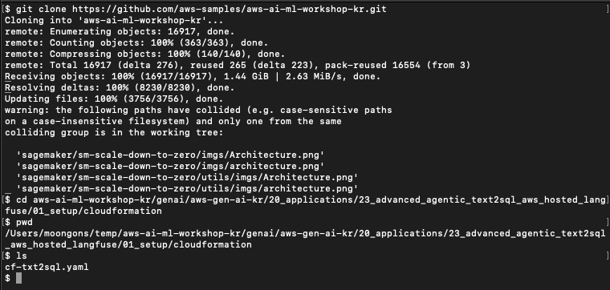

## 2. 인프라 자원 생성 (AWS CloudFormation 실행)
- [AWS CloudFormation Console](https://docs.aws.amazon.com/AWSCloudFormation/latest/UserGuide/Welcome.html) 로 이동합니다.
  Create Stack 을 클릭하고, 이래 그림 처럼 "Upload a template file" 선택하고, "Upload a template file" 을 클릭 합니다.
    - 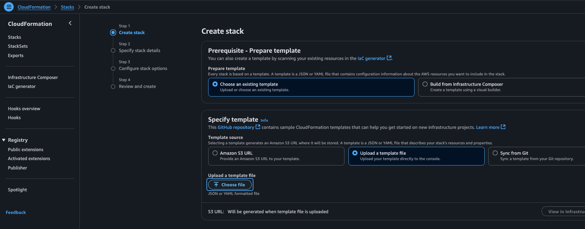
- 다운로드 했던 파일을 업로드 하면, 아래와 같이 화면이 나오고 이후에 Next 버튼을 클릭 합니다.
    - 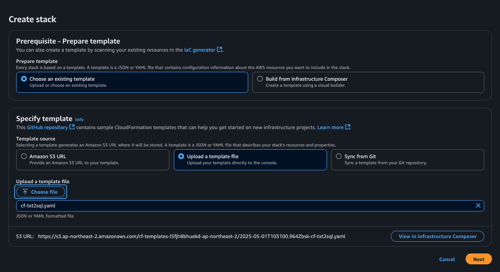
-  stack name 을 원하는 이름으로 입력합니다.
    - 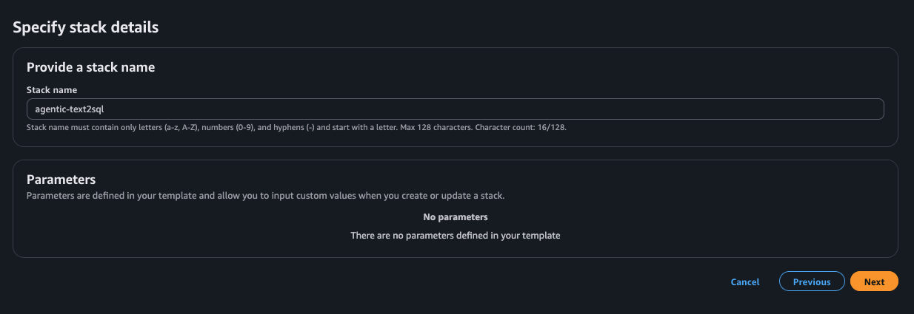
-  아래로 스크롤하고, I acknowledge ... 에 동의하고, Next 클릭 합니다.
    - 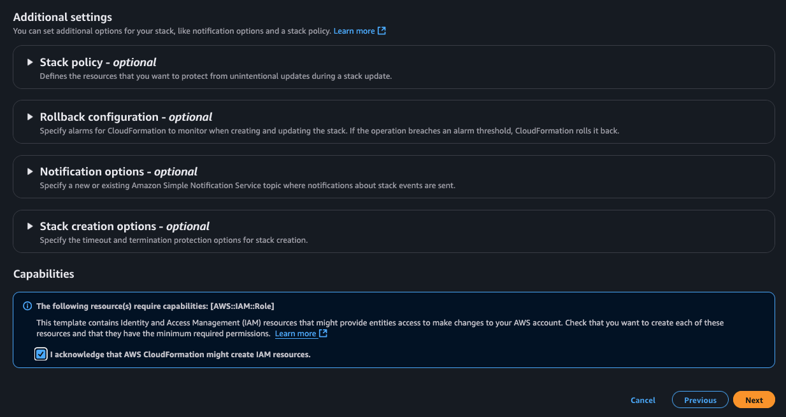
-  리뷰 페이지에서 아래까지 스크롤하고, Submit 버튼을 클릭 합니다.
    - 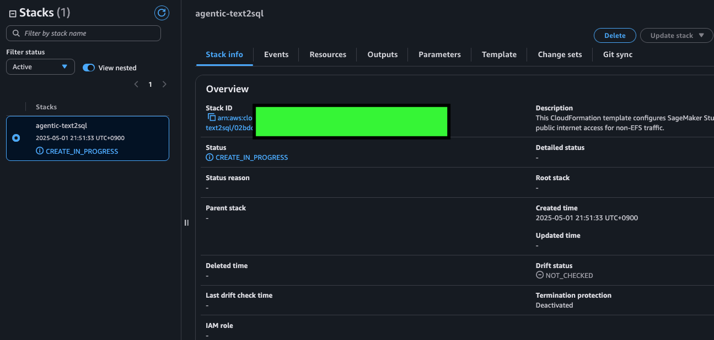
-  스택 작업 완료 (소요 시간: 약 10분)
    - 
## 3. OpenSearch Nori 한글 토큰나이저 설치
- OpenSearch 콘솔로 이동후에 왼쪽의 Managed Clusters --> Domains 를 클릭
    - 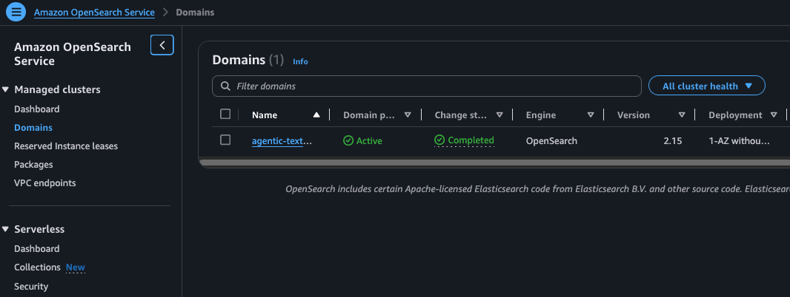
- 생성한 도메인을 클릭하고, 이후에 Package 를 클릭, 이후에 Associate packages 클릭
    - 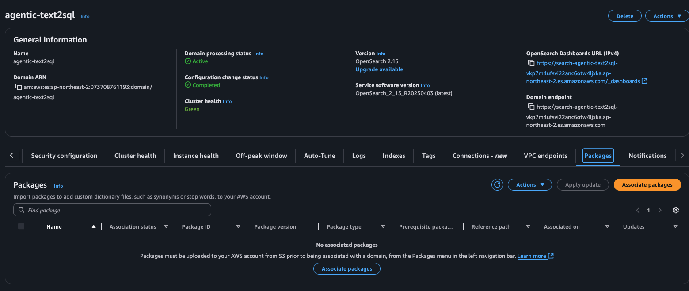
- Select Package 에서 analysis-nori 선택 후 Select
    - 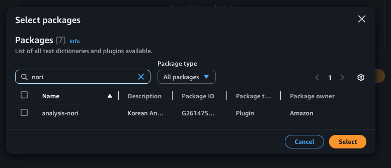- 
- 약 30분 후에 노리 분석기가 설치 됨
    - 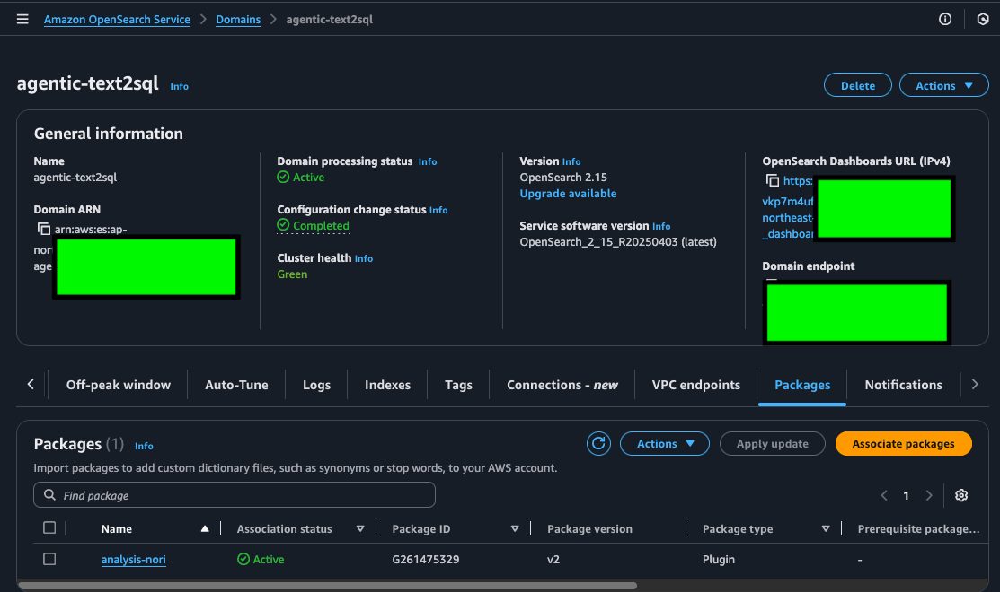
 
## 4. SageMaker AI Studio Jupyter App
- SageMaker AI Studio 로그인 하기 (AWS CloudFormation 실행시에 이미 설치 됨)
    - 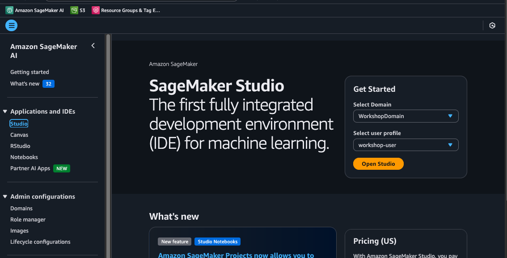
- Jupyter 클릭하고, Run 버튼을 클릭하면, 약 1분 뒤에 아래와 같은 화면이 나옵니다. Open 을 클릭하세요.
    - 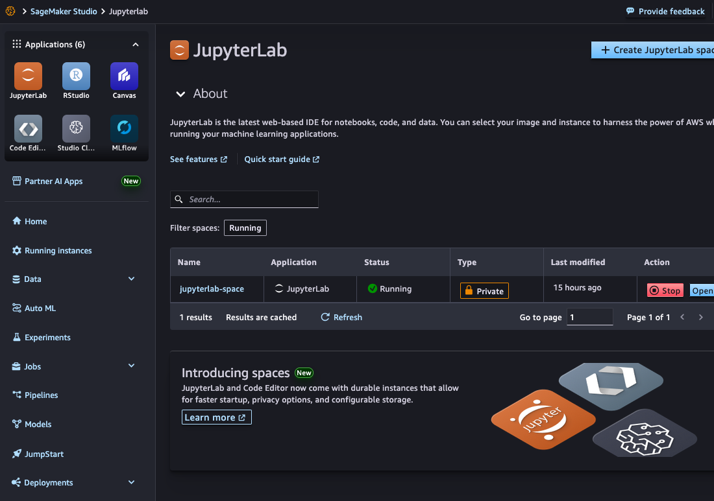
- Jupyter Labs 이 열립니다.
    - 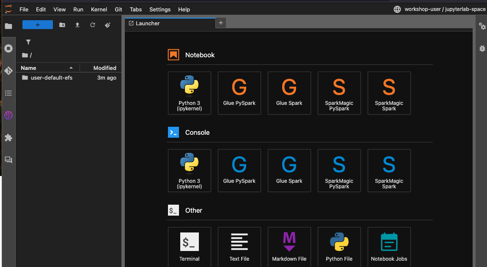

 ### 고생 하셨습니다. 다음 단계로 이동 하겠습니다.