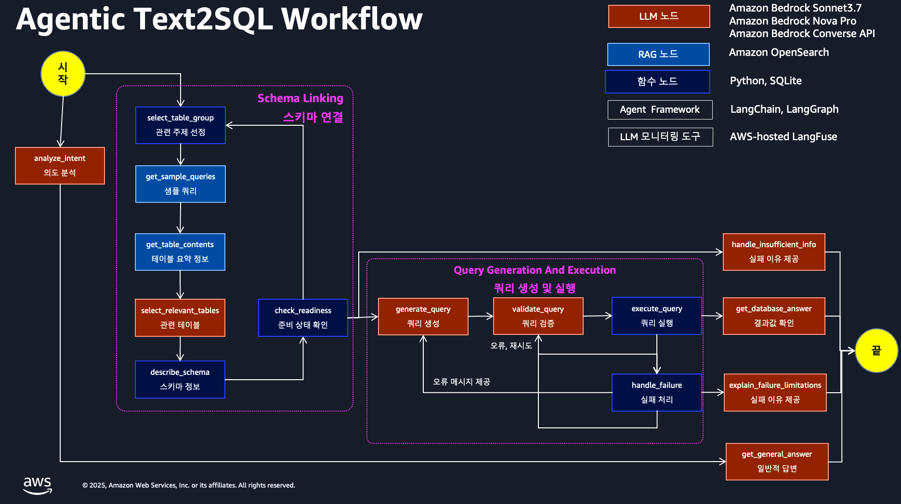
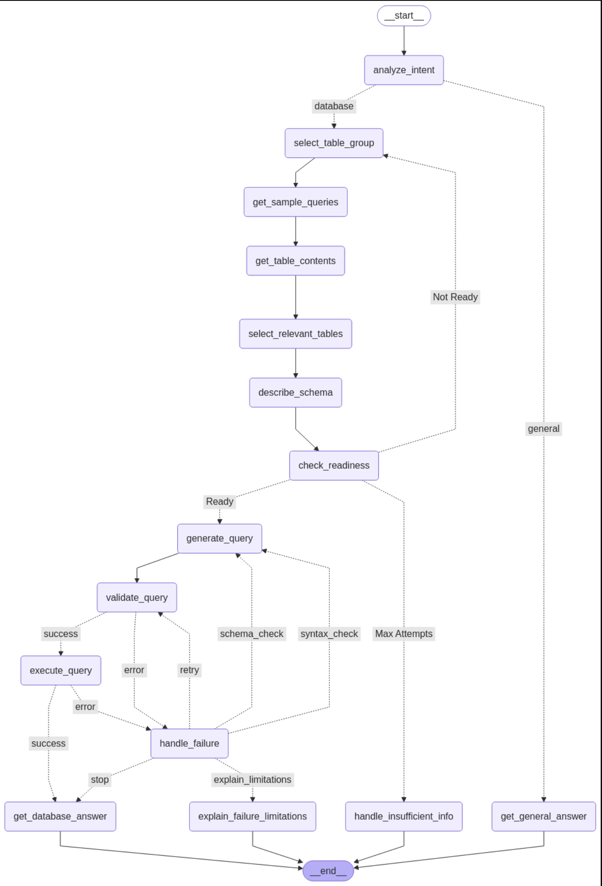
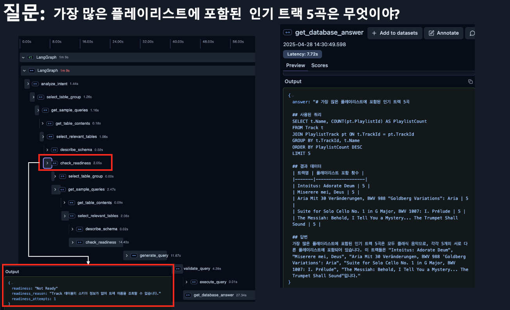

# Agentic Text-to-SQL Workflow with AWS-hosted Langfuse and Amazon Bedrock

    
    

Last Updated: Apr 28, 2025

## 1. 소개
### 1.1. 배경 및 목적
음악 앨범, 아티스트, 트랙, 고객 정보, 구매 내역 등 음악 판매와 관련된 11개의 테이블이 있는  [Chinook Database](https://github.com/lerocha/chinook-database) 가 있습니다. 아래와 같은 자연어 테스트 질문 목록이 있고, SQL 실행 결과를 얻는 것을 목표로 하는 Agentic Tex2SQL Workflow Application 을 만드는 것을 목표로 합니다.

#### 자연어 테스트 질문 목록
- Music
    - 각 장르별 트랙의 평균 가격과 총 트랙 수를 계산해줘.
    - 베토벤이 작곡한 모든 트랙의 이름과 그 트랙이 속한 앨범 제목을 알려줘.
    - 평균 트랙 길이가 가장 긴 상위 5명의 아티스트는 누구야?
    - 2000년대 이후 발매된 클래식 장르 앨범 중 가장 많은 트랙을 가진 앨범 3개를 찾아줘.
- User playlists
    - 가장 많은 플레이리스트에 포함된 인기 트랙 5곡은 무엇이야?
    - 'Rock'이라는 단어가 포함된 모든 플레이리스트와 각 플레이리스트에 포함된 트랙 수를 보여줘.
    - 가장 많은 트랙을 포함하고 있는 상위 10개 플레이리스트는 무엇이야?
- Business sales
    - 2022년 매출 상위 10개 국가는?
    - 상위 고객 5명의 고객 ID와 총 구매 금액 알려줘
    - 지난 분기에 가장 많은 매출을 올린 5명의 직원과 각 직원이 담당한 고객 수를 보여줘
- Cross 
    - 재즈와 블루스 장르의 트랙만 포함된 플레이리스트를 모두 찾아줘.
### 1.2. 솔루션 아키텍처 및 기술 스택
위의 "자연어 테스트 질문 목록" 을 모두 실행을 만족하는 워크플로우 및 기술 스택 입니다.

### 1.3. 구현된 LangGraph 워크플로우
실제 LangGraph 를 가시화한 내용 입니다. 

### 1.4. AWS-hosted Langfuse 추적 예시
"가장 많은 플레이리스트에 포함된  인기 트랙 5곡은 무엇이야?" 의 질의를 구현된 LangGraph 로 실행한 후에 AWS-hosted Langfuse 에서 추적이 되는 화면 입니다. 왼쪽 그림은 "가장 많은 플레이리스트에 포함된  인기 트랙 5곡은 무엇이야?" 의 질의를 구현된 LangGraph 노드의 실행 순서가 보이고, 오른쪽은 get_database_answer 노드의 결과를 보여 주고 있습니다.

## 2. 실습 가이드
AWS Region 은 <u>**us-east-1**</u> 에서 진행하시고, (1) 오픈서치 등을 생성하는 인프라 구성, (2) 오픈 서치에 한글 토큰나이저인 노리를 생성, (3) 노트불을 실행하는 가상환경 생성, (4) AWS-hosted Langfuse 설치를 합니다. 가능한 설치 과정을 단계별로 설명하려고 했으나, 중간에 에러가 발생할 수 있습니다. 에러에 대한 문의는 Git 의 Issues 등록 혹은 AWS Account SA 담당자가 있으면 연락 주세요.

### 2.1. 인프라 리소스 생성
아래를 클릭해서 (1) 오픈서치 등을 생성하는 인프라 구성, (2) 오픈 서치에 한글 토큰나이저인 노리를 생성을 해주세요.
- [인프라 리소스 생성](01_setup/README_CREATE_RESOURCE.md)

### 2.2 워크샵 환경 준비 
이 워크샵은 [SageMaker AI Studio Jupyterlab](https://docs.aws.amazon.com/ko_kr/sagemaker/latest/dg/studio-updated-jl.html) 및 [SageMaker AI Studio Code Editor](https://docs.aws.amazon.com/sagemaker/latest/dg/code-editor.html)에서 테스트 완료 되었습니다.

아래 링크를 클릭해서 워크샵 환경 준비를 해주세요.
- [워크샵 가상 환경 준비 ](01_setup/README.md)
- Langfuse 설치 혹은 사용
    - 관지자 용
        - [Langfuse 설치 ](../19_agentic_rag/01_setup/LAGNFUSE_ADMIN_README.md)
    - 일반 사용자 용 : <-- 위에 관리자가 Langfuse 설치 되었을시에 가능합니다.   
        - [Langfuse 사용 ](../19_agentic_rag/01_setup/LAGNFUSE_END_USER_README.md)

## 3. 실습
### 3.1. 실습: Text-to-SQL 스키마 준비
이 실습은 Text-to-SQL 애플리케이션을 위한 스키마 문서 준비를 포함합니다.

#### 파일
- `02_lab1_text2sql_schema_preparation/`
  - `1.sample_queries.ipynb`: 샘플 쿼리 문서를 준비하기 위한 주피터 노트북.
  - `2.detailed_schema.ipynb`: 상세 스키마 문서를 준비하기 위한 주피터 노트북.

### 3.2. 실습: LangGraph를 사용한 워크플로 구성
이 실습에서는 LangGraph를 사용하여 순환 워크플로를 구축합니다.
#### 파일
- `03_lab2_text2sql_langgraph/`
  - `1.langfuse_text2sql_langgraph.ipynb`: LangGraph를 사용하여 Text-to-SQL 워크플로를 개발하기 위한 주피터 노트북.

## A. 참조
- 이 리포는 [여기](https://github.com/kevmyung/text-to-sql-bedrock)의 코드를 참조하여 작성했습니다.
