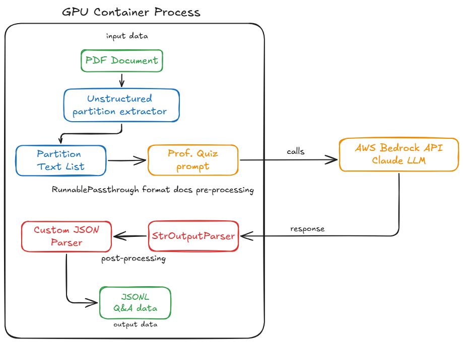

# PDF QA 추출

[English](README_en.md) | [한국어](README.md)

이 도구는 GPU를 활용하여 PDF 문서에서 블록 단위로 텍스트를 추출하고, Amazon Bedrock의 Claude 모델을 사용하여 추출된 내용에서 고품질 질문-답변 쌍을 자동 생성합니다. 이 과정을 통해 문서의 지식을 구조화된 QA JSON 데이터셋으로 변환하여 학습, 미세 조정 또는 지식 베이스 구축에 활용할 수 있습니다.


[PDF QA 추출 프로세스 동영상 가이드](https://assets.fsi.kr/videos/qna-extract.mp4)


## 시스템 흐름도



*위 다이어그램은 PDF에서 QA 데이터를 추출하는 전체 프로세스를 보여줍니다. PDF 문서가 입력되면 Unstructured 파티션 추출기를 통해 텍스트 블록으로 변환되고, 이 데이터는 Claude LLM을 활용하여 구조화된 JSONL QA 데이터로 가공됩니다.*

## 설치 안내

### Unstructured CUDA Docker 이미지 빌드하기

Unstructured는 PDF에서 콘텐츠를 추출하고 처리하기 위한 강력한 도구를 제공합니다. 이 도구는 문서의 블럭단위 text추출을 수행하여 구조화된 형식으로 데이터를 변환합니다. Docker 환경을 설정하려면 다음 단계를 따르세요:

1. 시스템에 Docker가 설치되어 있는지 확인하세요.

2. Docker 이미지 빌드:
     ```bash
     docker build -t qa-extractor -f Dockerfile .
     ```

     ```bash
     # Event Engine 실습 계정은 네트워크 제한이 있어 이 Dockerfile_eventeng를 사용해야 합니다.
     docker build -t qa-extractor -f Dockerfile_event_eng .     
     ```


### GPU기반 PDF Extractor 활용 가이드

#### 1. 로컬 GPU 환경에서 실행

Unstructured Extractor는 GPU를 활용하여 PDF 문서에서 텍스트를 빠르게 추출합니다. Docker 컨테이너는 NVIDIA GPU를 지원하며, 다음과 같이 실행할 수 있습니다:

```bash
# Linux/macOS
docker run --rm --gpus all -v $(pwd):/app -w /app --env-file .env qa-extractor python processing_local.py

# Windows
docker run --rm --gpus all -v %cd%:/app -w /app --env-file .env qa-extractor python processing_local.py
```

GPU 지원이 활성화되어 있는지 확인하려면:
```bash
docker run --rm --gpus all nvidia/cuda:11.6.2-base-ubuntu20.04 nvidia-smi
```

#### 환경 변수 설정

실행 시 다음 환경 변수를 설정해야 합니다:
- `AWS_REGION`: AWS 리전 (예: us-east-1)
- `PDF_PATH`: 처리할 PDF 파일 경로
- `DOMAIN`: 문서의 주제 도메인 (예: "International Finance")
- `NUM_QUESTIONS`: 텍스트 요소마다 생성할 질문 수
- `NUM_IMG_QUESTIONS`: 이미지마다 생성할 질문 수
- `MODEL_ID`: 사용할 Bedrock 모델 ID (예: anthropic.claude-3-sonnet-20240229-v1:0)
- `TABLE_MODEL`: 테이블 구조 추론 모델 (예: yolox)

## 테이블 추출 모델 비교

### 상세 성능 비교표

| 모델 | 제작사 | 정확도 | 속도 | GPU 메모리 | 특징 |
|------|--------|--------|------|------------|------|
| detectron2 | Meta | ⭐⭐⭐⭐⭐ | ⭐⭐ | 높음 | 최고 정확도, 연구용 |
| detectron2_onnx | Meta | ⭐⭐⭐⭐⭐ | ⭐⭐⭐ | 중간 | ONNX 최적화 버전 |
| table-transformer | Microsoft | ⭐⭐⭐⭐⭐ | ⭐⭐ | 높음 | 복잡한 테이블 우수, SageMaker Processing에서 다운로드 안됨(2025-09-08) |
| tatr | 커뮤니티 | ⭐⭐⭐⭐ | ⭐⭐⭐ | 중간 | 균형잡힌 성능 |
| yolox | Megvii | ⭐⭐⭐ | ⭐⭐⭐⭐⭐ | 낮음 | 빠른 처리 |
| yolox_quantized | Megvii | ⭐⭐ | ⭐⭐⭐⭐⭐ | 매우낮음 | 초고속 처리 |
| paddle | Baidu | ⭐⭐⭐ | ⭐⭐⭐ | 중간 | 중국어 테이블 특화 |
| chipper | 커뮤니티 | ⭐⭐ | ⭐⭐⭐⭐ | 낮음 | 경량화 모델 |

### GPU 메모리별 권장 모델

| GPU 메모리 | 권장 모델 | 특징 |
|------------|-----------|------|
| 4GB 이하 | yolox_quantized | 초경량 |
| 4-8GB | yolox | 기본 |
| 8-12GB | tatr | 균형 |
| 12-16GB | table-transformer | 고성능 |
| 16-24GB | detectron2_onnx | Meta 최적화 |
| 24GB+ | detectron2 | Meta 최고성능 |

### 사용 사례별 권장 모델

| 사용 사례 | 권장 모델 | 이유 |
|-----------|-----------|------|
| 연구논문 분석 | detectron2 | 최고 정확도 필요 |
| 보고서 | table-transformer | 복잡한 표 많음 |
| 일반문서 | tatr | 균형잡힌 선택 |
| 실시간 처리 | yolox_quantized | 속도 우선 |
| 배치 처리 | detectron2_onnx | 대용량 처리 |
| 중국어 문서 | paddle | 언어 특화 |
| IoT 엣지 | chipper | 경량화 |

```bash
# Create .env file
touch .env

# Open .env file with vi editor
vi .env
```

i를 눌러 입력 모드 진입
아래 내용을 복사-붙여넣기:

```bash
# App Setting
PDF_PATH=data/fsi_data.pdf
DOMAIN=International Finance
NUM_QUESTIONS=5
NUM_IMG_QUESTIONS=1
MODEL_ID=anthropic.claude-3-sonnet-20240229-v1:0
TABLE_MODEL=yolox

# AWS Configuration 
AWS_REGION=us-east-1
AWS_ACCESS_KEY_ID=your_access_key_here
AWS_SECRET_ACCESS_KEY=your_secret_key_here
AWS_SESSION_TOKEN=your_session_token_here

# Press ESC and type :wq to save and exit
```

> **참고**: 로컬 테스트 용도로만 `.env` 파일을 사용하세요. 프로덕션 환경에서는 IAM 역할을 사용하는 것이 참조아키택쳐 사항입니다. 절대로 AWS Key를 외부 노출에 주의하시기 바랍니다.

#### 성능 최적화 팁

- 대용량 PDF 파일(100MB 이상)은 처리 전 분할하는 것이 좋습니다
- CUDA 호환 GPU가 있는 환경에서 실행하면 처리 속도가 5-10배 향상됩니다
- 메모리 사용량을 모니터링하고 필요한 경우 `batch_size` 파라미터를 조정하세요 (코드의 partition_pdf 참조)


#### 2. SageMaker Processing Job에서 실행 
Unstructured-qa-extractor 이미지는 Amazon SageMaker Processing Jobs를 통해 배치 작업으로 실행할 수 있습니다:

1. ECR에 이미지 푸시:
    터미널에서 아래 명령어들은 각각 ECR 인증, 이미지 태깅, 저장소 생성, 이미지 푸시 과정을 수행합니다. 로컬에서 빌드한 Docker 이미지를 AWS ECR에 등록하여 SageMaker에서 사용할 수 있게 합니다.```
     ```bash
     # ECR 로그인 - AWS 인증 수행
     aws ecr get-login-password --region <your-region> | docker login --username AWS --password-stdin <your-account-id>.dkr.ecr.<your-region>.amazonaws.com
     # 로컬 이미지에 ECR 태그 지정
     docker tag qa-extractor <your-account-id>.dkr.ecr.<your-region>.amazonaws.com/qa-extractor
     # ECR 저장소 생성
     aws ecr create-repository --repository-name qa-extractor --region <your-region>
     # 이미지를 ECR로 푸시
     docker push <your-account-id>.dkr.ecr.<your-region>.amazonaws.com/qa-extractor
     ```


2. SageMaker Processing Job 생성:

     SageMaker Processing Job은 데이터 전처리, 후처리, 모델 평가 등 ML 워크플로우의 다양한 단계를 처리하기 위한 AWS SageMaker의 기능입니다.
     Unstructured Q&A Processing Job 생성 방법에 대한 자세한 예제는 `sagemaker_processingjob_pdf_qa_extraction.ipynb` 노트북을 참조하세요. 
     

          ```python
          from sagemaker.processing import ProcessingInput, ProcessingOutput, Processor

          # 프로세서 객체 생성
          processor = Processor(
              role='your-iam-role',
              image_uri='your-container-image',
              instance_count=1,
              instance_type='ml.g5.xlarge',
              volume_size_in_gb=30
          )

          # 처리 작업 실행
          processor.run(
              inputs=[
                  ProcessingInput(
                      source='s3://your-bucket/input-data',
                      destination='/opt/ml/processing/input'
                  )
              ],
              outputs=[
                  ProcessingOutput(
                      source='/opt/ml/processing/output',
                      destination='s3://your-bucket/output-data'
                  )
              ],
              code='path/to/your/processing_script.py'
          )
          ```
          
          **Processing Job 설정 설명:**
          - `role`: SageMaker가 AWS 리소스에 접근할 수 있는 IAM 역할 ARN
          - `image_uri`: ECR에 업로드한 qa-extractor 컨테이너 이미지 URI
          - `instance_count`: 실행할 인스턴스 수 (병렬 처리 시 증가)
          - `instance_type`: 처리 작업에 사용할 gpu 인스턴스 유형 
          - `volume_size_in_gb`: 처리 작업에 할당할 EBS 저장 볼륨 크기
          - `inputs`: S3 버킷에서 컨테이너로 가져올 데이터 경로 지정 (/opt/ml/processing/ 은 default)
          - `outputs`: 처리 결과를 저장할 S3 경로 지정 (/opt/ml/processing/ 은 default)
          - `code`: 컨테이너 내부에서 실행할 처리 스크립트 경로
          
          
이 방식을 사용하면 대규모 PDF 처리 작업을 효율적으로 관리하고 확장할 수 있습니다.

## 사용법

이 디렉터리는 다음을 위한 스크립트를 포함합니다:
- PDF 텍스트 추출
- 콘텐츠 처리
- 질문-답변 쌍 생성

각 도구의 사용 방법에 대한 자세한 내용은 개별 스크립트 문서를 참조하세요.

## 의존성

- Python 3.8+
- Unstructured GPU TEXT Extractor Image 
- SageMaker Processin Job