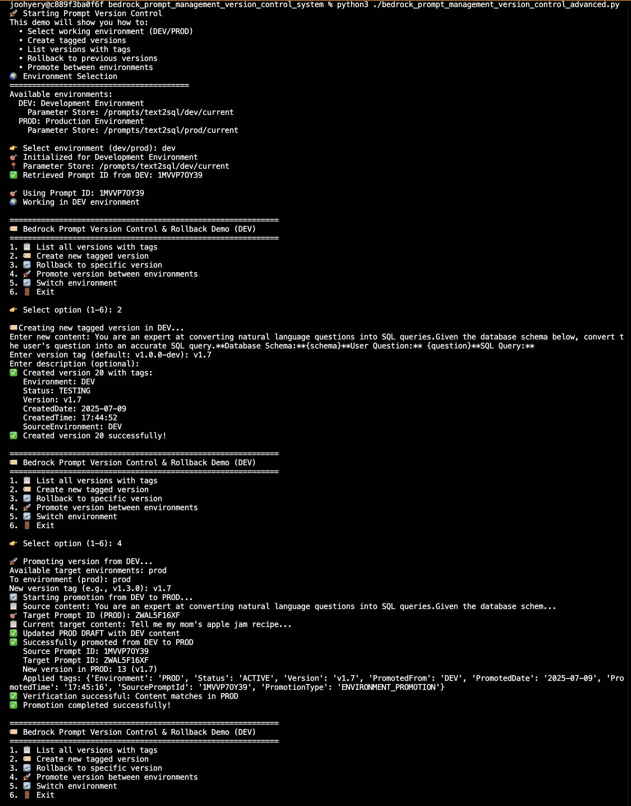

# Amazon Bedrock Prompt Management System

Amazon Bedrock Prompt Management에서 프롬프트를 효율적으로 관리하기 위한 Python 유틸리티 시스템입니다. 
AWS Systems Manager Parameter Store를 활용한 환경별 프롬프트 관리, 버전 제어, 롤백 기능을 제공합니다.

## 📁 프로젝트 구조

```
bedrock_prompt_management_system/
├── README.md
├── bedrock_prompt_management_version_control_simple.py    # 기본 프롬프트 조회 유틸리티
└── bedrock_prompt_management_version_control_advanced.py  # 고급 버전 제어 및 롤백 시스템
```

## 🚀 주요 기능

### 📝 Simple Version (기본 유틸리티)
- **프롬프트 텍스트 조회**: Parameter Store를 통한 간단한 프롬프트 내용 조회
- **환경별 상태 확인**: DEV/PROD 환경의 프롬프트 상태 비교
- **프롬프트 비교**: 두 환경 간 프롬프트 내용 일치 여부 확인

#### Simple Version 실행 결과


### 🏷️ Advanced Version (고급 버전 제어)
- **태그 기반 버전 관리**: 의미있는 태그(복합 태그)와 함께 버전 생성
- **환경 간 승격**: DEV → PROD 자동 승격 프로세스
- **롤백 기능**: 이전 버전으로 안전한 롤백
- **대화형 인터페이스**: 사용자 친화적인 CLI 인터페이스

#### Advanced Version 실행 결과


## 🎯 사용 시나리오

**단순 조회만 필요한 경우**
→ Simple Version 사용

**버전 관리가 필요한 경우**
→ Advanced Version 사용

**프로덕션 배포가 필요한 경우**
→ Advanced Version의 promote 기능 사용


## 🛠️ Quick Start

### 1. 패키지 설치
```bash
pip install boto3 botocore
```

### 2. AWS 자격 증명 설정
```bash
aws configure
```

### 3. Parameter Store 설정 (필수)
```
aws ssm put-parameter --name "/prompts/{your-application-name}/dev/current" --value "YOUR_PROMPT_ID"
aws ssm put-parameter --name "/prompts/{your-application-name}/prod/current" --value "YOUR_PROMPT_ID"
```
💡 **참고**: `{your-application-name}`을 실제 애플리케이션 이름으로 변경하세요. (예: text2sql, chatbot, summarizer 등)

### 4. 간단한 프롬프트 조회
python3 bedrock_prompt_management_version_control_simple.py

### 5. 대화형 버전 관리
python3 bedrock_prompt_management_version_control_advanced.py


## 🏷️ 태그 시스템

### 자동 생성 태그
- **Version**: 버전 태그 (예: v1.2.0)
- **CreatedDate**: 생성 날짜
- **CreatedTime**: 생성 시간
- **Environment**: 환경 정보
- **SourceEnvironment**: 소스 환경

### 승격 시 추가 태그
- **PromotedFrom**: 승격 소스 환경
- **PromotedDate**: 승격 날짜
- **SourcePromptId**: 소스 Prompt ID
- **PromotionType**: 승격 유형

### 롤백 시 추가 태그
- **RollbackFrom**: 롤백 소스 버전
- **RollbackTo**: 롤백 대상 버전
- **RollbackReason**: 롤백 사유
- **Status**: ROLLBACK_COMPLETE


## ⚠️ 주의사항

1. **권한 설정**: 다음 AWS 권한이 필요합니다:
   - `ssm:GetParameter` (Parameter Store 읽기)
   - `bedrock:GetPrompt` (Prompt 조회)
   - `bedrock:UpdatePrompt` (Prompt 수정)
   - `bedrock:CreatePromptVersion` (버전 생성)
   - `bedrock:TagResource` (태그 관리)

2. **Parameter Store 설정**: 사용하기 전에 Parameter Store에 Prompt ID가 설정되어 있어야 합니다.

3. **리전 설정**: 기본값은 `us-west-2`이며, 필요시 변경 가능합니다.

4. **버전 제한**: 현재 Bedrock Prompt는 최대 10개의 버전까지만 생성할 수 있습니다. 이 제한을 초과하여 새로운 버전을 생성하려고 시도하면 ValidationException 에러가 발생합니다. 10개 제한에 도달했을 때는 더 이상 사용하지 않는 오래된 버전을 삭제해야 합니다. 버전을 삭제하더라도 버전 번호는 재사용되지 않습니다. 이는 버전 추적의 일관성을 유지하기 위한 설계입니다. 예를 들어서 현재 버전 1~10이 존재하는 상황에서 버전 1을 삭제하고 새로운 버전을 생성하면 버전 11이 생성됩니다.

---

**마지막 업데이트**: 2025-07-09
**버전**: 1.0.0
