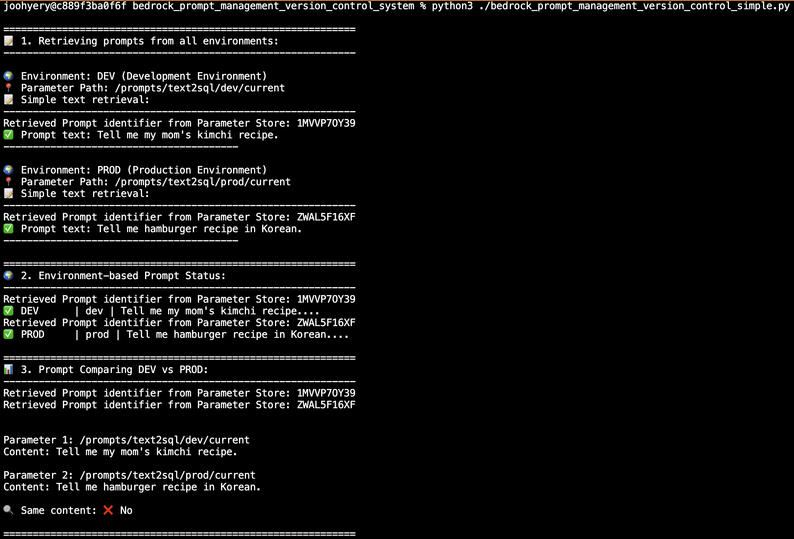
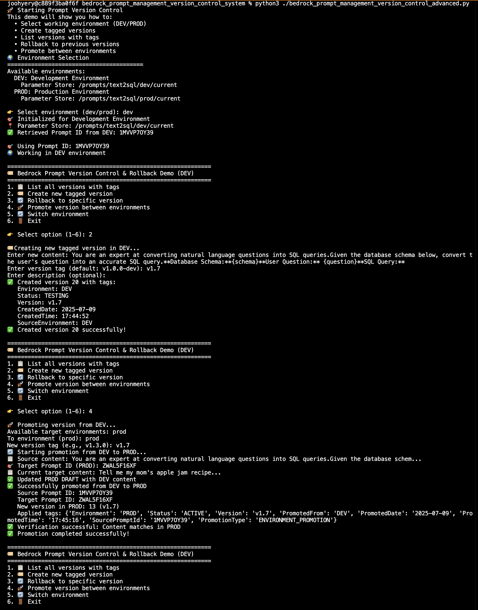

# Bedrock Prompt Management System

A Python utility system for efficiently managing prompts in Amazon Bedrock Prompt Management. 
Provides environment-specific prompt management, version control, and rollback functionality using AWS Systems Manager Parameter Store.

## 📁 Project Structure

```
bedrock_prompt_management_system/
├── README.md
├── bedrock_prompt_management_version_control_simple.py    # Basic prompt retrieval utility
└── bedrock_prompt_management_version_control_advanced.py  # Advanced version control and rollback system
```

## 🚀 Key Features

### 📝 Simple Version (Basic Prompt Retrieval Utility)
- **Prompt Text Retrieval**: Simple prompt content retrieval through Parameter Store
- **Environment Status Check**: Compare prompt status between DEV/PROD environments
- **Prompt Comparison**: Check content consistency between two environments

#### Simple Version execution results



### 🏷️ Advanced Version (Advanced Version Control)
- **Tag-based Version Management**: Create versions with meaningful tags (composite tags)
- **Cross-environment Promotion**: Automated DEV → PROD promotion process
- **Rollback Functionality**: Safe rollback to previous versions
- **Interactive Interface**: User-friendly CLI interface

#### Advanced Version execution results



## 🎯 Usage Scenarios

**When you only need simple retrieval**
→ Use Simple Version

**When version management is required**
→ Use Advanced Version

**When production deployment is needed**
→ Use the promote feature in Advanced Version

## 🛠️ Quick Start

### 1. Install Packages
```bash
pip install boto3 botocore
```

### 2. Configure AWS Credentials
```bash
aws configure
```

### 3. Configure Parameter Store (Required)
```
aws ssm put-parameter --name "/prompts/{your-application-name}/dev/current" --value "YOUR_PROMPT_ID"
aws ssm put-parameter --name "/prompts/{your-application-name}/prod/current" --value "YOUR_PROMPT_ID"
```
💡 **Note**: Replace `{your-application-name}` with your actual application name (e.g., text2sql, chatbot, summarizer, etc.)

### 4. Simple Prompt Retrieval
```bash
python3 bedrock_prompt_management_version_control_simple.py
```

### 5. Interactive Version Management
```bash
python3 bedrock_prompt_management_version_control_advanced.py
```


## 🏷️ Tag System

### Auto-generated Tags
- **Version**: Version tag (e.g., v1.2.0)
- **CreatedDate**: Creation date
- **CreatedTime**: Creation time
- **Environment**: Environment information
- **SourceEnvironment**: Source environment

### Additional Tags for Promotion
- **PromotedFrom**: Source environment for promotion
- **PromotedDate**: Promotion date
- **SourcePromptId**: Source Prompt ID
- **PromotionType**: Type of promotion

### Additional Tags for Rollback
- **RollbackFrom**: Source version for rollback
- **RollbackTo**: Target version for rollback
- **RollbackReason**: Reason for rollback
- **Status**: ROLLBACK_COMPLETE

## ⚠️ Important Notes

1. **Permission Setup**: The following AWS permissions are required:
   - `ssm:GetParameter` (Parameter Store read)
   - `bedrock:GetPrompt` (Prompt retrieval)
   - `bedrock:UpdatePrompt` (Prompt modification)
   - `bedrock:CreatePromptVersion` (Version creation)
   - `bedrock:TagResource` (Tag management)

2. **Parameter Store Setup**: Prompt IDs must be configured in Parameter Store before use.

3. **Region Configuration**: Default is `us-west-2`, can be changed as needed.

4. **Version Limitations**: Currently, Bedrock Prompt can only create up to 10 versions maximum. If you attempt to create a new version beyond this limit, a ValidationException error will occur. When the 10-version limit is reached, you must delete older versions that are no longer in use. Even after deleting versions, version numbers are not reused. This is by design to maintain consistency in version tracking. For example, if versions 1-10 currently exist and you delete version 1 and then create a new version, version 11 will be created.

---

**Last Updated**: 2025-07-09
**Version**: 1.0.0
