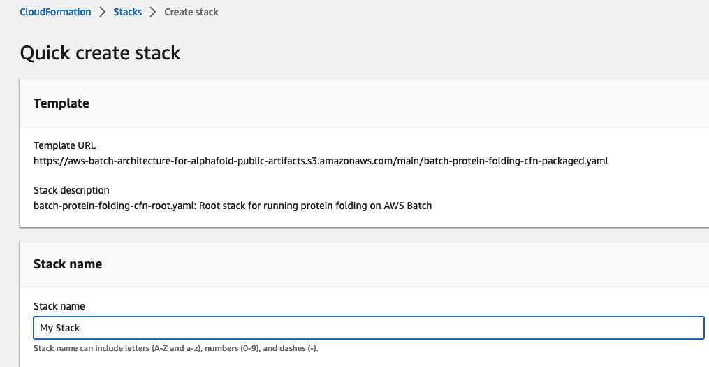
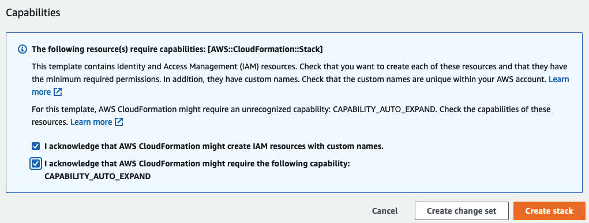

# Strands Agents & Amazon Bedrock AgentCore 워크샵
## 생명과학 및 헬스케어를 위한 AI Agent 개발

이 워크샵에서는 AWS의 새로운 오픈소스 프레임워크인 **Strands Agents**와 **Amazon Bedrock AgentCore** 서비스를 활용하여 생명과학 연구를 위한 AI Agent를 구축하는 방법을 실습합니다.

---

## 워크샵 개요

### 학습 목표
- Strands Agents 프레임워크 기초 이해 및 활용
- MCP (Model Context Protocol)를 통한 외부/내부 데이터베이스 통합
- Agent-as-Tool 패턴을 활용한 멀티 에이전트 시스템 구축
- Amazon Bedrock AgentCore를 통한 Production 배포

### 주요 기술 스택
- **Strands Agents**: AWS 오픈소스 AI Agent 프레임워크
- **Amazon Bedrock**: Claude 3.7 Sonnet 모델
- **MCP (Model Context Protocol)**: 표준화된 데이터 연동 프로토콜
- **AWS HealthOmics**: 단백질 설계 워크플로우
- **Amazon Bedrock AgentCore**: 서버리스 Agent 배포 플랫폼

---

## 워크샵 구성

### 📚 실습 노트북 (notebook/)

#### [00. 환경 설정](notebook/00_setup_environment.ipynb)
- 필수 패키지 설치 및 환경 구성
- AWS 계정 설정 및 권한 확인
- Bedrock 모델 액세스 활성화

#### [01. MCP를 통한 외부 데이터베이스 활용](notebook/01_external_dbs.ipynb)
**학습 내용:**
- MCP 서버 구성 및 클라이언트 연동
- Agent-as-Tool 패턴 이해 및 구현
- 멀티 에이전트 오케스트레이션

**연동 데이터베이스:**
- **ArXiv**: 학술 논문 및 프리프린트 검색
- **ChEMBL**: 화학 화합물 및 생물학적 활성 데이터
- **PubMed**: 생의학 문헌 검색
- **ClinicalTrials.gov**: 임상시험 정보 조회

#### [02. 내부 데이터베이스 활용](notebook/02_internal_dbs.ipynb)
**학습 내용:**
- Text-to-SQL 기술을 활용한 자연어 데이터베이스 쿼리
- PostgreSQL 내부 임상/유전체 데이터 분석
- 스키마 자동 탐색 및 쿼리 생성

**데이터셋:**
- `chemotherapy_survival`: 화학요법 후 환자 생존 데이터
- `clinical_genomic`: 폐암 환자 임상-유전체 통합 데이터 (50+ 컬럼)

**핵심 기능:**
- 복잡한 SQL 작성 없이 자연어로 데이터 조회
- 생존 분석, 유전자 발현량 비교, 돌연변이 분석

#### [03. 하이브리드 도구 활용](notebook/03_hybrid_tools.ipynb)
**학습 내용:**
- Amazon Bedrock Knowledge Base 연동
- 내부 문서와 외부 데이터베이스 통합 검색
- RAG (Retrieval-Augmented Generation) 패턴 구현

**활용 시나리오:**
- HER2 바이오마커 연구 증거 수집
- 내부 지식베이스 + PubMed 통합 검색

#### [04. 단백질 설계 with AWS HealthOmics](notebook/04_protein_design_strands.ipynb)
**학습 내용:**
- AWS HealthOmics 워크플로우 트리거
- 단백질 서열 최적화 작업 실행
- 워크플로우 상태 모니터링 및 결과 분석

**핵심 기능:**
- 방향성 진화 알고리즘 기반 단백질 최적화
- 사용자 정의 매개변수 설정 (병렬 체인, 최적화 단계)
- 실시간 워크플로우 모니터링

#### [05. Amazon Bedrock AgentCore로 Production 배포](notebook/05_production_agentcore.ipynb)
**학습 내용:**
- 모든 도구를 통합한 종합 Agent 구현
- 서버리스 환경에서 확장 가능한 Agent 운영

**통합 기능:**
- 외부 데이터베이스 (ArXiv, ChEMBL, PubMed, ClinicalTrials)
- 내부 데이터베이스 (PostgreSQL 임상/유전체 데이터)
- 단백질 설계 (AWS HealthOmics)
- Knowledge Base (RAG)

---

## 🌐 웹 애플리케이션 (application/)

워크샵 완료 후 실제 사용 가능한 웹 기반 데모 애플리케이션이 제공됩니다. Streamlit을 기반으로 구축되어 있으며, 실습한 모든 기능을 웹 인터페이스를 통해 체험할 수 있습니다.

**주요 기능:**
- 대화형 AI Agent 인터페이스
- 실시간 연구 질의 응답
- 다중 데이터 소스 통합 검색

---

## 사전 요구사항

### AWS 계정 및 권한
- AWS 계정 (Event Engine 또는 개인 계정)
- 다음 서비스에 대한 권한:
  - Amazon Bedrock (Claude 3.7 Sonnet 모델 액세스)
  - Amazon S3
  - Amazon RDS/Aurora (PostgreSQL)
  - AWS HealthOmics
  - Amazon Bedrock AgentCore

### SageMaker Studio Notebook 또는 로컬 환경에서 실습
- Python 3.9 이상
- Jupyter Notebook 또는 JupyterLab
- AWS CLI 구성

### 필수 AWS 리소스 배포
워크샵 실습을 위해 다음 CloudFormation 스택을 사전에 배포해야 합니다:
1. **네트워킹 인프라**: VPC, 서브넷 등
2. **Amazon Aurora PostgreSQL**: 임상/유전체 데이터베이스
3. **Amazon Bedrock Knowledge Base**: 내부 문서 저장소
4. **Protein Design Stack** (`stacks/protein_design_stack.yaml`): AWS HealthOmics 워크플로우

---

## 빠른 시작


### (직접 배포시) CloudFormation 배포하기 
0. 워크샵을 통해 기획된 레포이나, 아래의 방법을 통해 직접 배포하고 실험도 가능합니다. 다만 관련 비용이 청구되니 주의해 주세요.

1. 내 계정에 cloudformation stack 배포하기:

    | Region | Launch URL |
    | ------ | ---------- |
    | us-east-1 | [](https://us-east-1.console.aws.amazon.com/cloudformation/home#/stacks/create/review?templateURL=https://ws-assets-prod-iad-r-iad-ed304a55c2ca1aee.s3.us-east-1.amazonaws.com/fe97ac91-ff75-4753-a269-af39e7c3d765/unify.yaml) |
    | us-west-2 | [](https://us-west-2.console.aws.amazon.com/cloudformation/home#/stacks/create/review?templateURL=https://ws-assets-prod-iad-r-pdx-f3b3f9f1a7d6a3d0.s3.us-west-2.amazonaws.com/fe97ac91-ff75-4753-a269-af39e7c3d765/unify.yaml) |


2.  **Stack Name**, 고유한 값을 입력하세요.  **다음 단계**로 갑니다.
    
    
3. **AWS CloudFormation이 사용자 지정 이름으로 IAM 리소스를 생성할 수 있음을 인정합니다**를 선택후, **스택 만들기**를 선택하세요.  
    
   
4. AWS CloudFormation이 필요한 인프라 스택과 모듈 컨테이너를 생성하는 데 약 1시간 정도 기다립니다.


### 1. 환경 설정
```bash
# 저장소 클론
git clone <repository-url>
cd strands-agents-for-life-science

# 가상환경 생성 및 활성화
python -m venv .venv
source .venv/bin/activate  # Windows: .venv\Scripts\activate

# 기본 패키지 설치
pip install boto3 jupyter
```

### 2. Jupyter Notebook 실행
```bash
jupyter notebook
```

### 3. 실습 순서
1. `notebook/00_setup_environment.ipynb` - 환경 확인 및 설정
2. `notebook/01_external_dbs.ipynb` - 외부 DB 연동
3. `notebook/02_internal_dbs.ipynb` - 내부 DB 연동
4. `notebook/03_hybrid_tools.ipynb` - 하이브리드 도구
5. `notebook/04_protein_design_strands.ipynb` - 단백질 설계 도구 사용
6. `notebook/05_production_agentcore.ipynb` - Production 배포

---

## 주요 개념

### Agent-as-Tool 패턴
특수화된 에이전트를 도구로 변환하여 오케스트레이터 에이전트가 활용하는 패턴입니다. 각 에이전트는 특정 도메인(예: ArXiv 검색, ChEMBL 화합물 조회)에 전문화되어 있으며, 메인 에이전트가 이들을 적절히 선택하여 복합적인 연구 질문에 답변합니다.

### Text-to-SQL
자연어 질문을 SQL 쿼리로 자동 변환하는 기술입니다. 연구자는 복잡한 데이터베이스 스키마를 몰라도 "EGFR 돌연변이 환자의 생존율은?"과 같은 자연어 질문만으로 데이터를 조회할 수 있습니다.

### MCP (Model Context Protocol)
AI 에이전트가 다양한 데이터 소스 및 도구와 표준화된 방식으로 통신할 수 있게 해주는 오픈 프로토콜입니다. stdin/stdout 기반 JSON-RPC 메시징을 사용합니다.

---

## 활용 사례

### 신약 개발
- 타겟 발굴: PubMed/ArXiv에서 최신 연구 동향 파악
- 리드 발굴: ChEMBL에서 후보 화합물 검색
- 리드 최적화: HealthOmics로 단백질 구조 최적화
- 임상 전략: ClinicalTrials.gov에서 유사 임상시험 분석

### 정밀 의료
- 환자 맞춤형 치료: 내부 임상 데이터베이스에서 유사 환자 코호트 분석
- 바이오마커 발굴: 유전자 발현 데이터와 생존율 상관관계 분석
- 문헌 기반 의사결정: 최신 연구 증거 자동 수집 및 요약

### 연구 가속화
- 자동화된 문헌 조사: 여러 데이터베이스 동시 검색
- 데이터 통합 분석: 외부 공개 데이터 + 내부 임상 데이터 통합
- 가설 생성: AI 기반 패턴 발견 및 연구 방향 제시

---

## 프로젝트 구조

```
strands-agents-for-life-science/
├── notebook/                          # 실습 노트북
│   ├── 00_setup_environment.ipynb
│   ├── 01_external_dbs.ipynb
│   ├── 02_internal_dbs.ipynb
│   ├── 03_hybrid_tools.ipynb
│   ├── 04_protein_design_strands.ipynb
│   ├── 05_production_agentcore.ipynb
│   ├── documents/                     # Knowledge Base용 문서
│   ├── images/                        # 노트북 이미지
│   ├── stacks/                        # CloudFormation 템플릿
│   └── utils/                         # 헬퍼 함수
├── application/                       # 웹 데모 애플리케이션
│   ├── app.py                         # Streamlit 메인 앱
│   ├── mcp_server_*.py               # MCP 서버 구현
│   ├── pages/                         # 웹 페이지
│   ├── requirements.txt
│   └── README.md
└── README.md                          # 본 파일
```

---

## 문제 해결

### Bedrock 모델 액세스 오류
**증상**: "Access denied to model" 오류 발생
**해결**: AWS 콘솔에서 Bedrock > Model access로 이동하여 Claude 3.7 Sonnet 모델 활성화

### RDS 연결 실패
**증상**: PostgreSQL 연결 시 timeout 오류
**해결**:
- Security Group에서 포트 5432 인바운드 규칙 확인
- RDS 엔드포인트가 올바르게 설정되었는지 확인
- VPC 설정 및 노트북 환경 네트워크 확인

### MCP 서버 시작 실패
**증상**: MCP 클라이언트 연결 오류
**해결**:
- Python 버전 확인 (3.9 이상 필요)
- 필수 패키지 재설치: `pip install mcp arxiv chembl-webresource-client`

---

## 참고 자료

- [Strands Agents 공식 문서](https://strandsagents.com/)
- [Amazon Bedrock 문서](https://docs.aws.amazon.com/bedrock/)
- [Model Context Protocol (MCP)](https://modelcontextprotocol.io/)
- [AWS HealthOmics 문서](https://docs.aws.amazon.com/omics/)

---

## 보안 주의사항

이 코드는 **워크샵/데모 목적**으로 제작되었습니다. 프로덕션 환경에서 사용 시 SQL Injection 방지, 하드코딩된 자격 증명 제거 등 보안 강화가 필요합니다.

---

## 라이선스

이 프로젝트는 MIT-0 라이선스 하에 배포됩니다. 자유롭게 사용, 수정, 배포할 수 있습니다.

---

## 기여 및 피드백

질문이나 제안사항이 있으시면 GitHub Issues를 통해 문의해 주세요.

**워크샵을 즐기시고 생명과학 AI Agent 개발의 세계로 오신 것을 환영합니다!** 🧬🤖
