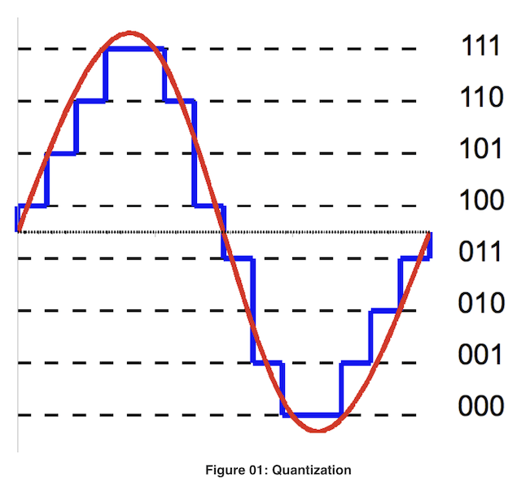
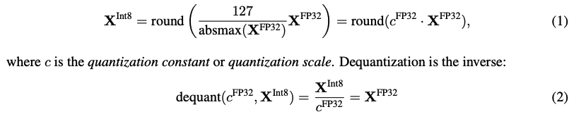
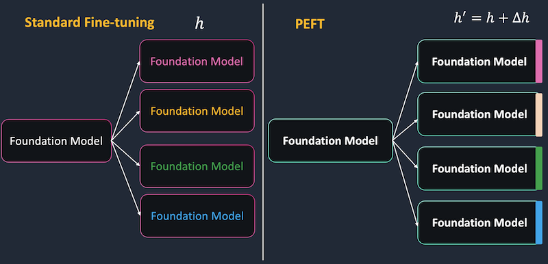
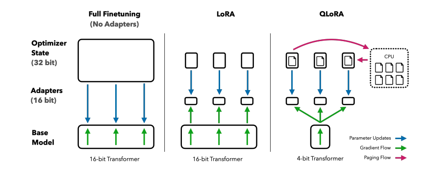
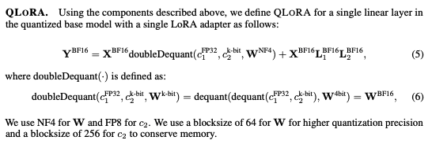
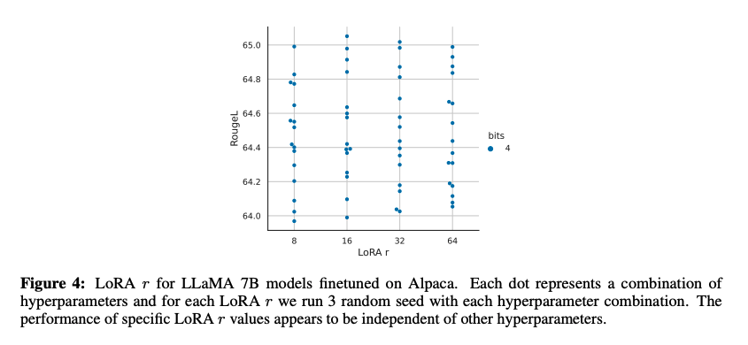
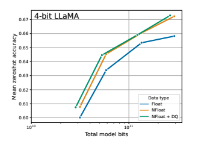

# QLORA: Efficient Finetuning of Quantized LLMs
"QLORA"는 대규모 언어 모델(Large Language Models, LLMs)을 효율적으로 파인튜닝(finetuning)하는 새로운 방법을 제시합니다. 이 방법은 단일 48GB GPU에서 65B 파라미터 모델을 파인튜닝할 수 있을 만큼 메모리 사용을 크게 줄입니다. QL O RA는 4비트로 양자화된 사전 훈련된 언어 모델을 통해 그래디언트를 역전파하여 Low Rank Adapters (LoRA)를 파인튜닝합니다. Amazon SageMaker에서는 Huggingface의 모델을 이용하여 QLORA 파인튜닝을 쉽게 할수 있습니다

논문링크 : https://arxiv.org/pdf/2305.14314.pdf

> **참고:** 본 코드는 SageMaker Notebook Instance에서 구현, 동작 검증 되었습니다. konlpy등 Java가 필요한 패키지들과 로컬 GPU 인스턴스에서 PEFT 파인튜닝하는 과정이 있기 때문입니다.
>
> **테스트 인스턴스 사양:**
> - 타입: ml.g5.2xlarge(A10G 1개) ~ ml.g5.12xlarge(A10G 4개)
> - EBS: 100기가 이상
>
> **코드 실행 순서:**
> 1. 데이터 학습 전처리 
>    - `1_prepare-dataset-alpaca-method.ipynb`
>    - `1_prepare-dataset-chunk-method.ipynb`
>
> 2. 로컬 QLoRA PEFT 학습
>    - `2_local-train-debug-lora.ipynb`
>    - ml.g5.xlarge 에서 동작 테스트 했습니다.
>
> 3. 로컬 QLoRA PEFT LLM 로드 및 테스트
>    - `2_local-infer-debug-lora.ipynb`
>    - ml.g5.xlarge 에서 동작 테스트 했습니다.
>
> 4. SageMaker training job - QLoRA PEFT
>    - `3_sm-train-lora.ipynb`
>    - 코드에 ml.g5.12xlarge에서 학습 인스턴스 설정되어있습니다.
>
> 5. SageMaker Endpoint API 추론배포 - QLoRA PEFT
>    - `4_sm-serving-djl.ipynb`
>    - 코드는 QLoRA 학습파라미터를 Merge한 원본 파라미터를 사용해서 추론합니다. 
>    - ml.g5.12xlarge 이상부터 가능합니다. (A10G 4대가 필요합니다.)

## 1. Introduction
대규모 언어 모델(Large Language Models, LLMs)을 파인튜닝(finetuning)하는 것은 그 성능을 향상시키는 매우 효과적인 방법이지만, 매우 큰 모델을 파인튜닝하는 것은 고비용이며 많은 GPU 메모리가 필요합니다. 예를 들어, 65B 파라미터를 가진 LLaMA 모델을 일반적인 16비트 파인튜닝으로 훈련시키려면 780GB 이상의 GPU 메모리가 필요합니다. 이러한 문제를 해결하기 위해 QL O RA 방법이 제안되었습니다. 이 방법은 4비트로 양자화된 모델을 파인튜닝하면서 성능 저하 없이 메모리 사용량을 크게 줄입니다. 이를 통해 단일 GPU에서도 대규모 모델을 파인튜닝할 수 있게 되어, 이러한 모델의 접근성이 크게 향상됩니다.

## 2. QLORA 이해를 위한 백그라운드

### 2-a.Block-wise k-bit Quantization

#### 개념

- **양자화(Quantization)**: 입력 데이터를 더 적은 정보를 가진 표현으로 변환하는 과정입니다. 일반적으로 더 많은 비트를 가진 데이터 타입을 더 적은 비트로 변환합니다. 예를 들어, 32-bit 부동소수점을 4-bit 정수로 변환할 수 있습니다.
  

 
 
  <a href="https://www.differencebetween.com/difference-between-uniform-and-nonuniform-quantization/">What is Quantization in the signal?</a>

#### 기본 방법

- **정규화(Normalization)**: 낮은 비트 데이터 타입의 전체 범위가 사용되도록 입력 데이터 타입은 대상 데이터 타입 범위로 정규화됩니다. 이는 입력 요소의 절대 최대값으로 정규화하여 이루어집니다.
- **양자화 상수(Quantization Constant)**: 이 상수는 양자화 과정에서 사용되며, 일반적으로 $c$로 표시됩니다.
- For example, quantizing a 32-bit Floating Point (FP32) tensor into a Int8 tensor with range $[−127, 127]$
  

 

#### 문제점

- **아웃라이어(Outlier)**: 입력에 큰 크기의 값이 있을 경우, 양자화 빈(quantization bins)이 잘 활용되지 않을 수 있습니다.
#### 해결 방법

- **블록별 양자화(Block-wise Quantization)**: 이 문제를 해결하기 위해 입력 텐서를 독립적으로 양자화되는 블록으로 분할합니다. 각 블록은 자체 양자화 상수 $\( c \)$를 가집니다.

- **블록 크기(Block Size)**: 입력 텐서는 $\( B \)$ 크기의 블록으로 분할되며, 이러한 블록은 독립적으로 양자화됩니다.

### 2-b. Low-rank Adapters (LoRA)

**Low-rank Adapters (LoRA)**는 파인튜닝(finetuning) 과정에서 메모리 요구 사항을 줄이기 위한 방법입니다. 이 방법은 작은 수의 훈련 가능한 매개변수, 즉 어댑터를 사용하면서 전체 모델 매개변수는 고정된 상태로 둡니다. 
  

    
  

#### 작동 원리
- 확률적 경사 하강법(stochastic gradient descent) 동안 그래디언트는 고정된 사전 훈련된 모델 가중치를 통과하여 어댑터로 전달됩니다.
- 이 어댑터는 손실 함수를 최적화하기 위해 업데이트됩니다.

LoRA는 선형 투영(linear projection)을 추가적인 팩터화된 투영(factorized projection)으로 확장합니다. 주어진 투영 $XW = Y$이 있을 때, $\( X \in R^{b \times h}$, $W \in R^{h \times o} \)$, LoRA는 다음과 같이 계산됩니다:

$$Y = XW + sXL_1 L_2 ,$$

여기서 $\( L_1 \in R^{h \times r} \)$와 $\( L_2 \in R^{r \times o} \)$이고, $\( s \)$는 스칼라입니다.

#### 메모리 효율성
- LoRA의 메모리 요구 사항은 매우 작기 때문에, 더 많은 어댑터를 사용하여 성능을 향상시킬 수 있습니다.
- 이는 전체 메모리 사용량을 크게 증가시키지 않으면서도 가능합니다.

### 2-c. Memory Requirement of Parameter-Efficient Finetuning

논문에서는 Parameter Efficient Finetuning (PEFT) 방법을 사용할 때 대부분의 메모리 사용량이 활성화 그래디언트(activation gradients)에서 발생하며, LoRA 매개변수에서는 상대적으로 적은 메모리만 사용한다고 설명하고 있습니다.

예를 들어, 7B LLaMA 모델을 FLAN v2 데이터셋과 배치 크기 1로 훈련할 때, LoRA 가중치는 원래 모델 가중치의 0.2%에 해당합니다. 이 경우, LoRA 입력 그래디언트는 567 MB의 메모리를 차지하는 반면, LoRA 매개변수는 단지 26 MB만 차지합니다.

그래디언트 체크포인팅을 사용하면 입력 그래디언트의 메모리 사용량은 시퀀스당 평균 18 MB로 줄어들며, 이는 모든 LoRA 가중치의 메모리 사용량보다 더 많습니다. 이를 통해 그래디언트 체크포인팅이 중요하다는 것과 함께, LoRA 매개변수의 양을 크게 줄이는 것은 메모리 효율성에 큰 영향을 미치지 않는다는 것을 강조하고 있습니다.

이 정보는 더 많은 어댑터를 사용하면서도 전체 훈련 메모리 사용량을 크게 증가시키지 않을 수 있음을 의미합니다.

## 3. QLORA Finetuning의 핵심 3가지
> 참고: 이 정보는 QLORA의 효율성과 성능을 높이는 데 중요한 역할을 합니다.
  

    
  

QLORA는 LoRA를 개선하기 위해 트랜스포머 모델을 4비트 정밀도로 양자화하고, 메모리 스파이크를 처리하기 위해 페이지드 옵티마이저를 사용합니다.
이는 기본적으로 QLORA가 LoRA에 비해 메모리 사용량을 줄이면서도 성능을 유지하거나 향상시키는 방법을 제시한다는 것을 의미합니다. 4비트 정밀도로 모델을 양자화하면 메모리 사용량이 줄어들고, 페이지드 옵티마이저는 메모리 사용량이 급증하는 상황을 효과적으로 관리해줍니다.

### 3-a. 4-bit NormalFloat 양자화

4-bit NormalFloat 양자화는 QLORA에서 중요한 구성 요소로, 정보 이론적으로 최적으로 설계되었습니다. 이는 4-bit 정수(Int4)와 4-bit 실수(FP4)에 비해 더 나은 경험적 결과를 제공합니다.

#### 작동 원리
NormalFloat (NF)는 Quantile 양자화에 기반을 두고 있으며, 이는 정보 이론적으로 최적의 데이터 유형입니다. QLORA의 가중치 텐서 $\( W \)$가 사용될 때, 이 텐서는 BFloat16으로 역양자화되어 $\( W' \)$가 됩니다. 그 후, 16-bit에서 행렬 곱셈이 수행됩니다:

$\[
Y = X \times W' 
\]$

여기서 $\( Y \)$는 출력 텐서, $\( X \)$는 입력 텐서, $\( W' \)$는 역양자화된 가중치 텐서입니다.

#### 성능
논문의 실험 결과에 따르면, 4-bit NormalFloat (NF4)는 4-bit 실수 (FP4)와 4-bit 정수 (Int4)보다 더 나은 성능을 보입니다. 또한, 이 데이터 유형은 16-bit 전체 파인튜닝 및 16-bit LoRA 파인튜닝 성능과 일치한다고 합니다.

#### 메모리 절약
4-bit NormalFloat는 메모리 사용량을 줄이면서도 성능을 유지하거나 향상시키는 데 도움이 됩니다. 이는 특히 메모리 제한이 있는 환경에서 유용합니다.

### 3-b. Double Quantization

#### 개요
Double Quantization은 QLORA의 중요한 구성 요소 중 하나로, 양자화 상수를 다시 양자화하는 방법입니다. 이는 평균적으로 매개변수 당 약 0.37비트를 절약하며, 65B 모델에 대해 약 3GB의 메모리를 절약할 수 있습니다.

#### 작동 원리
Double Quantization은 기본적으로 양자화 상수 자체를 양자화하는 과정입니다. 일반적인 양자화에서는 데이터를 양자화하여 메모리를 절약하지만, 양자화 상수는 여전히 저장되어 있어야 합니다. Double Quantization은 이러한 양자화 상수까지도 양자화하여 추가적인 메모리 절약을 달성합니다.

#### 성능
논문의 실험 결과에 따르면, Double Quantization은 성능을 저하시키지 않으면서 메모리를 효과적으로 절약합니다. 이는 4-bit QLORA가 16-bit 전체 파인튜닝 및 16-bit LoRA 파인튜닝 성능과 일치한다는 것을 뒷받침합니다.

#### 메모리 절약
Double Quantization은 평균적으로 매개변수 당 약 0.37비트를 절약합니다. 이는 큰 모델, 특히 65B 모델에 대해 약 3GB의 메모리를 절약할 수 있습니다.

### 3-c. Paged Optimizers

#### 개요
Paged Optimizers는 NVIDIA의 통합 메모리 기능을 활용하여 긴 시퀀스 길이의 미니배치를 처리할 때 발생하는 그래디언트 체크포인팅 메모리 스파이크를 피하는 기술입니다.

#### 작동 원리
Paged Optimizers는 NVIDIA의 통합 메모리를 사용하여 CPU와 GPU 사이의 페이지-페이지 전송을 자동으로 수행합니다. 이 기능은 GPU가 메모리를 초과할 경우 오류 없이 처리를 계속할 수 있게 해줍니다. 최적화기의 상태에 대한 페이지 메모리를 할당하고, GPU가 메모리를 초과하면 이를 CPU RAM으로 자동 이동시킵니다. 필요한 경우, 최적화기 업데이트 단계에서 다시 GPU 메모리로 페이지를 되돌립니다.

#### 성능
논문에 따르면, Paged Optimizers는 65B 모델에 대해 48GB GPU에서 배치 크기가 16일 때 일반 최적화기와 동일한 훈련 속도를 제공합니다. 그러나 이 기술이 언제 느려질지에 대한 측정은 미래의 작업에서 이루어져야 합니다.

#### 메모리 관리
이 기술은 특히 33B/65B 크기의 QLORA 모델을 단일 24/48GB GPU에서 튜닝할 때 중요합니다. 긴 시퀀스 길이의 미니배치를 처리할 때만 페이징이 발생하기 때문에, 이는 드문 경우입니다.

 

##### 참조 
- 그래디언트 체크포인팅(Gradient Checkpointing)

 딥 러닝 모델을 훈련할 때 메모리 사용량을 줄이기 위한 기술입니다. 일반적으로 딥 러닝 모델을 훈련시키려면 각 계층에서의 중간 출력값을 저장해야 합니다. 이 중간 출력값은 역전파(Backpropagation) 과정에서 그래디언트를 계산할 때 필요합니다. 그러나 이러한 중간 출력값을 모두 저장하면 많은 양의 메모리가 필요하게 됩니다.
그래디언트 체크포인팅은 이러한 중간 출력값을 일부만 저장하고, 나머지는 필요할 때 다시 계산하는 방식으로 메모리 사용량을 줄입니다. 이로 인해 계산 시간은 약간 늘어날 수 있지만, 메모리 사용량은 크게 줄어듭니다.

-  메모리 스파이크(Memory Spike)

그러나 그래디언트 체크포인팅을 사용하면 특정 시점에서 메모리 사용량이 급격히 증가하는 현상, 즉 "메모리 스파이크"가 발생할 수 있습니다. 이는 특히 긴 시퀀스를 처리할 때 더욱 두드러집니다. 이러한 메모리 스파이크 때문에 훈련 과정이 중단될 수 있으므로, 이를 관리하는 방법이 필요합니다.

## 4.  QLoRA vs. Standard Finetuning

### 4-a. Default LoRA Hyperparameters Do Not Match 16-bit Performance

LoRA (Low-rank Adapters)의 기본 하이퍼파라미터 설정은 16비트 설정과 일치하지 않습니다.

#### 주요 내용
논문에서는 LoRA의 기본 하이퍼파라미터 설정이 큰 기본 모델에 대한 전체 파인튜닝 성능을 복제할 수 없다는 것을 보여줍니다. 따라서, LoRA를 모든 트랜스포머 계층에 적용하는 것이 중요하며, 이를 통해 16비트 스텐다드 성능을 달성할 수 있다고 주장함.

1. **LoRA 어댑터의 중요성**
   - 논문에서는 LoRA 어댑터의 수가 얼마나 중요한지, 그리고 모든 선형 트랜스포머 블록 계층에서 LoRA가 필요한지를 논의합니다. 이는 Alpaca 데이터셋에서 LLaMA 7B 모델을 파인튜닝할 때의 결과를 통해 확인되었습니다.

2. **다른 하이퍼파라미터의 영향**
   - 논문에서는 다른 LoRA 하이퍼파라미터, 예를 들어 투영 차원 $\( r \)$,이 성능에 미치는 영향이 없다고 언급합니다 (부록 A 참조).

 

   - LoRA dropout : 은 0.0, 0.05, 0.1 중에서 선택할 수 있습니다. 작은 모델(7B, 13B)에 대해서는 LoRA dropout 0.05가 유용하다고 판단되었습니다. 
   - 그러나 더 큰 모델(33B, 65B)에 대해서는 LoRA dropout 0.05가 유용하지 않았습니다.또한, 모델 크기가 최대 13B까지는 LoRA dropout을 0.1로 설정하고, 33B와 65B 모델에 대해서는 0.05로 설정했습니다.
   - 이 정보를 기반으로 모델의 크기와 성능에 따라 LoRA dropout 값을 조정할 수 있음을 나타냅니다. 이는 과적합을 방지하고 모델의 일반화 성능을 향상시키는 데 도움이 된다고 판단할수 있습니다.

3. **16비트 성능과의 비교**
   - 논문에서는 LoRA를 모든 트랜스포머 계층에 적용할 경우에만 16비트 성능과 일치한다고 설명

### 4-b. 4-bit NormalFloat은 4-bit Floating Point보다 더 나은 성능을 보임

4비트 NormalFloat (NF4)가 표준 4비트 부동 소수점 (FP4)보다 어떤 실증적 이점이 있는지에 대해 논의합니다.

 

#### 주요 포인트

1. **정보 이론적 최적성**
   - 4비트 NormalFloat (NF4) 데이터 유형은 정보 이론적으로 최적이라고 설명되어 있습니다. 이는 데이터를 가장 효율적으로 표현하기 위해 설계되었습니다.

2. **실증적 이점**
   - 논문은 언어 모델링과 일련의 제로샷 작업에 대한 다양한 데이터 유형의 성능을 평가하기 위해 이전 연구의 설정을 따릅니다. 결과적으로 NF4가 FP4와 Int4보다 성능을 크게 향상시킨다고 나와 있습니다.

3. **메모리 사용량**
   - 논문에서는 더블 양자화가 성능을 저하시키지 않으면서 메모리 사용량을 줄인다고 언급합니다.

4. **16비트와의 비교**
   - 논문은 NF4와 더블 양자화가 16비트 성능을 완전히 회복한다고 덧붙여, NF4가 양자화 정밀도 측면에서 FP4보다 우수하다고 주장합니다.

5. **일관된 결과**
   - 논문은 4비트 QLoRA와 NF4 데이터 유형이 학술적 벤치마크에서 16비트 전체 파인튜닝 및 16비트 LoRA 파인튜닝 성능과 일치한다고 요약합니다.

논문은 4비트 NormalFloat가 특히 QLoRA 파인튜닝의 맥락에서 4비트 부동 소수점보다 더 효과적인 데이터 유형이라고 제시합니다. 
예를 들어, 언어 모델링 작업에서 NF4를 사용하면 FP4를 사용할 때보다 더 높은 정확도를 달성할 수 있습니다. 이는 NF4가 데이터를 더 효율적으로 표현하고, 따라서 더 나은 성능을 제공하기 때문입니다. 이러한 차이점은 NF4를 더 효과적인 데이터 유형으로 만들며, 특히 QLoRA 파인튜닝과 같은 상황에서는 FP4보다 더 우수한 성능을 보인다고 제시. 

논문에서 제시한 Appendix E의 NormalFloat 4bit을 보면, 주어진 값은 일반적인 부동소수점 (Floating Point)과 다르게, 특정한 분포나 규칙을 따르는것으로 보입니다. 
일반적인 부동소수점은 균일한 간격으로 값을 표현하지만, NormalFloat의 특징은 아래와 같습니다. 
4-bit NormalFloat는 정보이론적인 최적화된 양자화 방식으로 일반적인 부동소수점과는 다르게, 데이터의 특정 분포나 특성을 반영한다고 논문에서 제사합니다. 

- 비대칭 분포: 값들이 0을 중심으로 비대칭적으로 분포되어 있습니다.
- 비선형 간격: 값들 사이의 간격이 일정하지 않고, 비선형적입니다. 이는 일반적인 부동소수점에서는 보기 힘든 특성입니다.
- 한정된 범위: 값들이 -1.0에서 1.0 사이에 한정되어 있습니다.

#### Appendix E
- NormalFloat 4-bit data type
The exact values of the NF4 data type are as follows:
$$[-1.0, -0.6961928009986877, -0.5250730514526367,
-0.39491748809814453, -0.28444138169288635, -0.18477343022823334,
-0.09105003625154495, 0.0, 0.07958029955625534, 0.16093020141124725,
0.24611230194568634, 0.33791524171829224, 0.44070982933044434,
0.5626170039176941, 0.7229568362236023, 1.0]$$

### 4-c. k-bit QLORA는 16-bit 전체 파인튜닝 및 16-bit LoRA 성능과 일치

논문에서는 k-bit QLORA가 16-bit 전체 파인튜닝과 16-bit LoRA 파인튜닝 성능과 일치한다고 주장합니다. 이는 학술적 벤치마크에서의 실험 결과를 통해 확인하고, 
k-bit QLORA는 더 적은 메모리와 연산을 사용하면서도 16-bit의 전체 파인튜닝과 LoRA 파인튜닝 성능과 일치하는 높은 성능을 보이는 것으로 확인되었습니다. 이는 k-bit QLORA의 효율성과 범용성을 강조했습니다.

#### 주요 포인트

1. **성능 일치**
   - k-bit QLORA는 16-bit의 전체 파인튜닝과 LoRA 파인튜닝 성능과 일치하는 높은 성능을 보입니다. 논문의 벤치마크에서 일치한다고 주장함.

2. **효율성**
   - k-bit QLORA는 더 적은 비트를 사용하면서도 16-bit 성능을 달성합니다. 이는 메모리와 연산 효율성 측면에서 중요한 의미를 가집니다.

3. **범용성**
   - 이 결과는 다양한 작업과 데이터셋에서 일관되게 나타나, k-bit QLORA의 범용성을 입증합니다.

### 4-d. 요약

#### 주요 내용:
논문은 4-bit QLORA가 높은 성능을 유지하면서도 메모리와 연산 효율성을 향상시킬 수 있다는 중요한 포인트를 강조합니다.
1. **성능 일치**
   - 4-bit QLORA는 NF4 데이터 유형을 사용하여 16-bit 전체 파인튜닝과 16-bit LoRA 파인튜닝 성능과 일치합니다. 이는 학술적 벤치마크에서 잘 정립된 평가 설정을 사용하여 설명합니다.

2. **NF4의 효과성**
   - NF4 데이터 유형이 FP4보다 더 효과적이라고 제시

3. **더블 양자화의 효과**
   - 논문은 더블 양자화(double quantization)가 성능을 저하시키지 않는다는 것을 소개

4. **종합적 효과**
   - 논문에서는 이러한 결과들은 4-bit QLORA 파인튜닝이 16-bit 방법과 일치하는 결과를 안정적으로 가져온다는 결론을 제시합니다.

