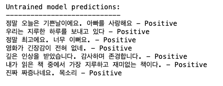
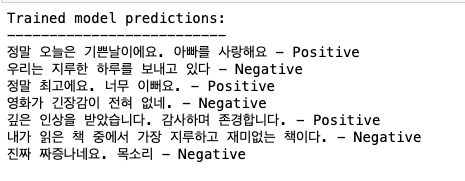

# PEFT-Huggingface-LoRA-Korean-Data

- 이 예제는 "Fine-tuning Large Language Models(LLMs)" 논문을 기반으로 만들어졌습니다.
- SageMaker에서 Naver sentiment movie corpus 한국어 데이터셋을 사용하여 Hugginface의 LoraConfig 클래스를 사용한 LoRA의 low rank Adaptation 파인튜닝 기법으로 텍스트 분류 모델을 훈련하는 코드를 포함하고 있습니다.
- Huggingface PEFT LoRA의 사용방법과 이해에 초점을 맞춘 코드로 모델은 간단한 BERT를 사용합니다. 
- LoRA는 언어 모델을 더욱 적응성 있고 효율적으로 만드는 방법입니다. 각 작업에 대해 전체 모델을 다시 훈련하는 대신, LoRA는 사전 훈련된 모델을 고정하고 각 모델 층에 작은 크기의 훈련 가능한 행렬을 추가합니다. 이러한 행렬들은 모든 매개변수를 변경하지 않고도 모델이 다양한 작업에 적응하도록 돕습니다.

## Table of Contents
- [환경설정](#환경설정)
- [사용법](#사용법)
- [모델아키텍처](#모델아키텍처)
- [학습](#학습)
- [추론](#추론)
- [References](#references)

## 환경설정

이 저장소의 코드를 사용하기 전에 필수 패키지 라이브러리를 설치해야 합니다. 다음 명령을 실행하여 이 작업을 수행할 수 있습니다. ipynb파일 첫 블럭에 설정되어있습니다.
이 명령은 tokenizing dataset 타입, transformers 패키지, LoRA 및 평가 지표 작업에 필요한 Python 라이브러리를 설치합니다.
```bash
!pip install datasets transformers peft evaluate
```
---------------------------------------


## 사용법

이 저장소의 코드를 사용하는 방법은 다음과 같습니다:

1. **Naver sentiment movie corpus 데이터셋 로드**:

Naver sentiment movie corpus은 한국어 영화 리뷰에서 가져온 문장들로 구성되어 있으며, 감정 라벨이 지정되어 있습니다.
한국어 영화 리뷰 데이터셋에 대한 자세한 정보는 [여기](https://github.com/e9t/nsmc)에서 확인할 수 있습니다.
코드는 dataframe으로 로드한 다음, Hugging Face의 `datasets` 라이브러리를 사용하여 데이터셋을 변환합니다.

2. **LoRA 모델 아키텍처 정의**:

   코드는 LoRA 기법을 사용하여 사전 학습된 언어 모델을 텍스트 분류 작업에 맞게 파인튜닝합니다. LoRA는 가중치 차이의 low-rank 특성을 활용하여 모델을 효율적으로 작업에 적용시키게 됩니다. Huggingface LoRA의 구현은 코드에 포함되어 있으며 [여기](https://huggingface.co/docs/peft/task_guides/lora_based_methods)에서 문서를 확인 할수 있습니다.

3. **데이터셋 토큰화**:

   데이터셋은 roberta 모델의 토큰화를 사용하여 토큰 변환되며, `[PAD]`와 같은 특수 토큰이 아직 없는 경우 추가됩니다.

   - 예시:
     - 배치 크기: 2
     - 최대 길이(maximum length): 5

     - 입력 문장:
        - 1. "The quick brown fox"
        - 2. "This is a long sentence"

     - 토크나이저에 의해 토큰화된 결과:
        - 1. `["The", "quick", "brown", "fox"]`
          - 문장의 길이: 4
        - 2. `["This", "is", "a", "long", "sentence"]`
          - 문장의 길이: 5

     - `[PAD]` 토큰 적용 후 결과:
        - 1. `["The", "quick", "brown", "fox", "[PAD]"]`
        - 2. `["This", "is", "a", "long", "sentence"]`


4. **LoRA 모델 학습**:

   코드는 학습 하이퍼파라미터를 정의하고 제공된 데이터셋을 사용하여 LoRA 적응 모델을 학습합니다. 학습률, 배치 크기, 에폭 수 등의 학습 인수는 `training_args` 변수에서 조정할 수 있습니다.
   Huggingface `LoraConfig` 클래스는 LORA 설정을 정의하는 데 사용합니다:   
   LoRA는 가중치 업데이트 행렬을 두 개의 작은 행렬로 분해합니다. 이러한 low-rank 행렬의 크기는 rank (r)에 의해 결정됩니다.

    - 1. `task_type="SEQ_CLS"`: 수행할 작업의 유형을 나타냅니다. `SEQ_CLS`는 시퀀스 분류(sequence classification) 작업을 의미합니다.
    - 2. `r`: LORA 랭크(rank)를 설정합니다. 높은 랭크는 더 많은 메모리를 사용하지만 모델 성능을 향상시킬 수 있습니다.높을수록 모델에 훈련할 매개변수가 더 많다는 의미일 뿐만 아니라 모델의 학습 용량도 더 크다는 의미입니다.
    - 3. `lora_alpha`: LORA 스케일링 계수(scaling factor)를 설정합니다. 이 값은 LORA 매개변수의 크기를 조절합니다.
    - 4. `lora_dropout`: LORA 드롭아웃(dropout) 비율을 설정합니다. 드롭아웃은 과적합(overfitting)을 방지하는 데 사용됩니다.
    - 5. `target_modules`: LORA를 적용할 모듈을 지정합니다. 여기서는 'query' 모듈에 LORA를 적용하도록 설정되어 있습니다. 분해된 작은 행렬이 삽입되는 결정된 위치입니다.

5. **학습된 LoRA 모델로 추론**:

   학습 후에는 학습된 LoRA 적응 모델을 사용하여 새로운 텍스트 입력에 대한 추론을 수행할 수 있습니다. 코드에는 모델을 로드하고 예제 문장 목록에 대한 예측을 수행하는 방법이 포함되어 있습니다.


---------------------------------------


## 모델아키텍처

이 코드는 사전 훈련된 언어 모델 아키텍처를 기반으로 하는 텍스트 분류 모델을 사용합니다. LoRA 파인튜닝(fine-tuning)이 이 사전 훈련된 모델을 효율적으로 적응시키기 위해 적용됩니다. LoRA 기술은 가중치 차이의 low-rank 구조를 활용하여 adaptation 성능을 향상시킵니다.

LoRA 기술에 대한 자세한 내용은 [LoRA 논문](https://arxiv.org/abs/2106.09685)을 참조하세요.

예제로 사용한 Attention Model은 RoBERTa이며 한국어 문장이 재학습되어있는 [klue/roberta-large](https://huggingface.co/klue/roberta-large) 를 사용해서 비교적 적은 epoch만으로도 높은 한국어 인식 성능의 lora 파인튜닝을 얻을 수 있습니다. klue의 논문은[여기](https://arxiv.org/pdf/2105.09680.pdf)서 확인합니다. 
기본 RoBERTa는 self-supervised 방식으로 대규모 영어 데이터 코퍼스에 대해 사전 훈련된 변환기 모델입니다. 텍스트에서 입력 및 레이블을 생성하는 자동 프로세스를 통해 인간이 어떤 방식으로든 레이블을 지정하지 않고 원시 텍스트에 대해서만 사전 학습되었음을 의미합니다.

---------------------------------------

## 학습

이 자료에서 LoRA 적응 모델을 학습하려면 아래 단계를 거칩니다.

1. [환경설정](#환경설정) 섹션에 언급된 대로 필수 라이브러리를 설치합니다.

2. 훈련 데이터세트를 정의하거나 제공된 한국어 네이버영화 데이터세트를 사용합니다.

3. 코드에서 모델 아키텍처와 하이퍼파라미터를 구성합니다.

4. 훈련 코드를 실행하면 데이터 세트에서 LoRA 기술을 사용하여 모델이 파인튜닝됩니다.

---------------------------------------

## 추론

학습 후에는 새로운 텍스트 입력에 대한 추론을 위해 학습된 LoRA 적응 모델을 사용할 수 있습니다. 

1. 코드에 설명된 대로 훈련된 LoRA 적응 모델을 로드합니다.

2. 모델의 토크나이저를 사용하여 입력 텍스트를 토큰화합니다.

3. 감정 분류를 위해 토큰화된 입력을 모델에 전달합니다.

4. 모델은 입력 텍스트에 긍정적인 감정이 있는지 부정적인 감정이 있는지 예측합니다.

## 학습되지 않은 klue/roberta-large 모델 예측




## PEFT LoRA 학습된 klue/roberta-large 모델 예측




## References
- [LoRA Paper](https://arxiv.org/abs/2106.09685)
- [KLUE Paper](https://arxiv.org/pdf/2105.09680.pdf)
- [KLUE Benchmark](https://github.com/KLUE-benchmark/KLUE)
- [klue/roberta-large](https://huggingface.co/klue/roberta-large)
- [한국어 영화 리뷰 데이터셋](https://github.com/e9t/nsmc)
