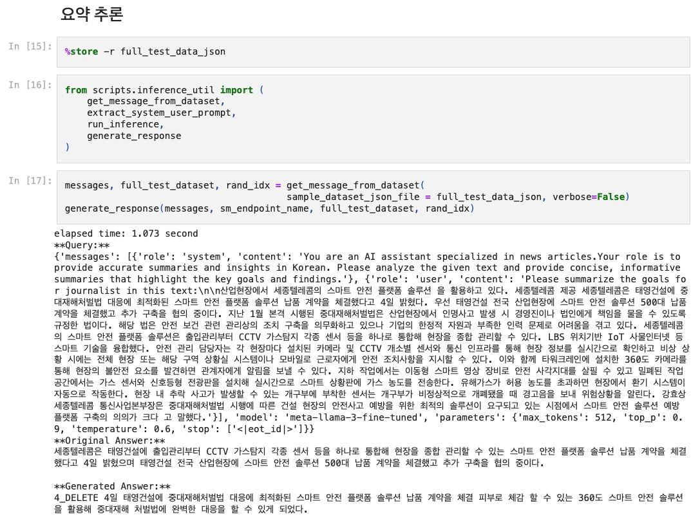

# SageMaker 에서 Llama3-8B 파인 튜닝하기

Updated: July 15, 2024

---

SageMaker 에서 Llama3-8B 파인 튜닝을 소개 합니다. 
PyTorch FSDP (Fully Sharded Distributed Training) 및 QLoRA 를 사용하여 파인 튜닝을 합니다. 동일 훈련 코드로 SageMaker Training 을 최소 ml.g5.4xlarge 에서 동작 테스트가 되었고, ml.g5.12xlarge, ml.g5.24xlarge, ml.g5.48xlarge, ml.p4d.24xlarge 의 단일 머신 뿐만 아니라 2개의 머신에서도 동작 테스트 되었습니다.
  
이 실습 과정은 제한된 GPU 리소스로 인해서, <u>모델의 품질 보다는 "코드가 동작" 되는 관점에서 준비 했습니다. </u> 
충분한 GPU 리소스가 있으신 환경에서는, 코드 수정 없이 파라미터인 인스턴스 타입, 인스턴스 개수, 데이터 셋 사이즈 수정, Epoch 조정 등의 코드를 수정하여 모델을 최적화 할 수 있습니다. 
 
---

## 1. 선수 준비 내용
현재 사용 계정에 아래의 Resource Quota 가 미리 준비 되어 있어야 합니다. 여기서 확인하시고, Quota 증가 하세요. --> [What is Service Quotas?](https://docs.aws.amazon.com/servicequotas/latest/userguide/intro.html)
- One ml.g5.4xlarge for notebook instance usage
- One ml.g5.4xlarge for training job usage 
- One ml.g5.12xlarge for endpoint usage

## 2. 실습 환경
아래 설치 하기를 클릭하시고, 가이드를 따라가 주세요.
- [setup/README.md](setup/README.md)

## 3. 노트북 실행 순서
아래와 같은 노트북을 차례로 실행 하시면 됩니다. notebook/01-naver-news-fsdp-QLoRA 하위의
- 01-Prepare-Dataset-KR-News.ipynb  
    - 데이터 셋 준비
- 02-Train-Local-KR-News.ipynb
    - 로컬 머신에서 훈련 
- 03-SageMaker-Training.ipynb
    - SageMaker Cloud 에서 훈련
- 04-SageMaker-Inference.ipynb
    - SageMaker Endpoint 에서 추론

## 4. 완료 화면
- 아래는 notebook/04-SageMaker-Inference.ipynb 노트북의 마지막을 실행 했습니다. (참고로 아래의 예시는 Sample 부분 데이터 셋 보다는 22K 전체 데이터 셋과 Epoc: 3 및 ml.p4d.24xlarge 에서 예시 추론 결과 입니다.)
  
- 