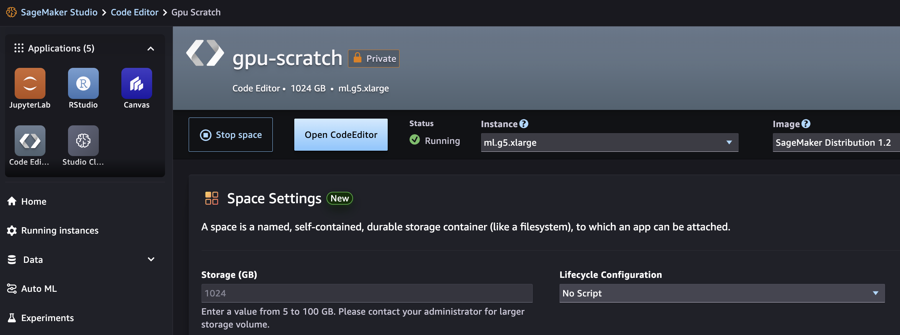
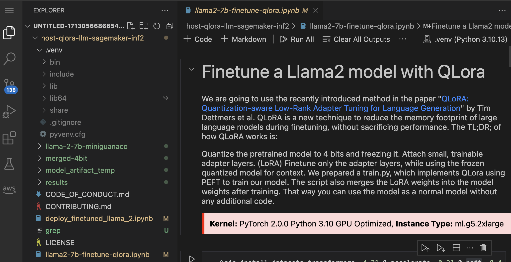
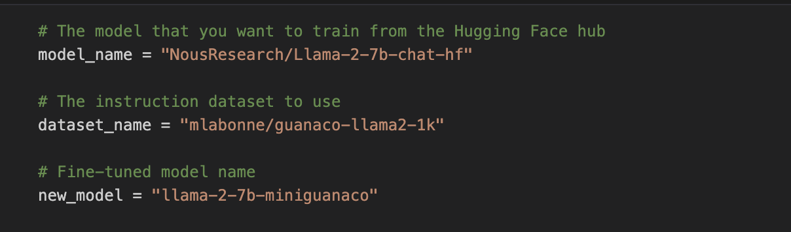
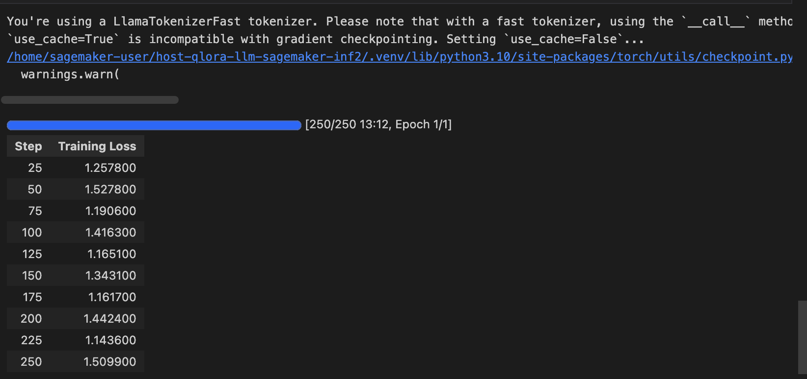
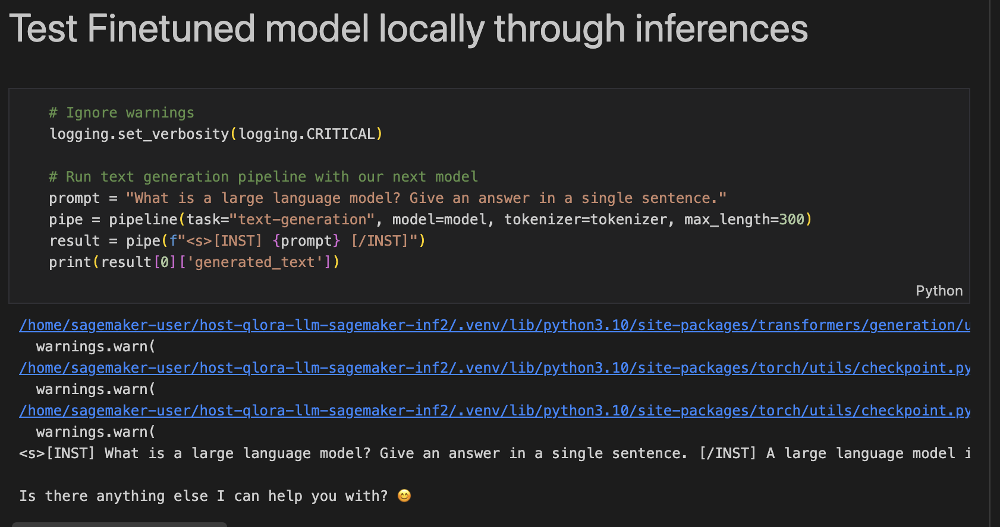
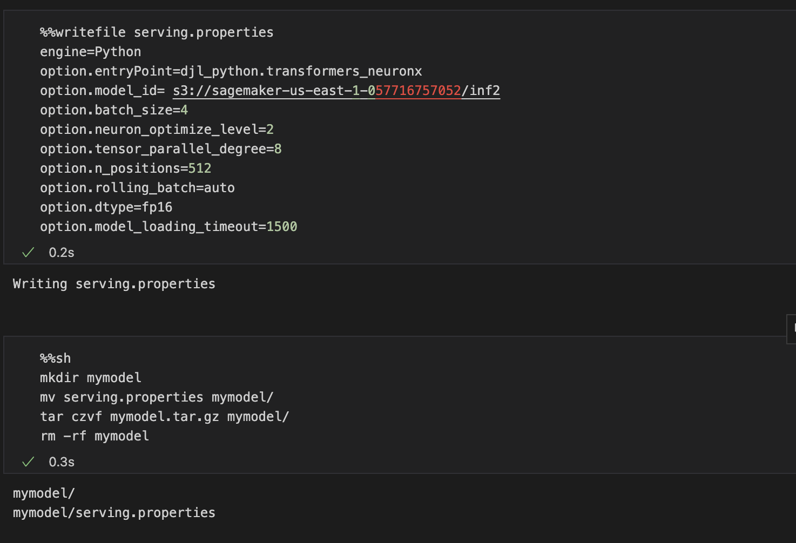
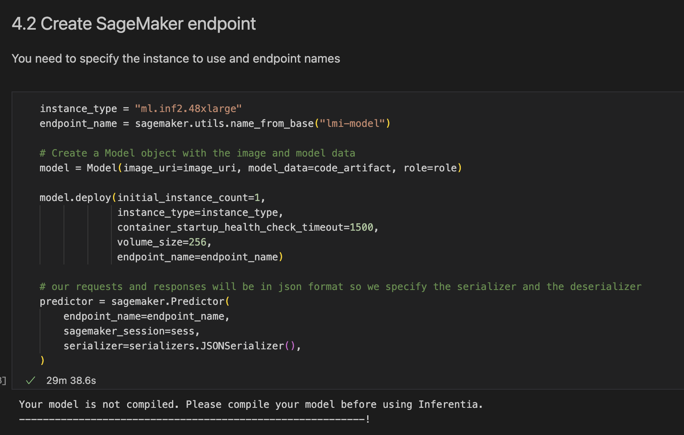
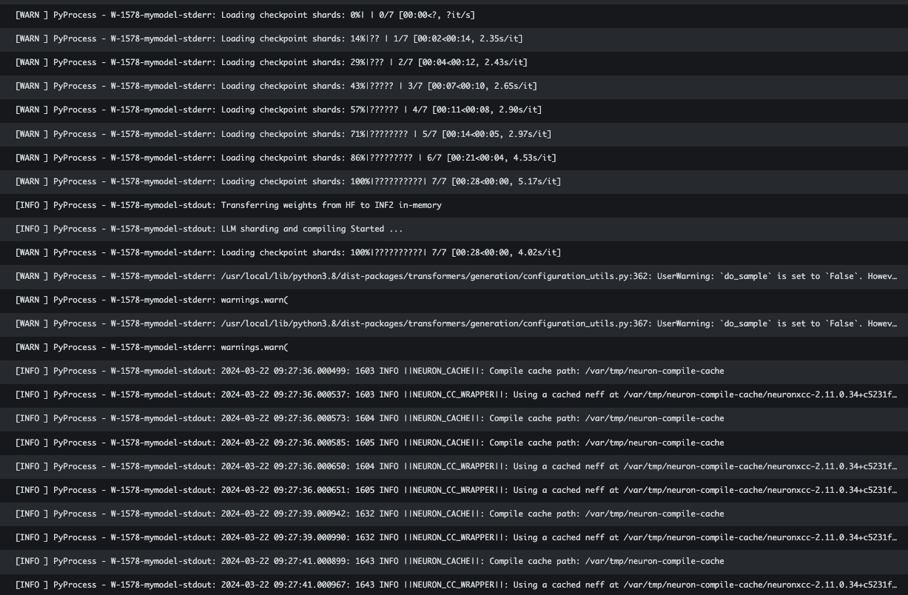

# Llama2 모델을 QLoRA 로 파인 튜닝 후에 Amazon Inferentia 2 를 사용하여 SageMaker Endpoint 에 배포
## 1. 목적
- 이 가이드는 아래 원본에 대한 내용을 간락하게 요약을 하고, 추후에 벤치 마킹을 하기 위해 필요한 것을 가이드 합니다.

## 2. 원본 내용
- 블로그: [Fine-tune Llama 2 using QLoRA and Deploy it on Amazon SageMaker with AWS Inferentia2](https://aws.amazon.com/blogs/machine-learning/fine-tune-llama-2-using-qlora-and-deploy-it-on-amazon-sagemaker-with-aws-inferentia2/)
 - Git Repo: [Host a QLoRA finetuned LLM using inferentia2 in Amazon SageMaker](https://github.com/aws-samples/host-qlora-llm-sagemaker-inf2)

## 3. 전체적인 리포의 실행 가이드
### 3.1. 실행 환경: 가상 환경
- Python 3.10.13
- 주요 패키지
    ```
    pip list | grep -E "dataset|torch|transformer|bitsandbytes|cuda|peft|trl"

        bitsandbytes              0.40.2
        datasets                  2.18.0
        nvidia-cuda-cupti-cu12    12.1.105
        nvidia-cuda-nvrtc-cu12    12.1.105
        nvidia-cuda-runtime-cu12  12.1.105
        peft                      0.4.0
        torch                     2.2.1
        transformers              4.31.0
        trl                       0.4.7        ```    
- 전체 설치 Python Package: [venv_python_pkg](venv_python_pkg.txt)
- SageMaker Studio Code Editor 환경
    - Step1: SageMaker Studio Code Editor 를 ml.g5.xlarge 로 설치
        - 
    - Step2: 가상 환경을 .venv 로 설치하고, Kernel 을 .venv 로 선택
        - 

## 4. 실행 
- Base 모델, 데이터셋, 파인 튜닝 모델 이름 기술
    - 
- 데이터 셋 샘플 보기    
    - 
- 파인 튜닝 인자 기술    
    - 
- 파인 튜닝 Loss Metric     
    - 
- 로컬에서 파인 튜닝 모델을 추론 하기    
    - 
- DJL 추론 서빙을 위한 serving.properties 파일 생성 후에 mymodel.tar.gz 로 압축 
    - 
- mymodel.tar.gz 를 s3://bucket/large-model-lmi/code/mymodel.tar.gz 업로드 및 추론 도커 이미지 경로 얻기    
    - 
- SageMaker Model 오브젝트 생성 및 모델 배포    
    - 
- SageMaker Endpoint 생성 로그 확인    
    - 
- SageMaker Endpoint 생성화면
    - 
- SageMaker Endpoint 에 추론
    - 
## 5.SageMaker Endpoint 이름 저장
- 벤치 마킹 등의 다른 목적으로 사용을 하신다면, SageMaker Endpoint Name 을 저장 하세요. (예: 위 화면 스샷의 lmi-model-2024-03-22-08-59-55-926 )
## 6.리소스 정리
- 반드시 원본 Git Repo 의 deploy_finetuned_llama_2.ipynb 를 참조하여, SageMaker Endpoint 를 삭제하시고, SageMaker Studio Code Editor 로 삭제 해주세요.