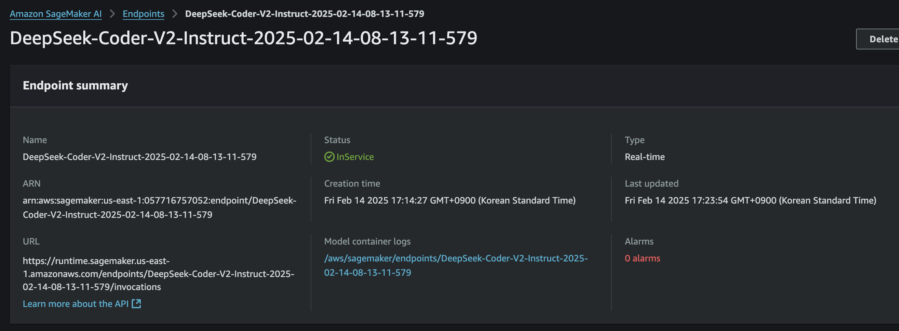
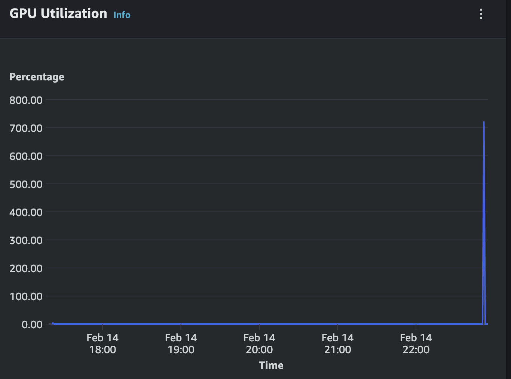
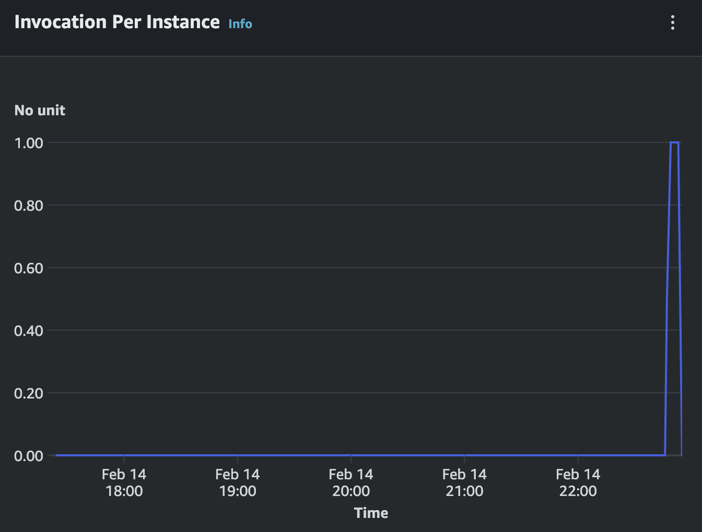
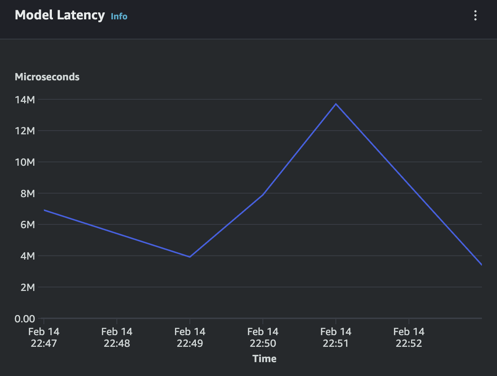

# Deploy DeepSeek-Coder-V2 with vLLM on SageMaker Endpoint using LMI container from DJL

최신 [vLLM](https://github.com/vllm-project/vllm) 추론 서빙과 [SageMaker AI Endpoint](https://docs.aws.amazon.com/prescriptive-guidance/latest/image-classification/sagemaker.html) 를 통해서 [DeepSeek-Coder-V2](https://huggingface.co/deepseek-ai/DeepSeek-Coder-V2-Lite-Instruct) 모델 호스팅을 아래와 같은 내용으로 배우게 됩니다.

- 최신 vLLM 버전 (0.7.1 , Feb 1, 25 릴리이즈) 사용
- DeepSeek-Coder-V2 모델 (16B 파라미터) 을 Hugging Face 에서 다운로드 하여 SageMaker Endpoint 에 배포 
- DeepSeek-Coder-V2 모델을 S3 에 업로드 후에 S3 에서 다운로드 하여 SageMaker Endpoint 에 배포 (ml.g5.12xlarge, ml.p4d.24xlarge 사용 가능)
    - 자체 파인 튜닝 모델을 이러한 방식으로 S3 에 업로드 후에 사용할 수 있음.
- Message Prompt 형식으로 invoke_endpoint_with_response_stream Boto3 API 통한   추론
- 모델 배포 및 추론의 로그에 대하여 상세 분석 ( CloudWatch 사용 )
    - 중요 환경 변수 및 GPU 메모리 사용량 (i.e. KV Cache) 등 확인 가능
- Real-time Inference Autoscaling 

<p>
    
Contributor: 
- <span style="#FF69B4;"> **Dongjin Jang, Ph.D.** (AWS AI/ML Specislist Solutions Architect) | [Mail](mailto:dongjinj@amazon.com) | [Linkedin](https://www.linkedin.com/in/dongjin-jang-kr/) | [Git](https://github.com/dongjin-ml) | [Hugging Face](https://huggingface.co/Dongjin-kr)</span>
- <span style="#FF69B4;"> **Gonsoo Moon** (AWS AI/ML Specislist Solutions Architect) | [Mail](mailto:moongons@amazon.com) | [Linkedin](https://www.linkedin.com/in/gonsoomoon/) | [Git](https://github.com/gonsoomoon-ml) | </span>    
---    

## 1. Use DJL with the SageMaker Python SDK
- SageMaker Python SDK를 사용하면 Deep Java Library를 이용하여 Amazon SageMaker에서 모델을 호스팅할 수 있습니다. <BR>
- Deep Java Library (DJL) Serving은 DJL이 제공하는 고성능 범용 독립형 모델 서빙 솔루션입니다. DJL Serving은 다양한 프레임워크로 학습된 모델을 로드하는 것을 지원합니다. <BR>
- SageMaker Python SDK를 사용하면 DeepSpeed와 HuggingFace Accelerate와 같은 백엔드를 활용하여 DJL Serving으로 대규모 모델을 호스팅할 수 있습니다. <BR>
- DJL Serving의 지원 버전에 대한 정보는 [AWS 문서](https://docs.aws.amazon.com/deep-learning-containers/latest/devguide/deep-learning-containers-images.html)를 참조하십시오. <BR>
- 최신 지원 버전을 사용하는 것을 권장합니다. 왜냐하면 그곳에 우리의 개발 노력이 집중되어 있기 때문입니다. <BR>
- SageMaker Python SDK 사용에 대한 일반적인 정보는 [SageMaker Python SDK 사용하기](https://sagemaker.readthedocs.io/en/v2.139.0/overview.html#using-the-sagemaker-python-sdk)를 참조하십시오.
    
REF: [BLOG] [Deploy LLM with vLLM on SageMaker in only 13 lines of code](https://mrmaheshrajput.medium.com/deploy-llm-with-vllm-on-sagemaker-in-only-13-lines-of-code-1601f780c0cf)
    
## 2. 추론 도커 이미지 사용
- LMI container Image:  v1.0-djl-0.32.0-inf-lmi-14.0.0
    * Release date (Feb 8, 25) 
        * https://github.com/aws/deep-learning-containers/releases/tag/v1.0-djl-0.32.0-inf-lmi-14.0.0
    * Docker Image
        * 763104351884.dkr.ecr.us-west-2.amazonaws.com/djl-inference:0.32.0-lmi14.0.0-cu124
        * 763104351884.dkr.ecr.us-east-1.amazonaws.com/djl-inference:0.32.0-lmi14.0.0-cu124

    
## 3. 실습 정보
- 환경
    * [SageMaker Notebook Instance](https://docs.aws.amazon.com/sagemaker/latest/dg/nbi.html) 에서 테스트 되었습니다. Amazon SageMaker Notebook Instances 는 ml.g5.xlarge 사용을 권장 합니다.     
- 실행 노트북 입니다.
    * [0_setup.ipynb](0_setup.ipynb)
    * [1_deepseek-deploy-djl-lmi.ipynb](1_deepseek-deploy-djl-lmi.ipynb)
        - HF 에서 모델 다운로드 받아 배포, 추론 및 오토스케일링 
    * [2_deepseek-deploy-djl-lmi-from-s3.ipynb](2_deepseek-deploy-djl-lmi-from-s3.ipynb)
        - HF 에서 모델 다운로드 및 S3 업로드 후에  배포, 추론
    
## 4. 모델 배포 및 추론 로그 분석  

### 4.1. vLLM 및 SageMaker AI Endpoint 생성시의 주요 환경 변수
```
deploy_env = {
    "OPTION_ROLLING_BATCH": "vllm",
    "OPTION_TENSOR_PARALLEL_DEGREE": "max",
    "OPTION_MAX_ROLLING_BATCH_SIZE": "2",
    "OPTION_DTYPE":"fp16",
    "OPTION_TRUST_REMOTE_CODE": "true",
    "OPTION_MAX_MODEL_LEN": "8192",
    "VLLM_ATTENTION_BACKEND": "XFORMERS",
    "OPTION_GPU_MEMORY_UTILIZATION": "0.9",  # GPU 메모리 사용률 제한 (기본값 0.9)
    "VLLM_MAX_NUM_SEQS": "16",  # 동시 처리 시퀀스 수 제한    
}
```
### 4.2 SageMaker AI Endpoint 배포 후 요약 (ml.p4d.24xlarge 사용, A100 8장)
    

### 4.3 CloudWatch 로그
#### 4.3.1 환경 정보
```
Config file: /opt/djl/conf/config.properties
Inference address: http://0.0.0.0:8080
Management address: http://0.0.0.0:8080
Default job_queue_size: 1000
Default batch_size: 1
Default max_batch_delay: 100
Default max_idle_time: 60
Model Store: /opt/ml/model
Initial Models: ALL
Netty threads: 0
Maximum Request Size: 67108864
Environment variables:
    HF_HUB_ENABLE_HF_TRANSFER: 1
    HF_HOME: /tmp/.cache/huggingface
    OPTION_MAX_ROLLING_BATCH_SIZE: 2
    OPTION_TRUST_REMOTE_CODE: true
    OMP_NUM_THREADS: 1
    OPTION_GPU_MEMORY_UTILIZATION: 0.9
    SAGEMAKER_SAFE_PORT_RANGE: 29000-29999
    OPTION_DTYPE: fp16
    OPTION_ROLLING_BATCH: vllm
    OPTION_TENSOR_PARALLEL_DEGREE: max
    SERVING_FEATURES: vllm,lmi-dist
    OPTION_MAX_MODEL_LEN: 8192
    DJL_CACHE_DIR: /tmp/.djl.ai
```
#### 4.3.2 모델 파라미터
    
```
[INFO ] LmiUtils - Detected mpi_mode: null, rolling_batch: vllm, tensor_parallel_degree: max, for modelType: deepseek_v2
[INFO ] ModelInfo - M-0001: Apply per model settings:
    job_queue_size: 1000
    max_dynamic_batch_size: 1
    max_batch_delay: 100
    max_idle_time: 60
    load_on_devices: *
    engine: Python
    mpi_mode: null
    option.entryPoint: null
    option.dtype: fp16
    option.max_model_len: 8192
    option.tensor_parallel_degree: max
    option.pythonExecutable: /opt/djl/vllm_venv/bin/python
    option.max_rolling_batch_size: 2
    option.pipeline_parallel_degree: 1
    option.trust_remote_code: true
    option.gpu_memory_utilization: 0.9
    option.rolling_batch: vllm
```
#### 4.3.3 vllm 설정 정보
```
[INFO ] PyProcess - W-210-model-stdout: INFO 02-14 08:22:13 llm_engine.py:232] Initializing a V0 LLM engine (v0.7.1) with config: model='/opt/ml/model', speculative_config=None, tokenizer='/opt/ml/model', skip_tokenizer_init=False, tokenizer_mode=auto, revision=None, override_neuron_config=None, tokenizer_revision=None, trust_remote_code=True, dtype=torch.float16, max_seq_len=8192, download_dir=None, load_format=LoadFormat.AUTO, tensor_parallel_size=8, pipeline_parallel_size=1, disable_custom_all_reduce=False, quantization=None, enforce_eager=False, kv_cache_dtype=auto,  device_config=cuda, decoding_config=DecodingConfig(guided_decoding_backend='xgrammar'), observability_config=ObservabilityConfig(otlp_traces_endpoint=None, collect_model_forward_time=False, collect_model_execute_time=False), seed=0, served_model_name=/opt/ml/model, num_scheduler_steps=1, multi_step_stream_outputs=True, enable_prefix_caching=False, chunked_prefill_enabled=False, use_async_output_proc=True, disable_mm_preprocessor_cache=False, mm_processor_kwargs=None, pooler_config=None, compilation_config=
{
    "splitting_ops": [],
    "compile_sizes": [],
    "cudagraph_capture_sizes": [
        2,
        1
    ],
    "max_capture_size": 2
}
, use_cached_outputs=False, 
```
#### 4.3.4 메모리 할당 정보
```
INFO ] PyProcess - W-210-model-stdout: #033[1;36m(VllmWorkerProcess pid=240)#033[0;0m INFO 02-14 08:23:15 worker.py:266] the current vLLM instance can use total_gpu_memory (39.39GiB) x gpu_memory_utilization (0.90) = 35.45GiB
[INFO ] PyProcess - W-210-model-stdout: #033[1;36m(VllmWorkerProcess pid=240)#033[0;0m INFO 02-14 08:23:15 worker.py:266] model weights take 3.97GiB; non_torch_memory takes 2.10GiB; PyTorch activation peak memory takes 0.36GiB; the rest of the memory reserved for KV Cache is 29.02GiB.

- deepseek-ai/DeepSeek-Coder-V2-Lite-Instruct: 16B 파라미터 
- 물리적인 모델 가중치 파일은 4개이고 각각 8.59 GB, 8.59 GB, 8.59 GB, 5.64 GB 입니다. 총 합은 31.41 GB. 
- 1개의 GPU 에 3.97GiB 사용되었고, 총 8개의 GPU에는 3.97 * 8 31.76 GB 입니다.
- 환경 변수 OPTION_DTYPE = fp 16
```
#### 4.3.5 Starting Model Server
```
INFO ] PyProcess - W-210-model-stdout: #033[1;36m(VllmWorkerProcess pid=237)#033[0;0m INFO 02-14 08:23:25 model_runner.py:1563] Graph capturing finished in 5 secs, took 0.47 GiB
[INFO ] PyProcess - W-210-model-stdout: INFO 02-14 08:23:25 llm_engine.py:429] init engine (profile, create kv cache, warmup model) took 15.79 seconds
[INFO ] PyProcess - Model [model] initialized.
[INFO ] WorkerThread - Starting worker thread WT-0001 for model model (M-0001, READY) on device gpu(0)
[INFO ] ModelServer - Initialize BOTH server with: EpollServerSocketChannel.
[INFO ] ModelServer - BOTH API bind to: http://0.0.0.0:8080
```
#### 4.3.6 Inference 로그
```
[INFO ] PyProcess - W-210-model-stdout: INFO 02-14 13:51:44 metrics.py:453] Avg prompt throughput: 11.4 tokens/s, Avg generation throughput: 73.7 tokens/s, Running: 1 reqs, Swapped: 0 reqs, Pending: 0 reqs, GPU KV cache usage: 0.0%, CPU KV cache usage: 0.0%.
[INFO ] PyProcess - W-210-model-stdout: INFO 02-14 13:51:49 metrics.py:453] Avg prompt throughput: 0.0 tokens/s, Avg generation throughput: 57.7 tokens/s, Running: 1 reqs, Swapped: 0 reqs, Pending: 0 reqs, GPU KV cache usage: 0.1%, CPU KV cache usage: 0.0%.
```    
## 5. 모니터링
아래는 위의 실습 노트북에서 모델 배포 및 추론을 실행한 후의 모니터링 화면 입니다.

    
        
