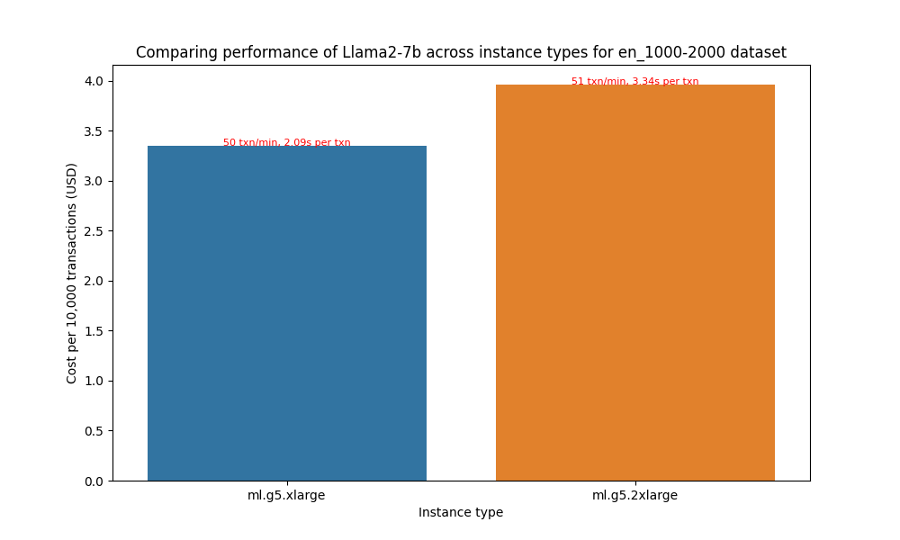
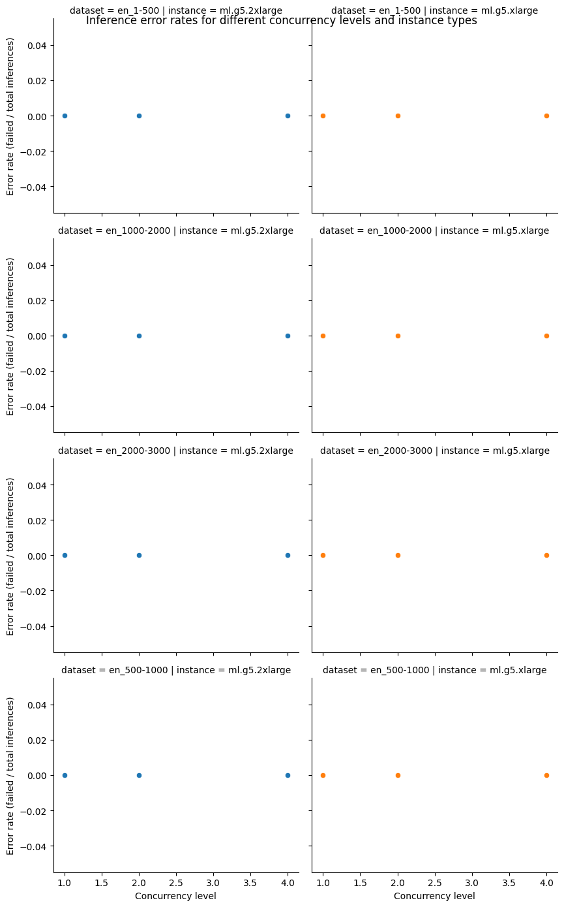
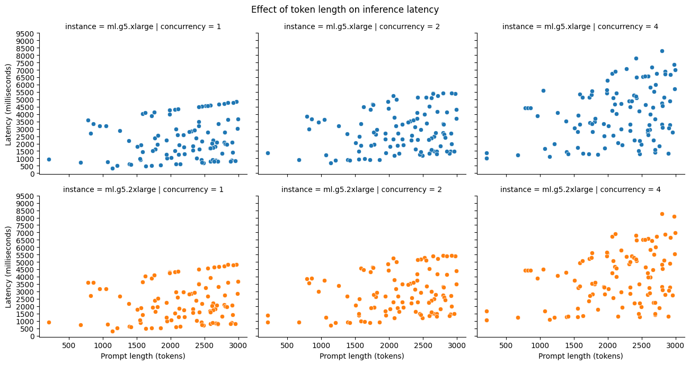
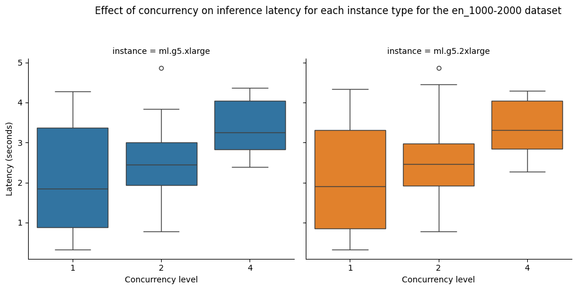

# [목적]
- 이 페이지는 fmbench 의 디폴트 실행을 한 후의 리포트 결과를 보여 주어서, 벤치 마킹의 기본적인 개념을 잡기 위함 입니다.
- 아래는 fmbench git 의 기본 Quickstart 를 실행한 후에 생성된 reprot.md 파일의 내용입니다. 
    - [Foundation Model benchmarking tool (FMBench) built using Amazon SageMaker](https://github.com/aws-samples/foundation-model-benchmarking-tool)

---

# Results for performance benchmarking

**Last modified (UTC): 2024-04-09 10:28:00.510046**

## Summary

We did performance benchmarking for the `Llama2-7b` model on "`ml.g5.2xlarge`, `ml.g5.xlarge`" instances on multiple datasets and based on the test results the best price performance for dataset `en_1000-2000` is provided by the `ml.g5.xlarge` instance type.  
| Information | Value |
|-----|-----|
| experiment_name | llama2-7b-g5.xlarge-huggingface-pytorch-tgi-inference-2.0.1-tgi1.1.0 |
| payload_file | payload_en_1000-2000.jsonl |
| instance_type | ml.g5.xlarge |
| concurrency | 1 |
| error_rate | 0.0 |
| prompt_token_count_mean | 1626 |
| prompt_token_throughput | 1307 |
| completion_token_count_mean | 35 |
| completion_token_throughput | 13 | --> Tokens / Sec (1초당 Token 처리 개수)
| latency_mean | 2.09 |
| latency_p50 | 2.09 |
| latency_p95 | 2.09 |
| latency_p99 | 2.09 |
| transactions_per_minute | 50 |
| price_per_hour | 1.006 |
| price_per_txn | 0.000335 |
| price_per_token | 0.00000020 |

The price performance comparison for different instance types is presented below:

The configuration used for these tests is available in the [`config`](config-llama2-7b-g5-quick.yml) file.

The cost to run each experiment is provided in the table below. The total cost for running all experiments is $0.39.

| experiment_name | instance_type | duration_in_seconds | cost |
|-----|-----|-----|-----|
| llama2-7b-g5.xlarge-huggingface-pytorch-tgi-inference-2.0.1-tgi1.1.0 | ml.g5.xlarge | 626.45 | 0.18 |
| llama2-7b-g5.2xlarge-huggingface-pytorch-tgi-inference-2.0.1-tgi1.1.0 | ml.g5.2xlarge | 624.54 | 0.21 |

## Per instance results

The following table provides the best combinations for running inference for different sizes prompts on different instance types. The following dataset(s) were used for this test: `2wikimqa_e.jsonl`, `2wikimqa.jsonl`, `hotpotqa_e.jsonl`, `hotpotqa.jsonl`, `narrativeqa.jsonl`, `triviaqa_e.jsonl`, `triviaqa.jsonl`.

|Dataset   | Instance type   | Recommendation   |
|---|---|---|
|`payload_en_1-500.jsonl`|`ml.g5.2xlarge`|The best option for staying within a latency budget of `20 seconds` on a `ml.g5.2xlarge` for the `payload_en_1-500.jsonl` dataset is a `concurrency level of 4`. A concurrency level of 4 achieves an `average latency of 1.21 seconds`, for an `average prompt size of 207 tokens` and `completion size of 14 tokens` with `144 transactions/minute`.|
|`payload_en_1000-2000.jsonl`|`ml.g5.2xlarge`|The best option for staying within a latency budget of `20 seconds` on a `ml.g5.2xlarge` for the `payload_en_1000-2000.jsonl` dataset is a `concurrency level of 4`. A concurrency level of 4 achieves an `average latency of 3.34 seconds`, for an `average prompt size of 1626 tokens` and `completion size of 34 tokens` with `51 transactions/minute`.|
|`payload_en_2000-3000.jsonl`|`ml.g5.2xlarge`|The best option for staying within a latency budget of `20 seconds` on a `ml.g5.2xlarge` for the `payload_en_2000-3000.jsonl` dataset is a `concurrency level of 4`. A concurrency level of 4 achieves an `average latency of 4.32 seconds`, for an `average prompt size of 2538 tokens` and `completion size of 32 tokens` with `42 transactions/minute`.|
|`payload_en_500-1000.jsonl`|`ml.g5.2xlarge`|The best option for staying within a latency budget of `20 seconds` on a `ml.g5.2xlarge` for the `payload_en_500-1000.jsonl` dataset is a `concurrency level of 4`. A concurrency level of 4 achieves an `average latency of 2.77 seconds`, for an `average prompt size of 763 tokens` and `completion size of 41 tokens` with `122 transactions/minute`.|
|`payload_en_1-500.jsonl`|`ml.g5.xlarge`|The best option for staying within a latency budget of `20 seconds` on a `ml.g5.xlarge` for the `payload_en_1-500.jsonl` dataset is a `concurrency level of 4`. A concurrency level of 4 achieves an `average latency of 1.11 seconds`, for an `average prompt size of 207 tokens` and `completion size of 16 tokens` with `174 transactions/minute`.|
|`payload_en_1000-2000.jsonl`|`ml.g5.xlarge`|The best option for staying within a latency budget of `20 seconds` on a `ml.g5.xlarge` for the `payload_en_1000-2000.jsonl` dataset is a `concurrency level of 4`. A concurrency level of 4 achieves an `average latency of 3.37 seconds`, for an `average prompt size of 1626 tokens` and `completion size of 35 tokens` with `50 transactions/minute`.|
|`payload_en_2000-3000.jsonl`|`ml.g5.xlarge`|The best option for staying within a latency budget of `20 seconds` on a `ml.g5.xlarge` for the `payload_en_2000-3000.jsonl` dataset is a `concurrency level of 4`. A concurrency level of 4 achieves an `average latency of 4.4 seconds`, for an `average prompt size of 2538 tokens` and `completion size of 33 tokens` with `38 transactions/minute`.|
|`payload_en_500-1000.jsonl`|`ml.g5.xlarge`|The best option for staying within a latency budget of `20 seconds` on a `ml.g5.xlarge` for the `payload_en_500-1000.jsonl` dataset is a `concurrency level of 4`. A concurrency level of 4 achieves an `average latency of 2.76 seconds`, for an `average prompt size of 763 tokens` and `completion size of 41 tokens` with `122 transactions/minute`.|

## Plots

The following plots provide insights into the results from the different experiments run.

