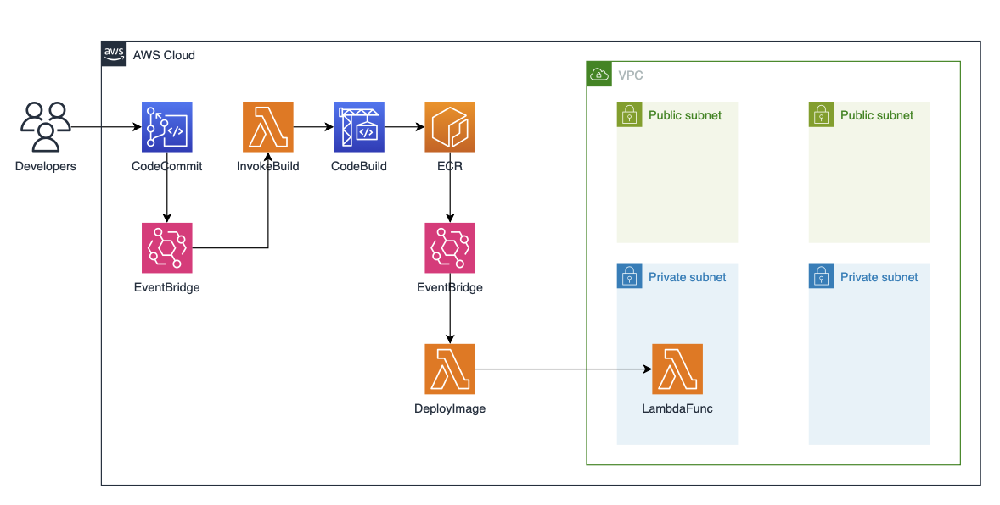
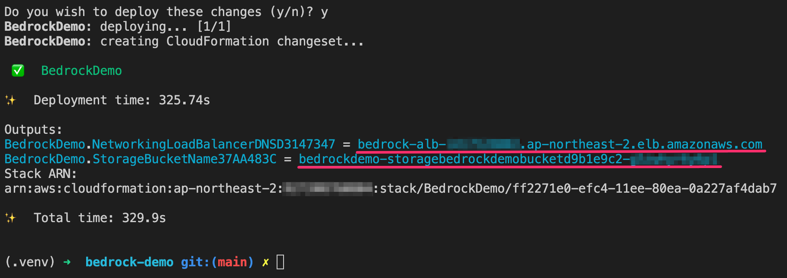
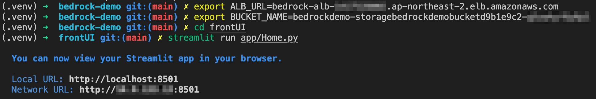

# Bedrock Demo
본 데모는 무신사에 딜리버리한 데모를 기반으로 하고 있습니다. 총 5가지의 데모를 Claude 3 모델 기반으로 프롬프트 엔지니어링 기법으로 만들었습니다.

> [!NOTE]
> 실제 데모에서는 무신사의 데이터를 이용하였으나 본 Repository에 올리기 위해서 무신사의 데이터를 삭제하였습니다.

1. [Prompt Demo](./frontUI/app/pages/1_Prompt_Demo.py)
    - 질문/답변 형식의 일반적인 GenAI 데모입니다. 
2. [Review Summary Demo](./frontUI/app/pages/2_Review_Summary_Demo.py)
    - 무신사에서 판매중인 상품의 리뷰들을 모아 분석해서 색상, 핏, 소재, 세탁, 가격 등의 항목으로 보여줍니다.
3. [Review Comment Demo](./frontUI/app/pages/3_Review_Comment_Demo.py)
    - 무신사의 고객들이 작성한 리뷰를 분석해서 상품에 대한 구매자의 Sentiment 를 추측하고 이에 적합한 답변을 생성해 줍니다.
4. [Product Identify Demo](./frontUI/app/pages/4_Product_Identify_Demo.py)
    - 신발 이미지를 올리면 이미지를 분석해서 상품에 대한 정보와 이와 비슷한 아디다스 신발을 추천해 줍니다.
    - 현재는 Claude 3의 정보로만 신발을 추천해 주는데 고객사의 상품 데이터로 DB를 구축하면 고객사의 상품에서만 추천을 할 수 있다고 가이드합니다.
5. [Video ShotForm](./frontUI/app/pages/5_Video_ShotForm.py)
    - 무신사는 MUSINSA TV 라는 유투브 채널을 운영중인데 다양한 동영상들이 있습니다. 대부분 길이가 10분 이상인 동영상들인데 숏폼이 유행하는 현재 트렌드에 맞게 이러한 동영상의 핵심만 요약해서 1분 내외의 짧은 동영상으로 바꾸어 줍니다.


## Architecture
Backend를 구성하는 아키텍처입니다. Frontend는 Streamlit을 사용하였습니다.
Frontend에서 API 호출을 통해 Backend에 구성된 Lambda를 호출하는 방식입니다.

Backend는 *ALB와 Lambda를 통해 Bedrock를 호출하는 부분* 과 *코드 변경에 따른 실시간 Lambda Function 업데이트를 위해 CodeCommit과 CodeBuild 등을 사용한 CI/CD*로 구성되어 있습니다.



## Prerequisites
- [AWS CLI](https://docs.aws.amazon.com/cli/latest/userguide/install-cliv2.html)가 설치되어 있고 사용하려는 계정으로 설정되어 있는지 확인합니다.
- 컨테이너 이미지를 빌드하려면 [Docker Engine](https://docs.docker.com/engine/install/)이 설치되어 있어야 합니다. *Lambda 함수가 컨테이너 이미지를 사용하고 있습니다.*

### install cdk
```shell
npm install -g aws-cdk
cdk --version
```

### setting AWS_PROFILE
```shell
export AWS_PROFILE=[The configuration profile for aws-cli]
```

## How to deploy

### Step 1. Create virtualenv
python을 사용하여 코드가 작성되었고 관련 라이브러리를 설치해야 하므로 python 가상 환경을 구성합니다.  
```shell
cd aws-ai-ml-workshop-kr/genai/genai-app-demo/01-prompt-engineering-demo/
python3 -m venv .venv
source .venv/bin/activate
```

### Step 2. Install requirements
```shell
pip install -r requirements.txt
```

### Step 3. Deploy CDK
cdk deploy를 하기 전에 우선 Docker Engine이 실행 중인지 확인합니다. cdk deploy를 실행하면 기존에 빌드된 컨테이너 이미지가 없으면 자동으로 컨테이너 빌드를 수행합니다.

```shell
cdk deploy BedrockDemo
```

### Step 4. Set Environment Variables
cdk를 성공적으로 배포하고 나면 Outputs에 *ALB의 DNS 이름* 과 *S3 버킷 이름*이 출력됩니다. 이를 복사하여 환경 변수로 만듭니다.




```shell
export ALB_URL=[The DNS name of the ALB]
export BUCKET_NAME=[The name of the S3 bucket]
```

### Step 5. Run streamlit
frontUI 디렉토리로 이동하여 streamlit 을 실행시킵니다. streamlit 이 실행되면 자동으로 브라우저에 데모 페이지가 로딩됩니다.
```shell
cd frontUI
streamlit run app/Home.py
```



로딩된 데모 페이지에서 5개의 데모를 확인할 수 있습니다.

## Clean up resources
기본적으로 cdk destroy를 하면 모든 생성된 리소스가 삭제됩니다. 다만 S3 버킷은 수동으로 삭제해야 합니다.

### Destroy Stack
```shell
cdk destroy BedrockDemo
```
