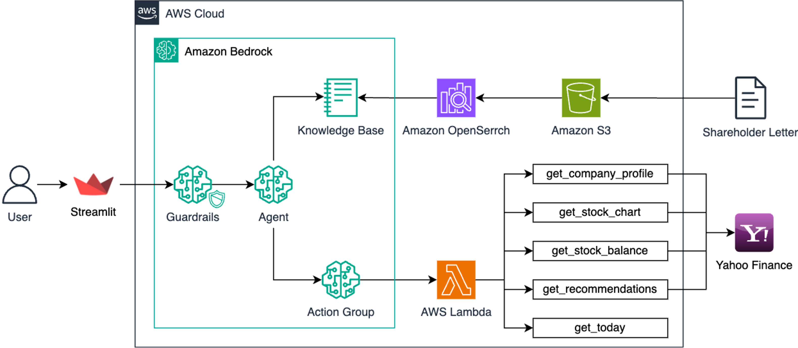

# Amazon Bedrock Agent 기반 주식 분석 애플리케이션

이 워크샵에서는 Amazon Bedrock Agent를 활용하여 강력한 주식 분석 애플리케이션을 구축하는 방법을 학습합니다. 참가자들은 복잡한 금융 데이터를 처리하고 분석하는 AI 기반 시스템을 단계별로 구현하게 됩니다.

> **중요**: 이 저장소는 실습 코드만을 포함하고 있습니다. 실제 워크샵 수행과 상세한 가이드를 위해서는 아래 링크의 전체 워크샵 페이지를 참조해 주세요.
> 
> [Bedrock Agent 어플리케이션](https://catalog.us-east-1.prod.workshops.aws/workshops/86f59566-0ae7-44be-80ab-9044b83c88f2/ko-KR/agent)

## 개요

Amazon Bedrock Agent는 사용자 요청을 이해하고, 데이터를 처리하며, 필요한 API를 호출하여 작업을 자동으로 수행합니다. 이를 통해 복잡한 다단계 작업을 자동화하고, 개발 시간과 비용을 절감할 수 있습니다.

## 아키텍처

1. **Streamlit**: 사용자 인터페이스를 제공하여 주식 분석 결과를 시각적으로 표시합니다.
2. **Amazon Bedrock Agent**: 다양한 AI 모델과 통합되어 주식 데이터를 분석하고, Knowledge Base와 Action Group을 통해 데이터를 처리합니다.
3. **Amazon OpenSearch**: Amazon Bedrock의 RAG(검색 증강 생성) 기능을 담당하는 벡터 데이터베이스로, Knowledge Base와 연동되어 빠르고 효율적인 검색 능력을 제공합니다.
4. **AWS Lambda**: 주식 데이터를 처리하고 분석하는 데 필요한 함수를 실행합니다.
5. **Yahoo Finance**: 야후 파이낸스의 주식 데이터를 가져와 분석에 사용합니다.
6. **Amazon Bedrock Guardrails**: Amazon Bedrock Agent의 입력과 출력을 필터링하고 제어하여 에이전트의 응답을 안전하게 관리합니다.

## 실습 모듈

1. **S3 버킷 생성 및 업로드**: Amazon S3 버킷을 생성하고 필요한 파일을 업로드합니다.
2. **Knowledge Base 생성**: Amazon Bedrock의 RAG 기능을 설정하고 관리합니다.
3. **Lambda 함수 생성**: 주식 데이터 수집을 위한 Lambda 함수를 설정합니다.
4. **Bedrock Agent 생성**: Bedrock Agent를 생성하고 Knowledge Base와 연동합니다.
5. **Action Group 생성**: 다양한 작업을 처리할 수 있는 Action Group을 구축합니다.
6. **Bedrock Guardrails 생성**: LLM 입력과 출력을 필터링하여 안전성을 높입니다.
7. **Permission 추가 및 Alias 생성**: 필요한 권한을 설정하고 에이전트 버전을 관리합니다.
8. **Streamlit 앱 실행**: 완성된 주식 분석 애플리케이션을 실행합니다.

이 워크샵을 통해 참가자들은 Amazon Bedrock Agent 기능을 활용하여 복잡한 금융 데이터를 처리하고 분석하는 실용적인 애플리케이션을 구축하는 방법을 배우게 됩니다.

---

# Stock Analysis Application Based on Amazon Bedrock Agent

This workshop teaches you how to build a powerful stock analysis application using Amazon Bedrock Agent. Participants will implement an AI-based system that processes and analyzes complex financial data in a step-by-step manner.

> **Important**: This repository contains only the practice code. For the actual workshop execution and detailed guide, please refer to the full workshop page at the link below.
> 
> [Bedrock Agent Application](https://catalog.us-east-1.prod.workshops.aws/workshops/86f59566-0ae7-44be-80ab-9044b83c88f2/en-US/agent)

## Overview

Amazon Bedrock Agent understands user requests, processes data, and automatically performs tasks by calling necessary APIs. This allows for automation of complex multi-step tasks, reducing development time and costs.

## Architecture

1. **Streamlit**: Provides a user interface to visually display stock analysis results.
2. **Amazon Bedrock Agent**: Integrates with various AI models to analyze stock data and process information through Knowledge Base and Action Group.
3. **Amazon OpenSearch**: Serves as a vector database for Amazon Bedrock's RAG (Retrieval-Augmented Generation) functionality, providing fast and efficient search capabilities in conjunction with the Knowledge Base.
4. **AWS Lambda**: Executes functions necessary for processing and analyzing stock data.
5. **Yahoo Finance**: Retrieves stock data from Yahoo Finance for analysis.
6. **Amazon Bedrock Guardrails**: Filters and controls the input and output of Amazon Bedrock Agent to safely manage the agent's responses.

## Practice Modules

1. **Create S3 Bucket and Upload**: Create an Amazon S3 bucket and upload necessary files.
2. **Create Knowledge Base**: Set up and manage the RAG functionality of Amazon Bedrock.
3. **Create Lambda Function**: Set up Lambda functions for collecting stock data.
4. **Create Bedrock Agent**: Create a Bedrock Agent and integrate it with the Knowledge Base.
5. **Create Action Group**: Build an Action Group capable of handling various tasks.
6. **Create Bedrock Guardrails**: Enhance safety by filtering LLM input and output.
7. **Add Permissions and Create Alias**: Set up necessary permissions and manage agent versions.
8. **Run Streamlit App**: Execute the completed stock analysis application.

Through this workshop, participants will learn how to build a practical application that processes and analyzes complex financial data using the powerful features of Amazon Bedrock Agent.