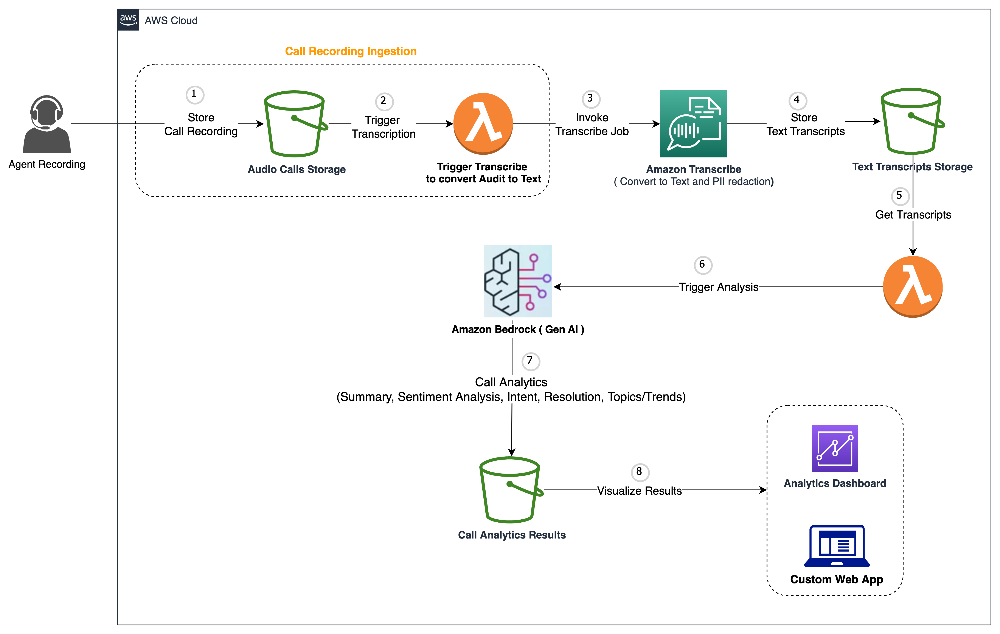

# Post Call Analytics

This approach enables the extraction of actionable information, providing a comprehensive understanding of the calls and facilitating efficient post-call analysis.

# When to use this sample

**Industry: Telco**

**Horizonal Use Case: Extraction**

This example demonstrates an use case for prompt engineering in the context of post-call analytics. By leveraging Large Language Models (LLMs), the objective is to analyze and extract valuable insights from large audio recording scripts. The process involves segmenting the recordings into smaller chunks and utilizing LLMs to iteratively perform various tasks such as intent classification, sentiment analysis, resolution identification, and summarization. 

# Technical Overview

This notebook tackles a well-known challenge faced by Text-to-Text Generative AI models, which is the limited capacity to process a specific number of tokens. To address this issue, the notebook introduces the implementation of langchain as a solution to assist Large Language Models (LLMs) in analyzing lengthy audio scripts and extracting insights automatically. The notebook showcases the utilization of two distinct models, namely the Amazon Titan large model and the Anthropic Claude model, for the purpose of contextual extraction. By incorporating these models, the notebook aims to enhance the ability of LLMs to effectively analyze and derive valuable insights from long audio scripts.

# Architecture Diagram

# Key Technologies

* Amazon Bedrock
    * Claude model for text to text
    * Titan model for text to text

# How to Run

There is only one [notebook](./post-call-analytics.ipynb) which needs to be run. The current demo covers the step 5 to 8 in the architecture and was run on SageMaker Studio using the Data Science 3.0 Image, Python 3 kernel, and a ml.t3.medium instance. **Please note: this notebook requires access to Amazon Bedrock which is in private preview at the time of writing.**
