#  Dolly 데이터 셋을 이용하여 trn1.32xlarge 에서 Llama-2-7B 파인 튜닝하기

Last Update: Feb 25, 2024

---

이 튜토리얼은 trn1.32xlarge 로 Llama-2-7B 모델을 파인튜닝하고, 추론을 위한 가이드 입니다. 아래의 노트북을 실행 하기 위함 입니다. 
- [Fine-tune Llama on AWS Trainium](https://github.com/huggingface/optimum-neuron/blob/main/notebooks/text-generation/llama2-7b-fine-tuning.ipynb)

실행을 위해서 위의 해당 노트북을 실행 하시고, 여기서는 중요 가이드 및 일부 코드 실행 결과를 보여 드립니다. 


- [../01-Chatbot-Llama-2-13B-Inf2/README.md](https://huggingface.co/docs/optimum-neuron/tutorials/llama2-13b-chatbot)
<br>
<p> 

# 1. 기본 사전 단계
## Quota 준비 
- 먼저 AWS 계정에 아래에 해당되는 기본적인 [Quota](https://docs.aws.amazon.cohttps://awsdocs-neuron.readthedocs-hosted.com/en/latest/general/arch/neuron-hardware/trn1-arch.htmlm/servicequotas/latest/userguide/intro.html) 가 필요 합니다. [trn1.32xlarge]() 는 vCPU 가 128개 필요하므로 Running On-Demand Trn Instances 가 128 개 이상 있어야 합니다. 
- 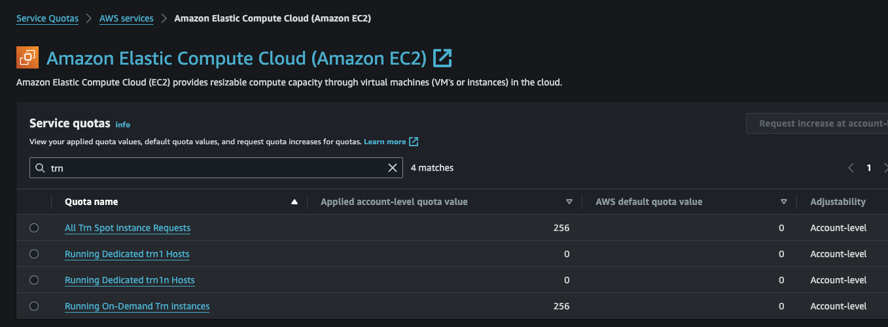

# 2. 기본 환경 

##  2.1. Launch the Instance (Trn1.32xlarge EC2 생성)
- Region: us-west-2, Subnet: us-east-2d, AZ: usw2-az4 에서 진행 했음.
- AMI, Instance Type 지정. 
    - 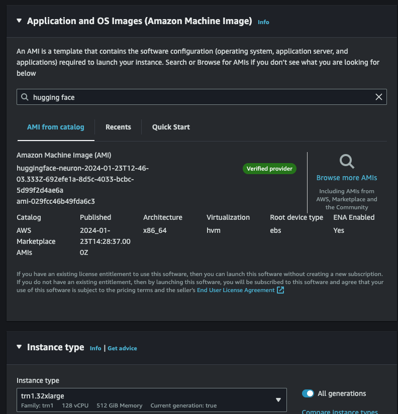
- [중요] <u>Storage 는 200 GB 로 수정해주세요.</u>
- Trouble Shooting: Error
    - trn1.32xlarge EC2 런칭시에 아래와 같은 에러:
        - Failed to start the instance i-04c1XXXXXXXX The requested configuration is currently not supported. Please check the documentation for supported configurations.
    - 솔루션
        - 위의 이유는 해당 Region 및 Availability Zone (AZ) 에 해당 EC2 가 부족하여 발생하는 에러 입니다. EC2 생성시에 Network 부분의 Subnet 을 바꾸어서 해보세요. 그래도 에러가 발생하면 AWS Account 팀에 문의 바랍니다. 

## 2.2 EC2 Connection
- 편하신 방법으로 EC2 에 SSH 로 연결하시면 됩니다. 저는 로컬에서 VS Code Remote Connection 으로 연결 하였습니다. 
- 

## 2.3 Start Jupyter Server and Select Kernel
- 이 섹션은 노트북 "AWS Inferentia 기반 위에 llama-2-13B 이용하여 챗봇 데모" 의  2.3 Start Jupyter Server and Select Kernel 를 참조 해주세요. [2.3 Start Jupyter Server and Select Kernel](../01-Chatbot-Llama-2-13B-Inf2/README.md)

<p>

# 3. 노트북 실행
## 3.1. Dolly 데이터 샛 준비
- 아래는 15,000 개의 Dolly 데이터 샘플의 한개의 예시 입니다. 
    - 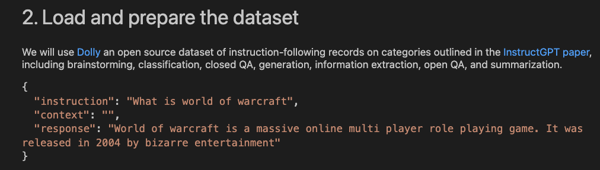
- 아래는 Dolly 데이터 셋을 로드 합니다.
    - 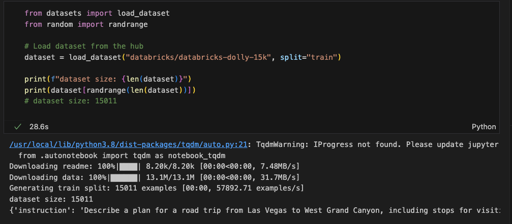   
- 아래는 기본 데이터 셋의 형태를 Task 맞추어진 포맷으로 변경 합니다.
    - 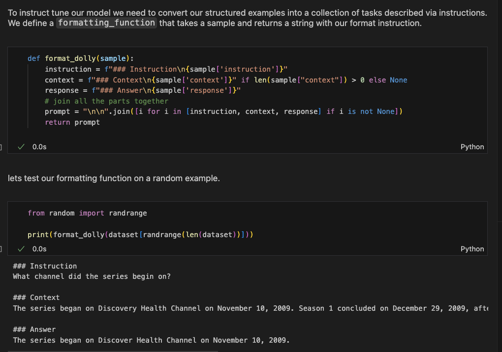    
- 아래는 훈련을 효율적으로 하기 위해서 최대 길이 컨텍스트 2048 (모델은 4096 까지 지원) 로 각 샘플을 패킹하는 절차 입니다. 아래 원 노트북의 설명 입니다. 
"또한 샘플 형식을 지정하기 위해 여러 샘플을 하나의 시퀀스로 묶어 보다 효율적인 학습을 합니다.이는 여러 샘플을 하나의 시퀀스에 쌓고 이를 EOS 토큰으로 분할한다는 의미입니다. 이는 훈련을 더욱 효율적으로 만듭니다. 샘플 패킹/적재는 훈련 도중이나 이전에 수행할 수 있습니다. 시간을 절약하기 위해 훈련 전에 할 것입니다."
    - 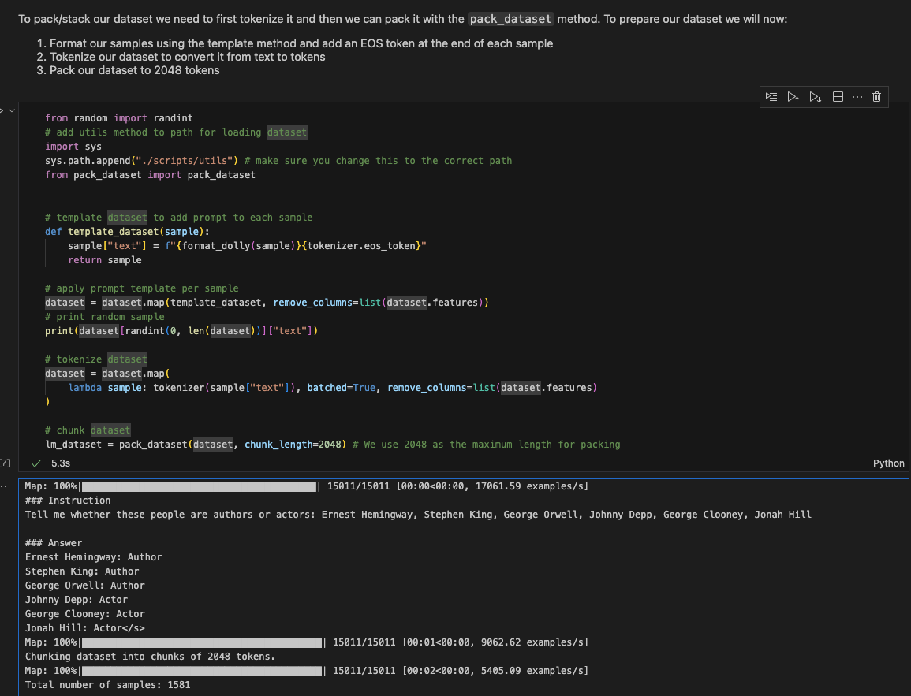

## 3.2. 모델 컴파일
- 아래는 모델을 컴파일하는 코드와 실행 결과 입니다. 약 25분이 걸렸습니다.
    - 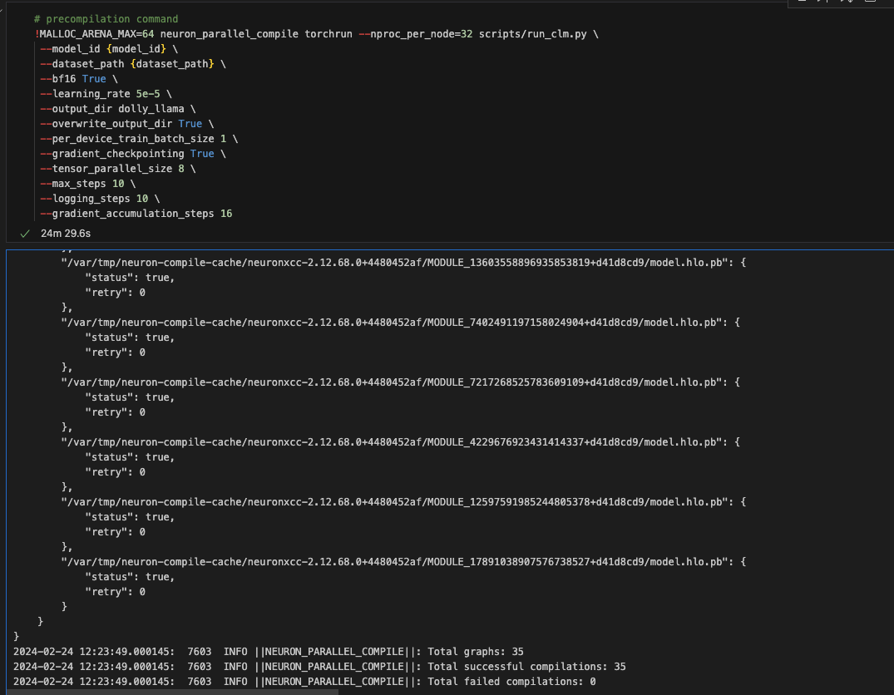

## 3.3. 모델 파인 튜닝
- 아래는 모델을 파인 튜닝 코드와 실행 결과 입니다. 약 34분이 걸렸습니다.
    - 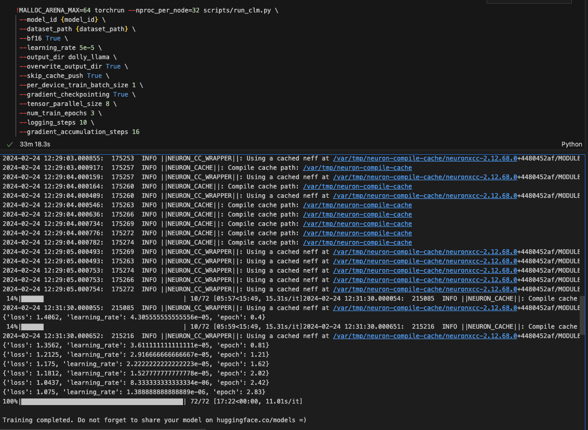
- 아래는 훈련 중의 스크린 샷 입니다. 32 개의 Neuron core 가 모두 사용이 되고 있고, 총 16개의 Accelerator 가 있는 각 1개당 총 메모리는 32 GB 인데요, 약 25 GB 를 사용하고 있습니다. 
    - 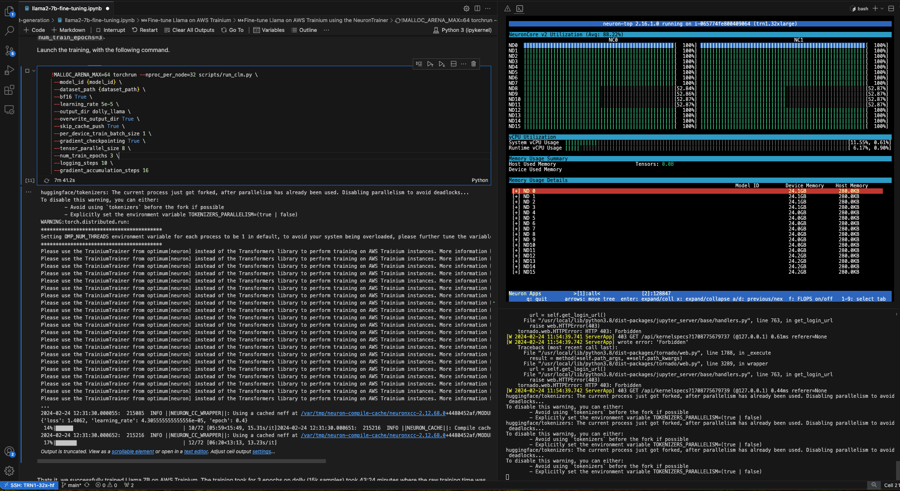    

## 3.4. Neuron Core 에 모델 가중치를 배치하여 모델 로딩
- Optimum Neuron은 쉬운 추론 사용을 위해 Transformers AutoModel 클래스와 유사하게 구현합니다. 'NeuronModelForCausalLM' 클래스를 사용하여 바닐라 변환기 체크포인트를 로드하고 이를 뉴런으로 변환합니다.
    - 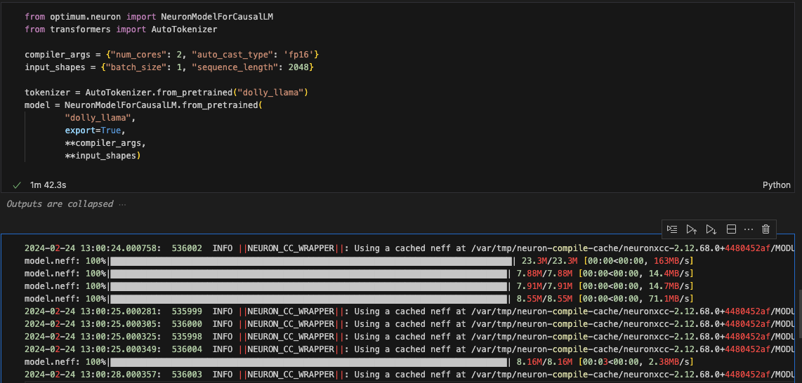

## 3.5. 모델 추론
- 아래는 "instruction": "Can you tell me something about AWS?" 의 질문에 잘 답변을 하는 것을 보여 주고 있습니다. 
    - 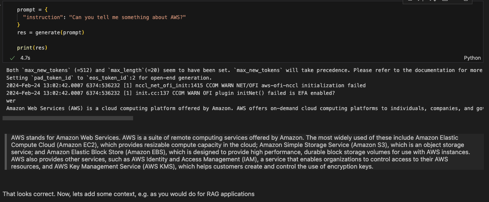
- 아래는 질문과 Context 를 제공하여 RAG 에 대한 요청을 하고, 정확한 답을 제공 합니다.

    ```
    prompt = {
    "instruction": "How can train models on AWS Trainium?",
    "context": "🤗 Optimum Neuron is the interface between the 🤗 Transformers library and AWS Accelerators including [AWS Trainium](https://aws.amazon.com/machine-learning/trainium/?nc1=h_ls) and [AWS Inferentia](https://aws.amazon.com/machine-learning/inferentia/?nc1=h_ls). It provides a set of tools enabling easy model loading, training and inference on single- and multi-Accelerator settings for different downstream tasks."
    }
    ```
    - 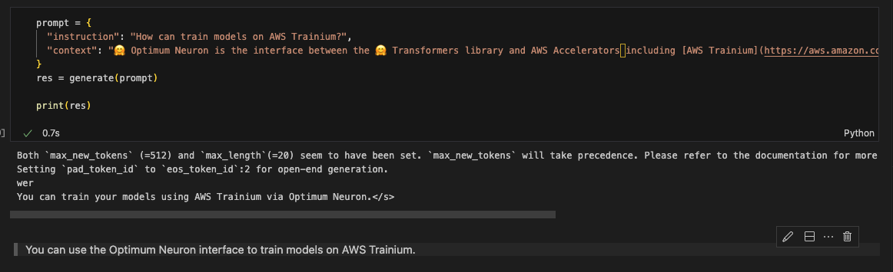

    

여기까지 오셨으면 성공 하셨습니다. 축하 드립니다. ^^

---
Contributor: 문곤수 (Gonsoo Moon)