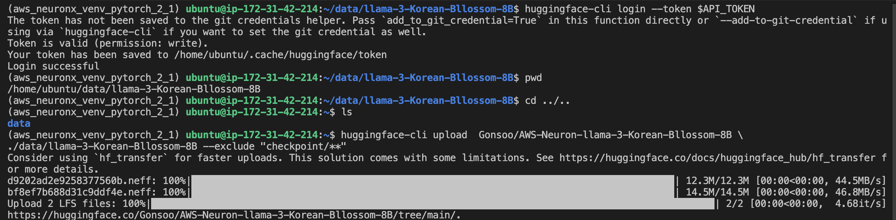

#  Amazon EC2 Inferentia2 기반 위에 한국어 파인 튜닝 모델을 서빙하기
Last Update: Aug 19, 2024

---

이 문서는 AWS Inferentia2 EC2 기반에서 한국어 파인 튜닝 모델을 서빙하는 과정을 설명합니다. 주요 단계는 다음과 같습니다:

1. Amazon EC2 Inferentia2 인스턴스 설치 (inf2.8xlarge와 inf2.xlarge)
2. 모델 컴파일: inf2.8xlarge에서 TGI Docker 이미지를 사용하여 한국어 모델 컴파일
    - 한국어 파인 튜닝 모델: [MLP-KTLim/llama-3-Korean-Bllossom-8B](https://huggingface.co/MLP-KTLim/llama-3-Korean-Bllossom-8B)
3. AWS Neuron 컴파일된 모델을 Hugging Face Hub에 업로드
    - 컴파일된 모델: [Gonsoo/AWS-Neuron-llama-3-Korean-Bllossom-8B](https://huggingface.co/Gonsoo/AWS-Neuron-llama-3-Korean-Bllossom-8B)
4. 모델 서빙: inf2.xlarge에서 TGI Docker를 사용하여 모델 서빙
5. 추론 테스트: Completion API와 Message API를 사용한 curl 명령어로 테스트
6. Gradio를 통한 웹 인터페이스 구현 및 테스트

주요 도구 및 기술:
- Hugging Face Text Generation Inference (HF TGI)
- Optimum Cli 로 파인 튜닝 모델을 AWS Neuron Model 로 컴파일
- TGI Docker Serving
- Gradio

다음 단계:
- 이 노트북은 Amazon Inferentia2 EC2 에 모델을 배포를 한 예시 입니다. Amazon SageMaker Endpoint 에도 배포가 가능하고, 다음 노트북 [02-deploy-llama-3-neuron-moel-inferentia2](notebook/02-deploy-llama-3-neuron-moel-inferentia2.ipynb) 을 실행 하시면 됩니다.

이 과정을 통해 사용자는 AWS EC2 Inferentia2  활용하여 효율적으로 한국어 LLM 모델을 서빙하고 테스트할 수 있습니다. 문서는 각 단계별 상세한 명령어와 설정 방법, 그리고 결과 확인 방법을 제공합니다.


---

# 1. 기본 사전 단계
## Quota 준비 
- 먼저 AWS 계정에 아래에 해당되는 기본적인 [Quota](https://docs.aws.amazon.com/servicequotas/latest/userguide/intro.html) 가 필요 합니다. inf2.xlarge 는 vCPUS 4개, inf2.8xlarge 32 개 필요 합니다. Running On-Demand Inf Instances 가 36 개 이상 있어야 합니다. 여기를 통해서 [inf2 spec](https://awsdocs-neuron.readthedocs-hosted.com/en/latest/general/arch/neuron-hardware/inf2-arch.html) 확인 해보세요.
- 

# 2. Amazon EC2 Inferentia2  설치
여기서는 2개의 [INF2](https://aws.amazon.com/ec2/instance-types/inf2/) 가 필요합니다. 컴파일을 위해서 inf2.8xlarge, 모델 서빙을 위해서 inf2.xlarge 필요 합니다.
-  inf2.xlarge 는 메모리가 16 GB 이어서, 컴파일시 inf2.8xlarge 를 사용 합니다. 


##  2.1. Launch the Instance (inf2.2xlarge EC2 생성)
- Region: us-east-1 에서 진행 했음.
- AMI, Instance Type 지정. 
    - 
- [중요] <u>Storage 는 512 GB 로 수정해주세요.</u>
- Trouble Shooting: Error
    - inf2.xlarge EC2 런칭시에 아래와 같은 에러:
        - Failed to start the instance i-04c1XXXXXXXX The requested configuration is currently not supported. Please check the documentation for supported configurations.
    - 솔루션
        - 위의 이유는 해당 Region 및 Availability Zone (AZ) 에 해당 EC2 가 부족하여 발생하는 에러 입니다. EC2 생성시에 Network 부분의 Subnet 을 바꾸어서 해보세요. 그래도 에러가 발생하면 AWS Account 팀에 문의 바랍니다. 

## 2.2 EC2 Connection
- 편하신 방법으로 EC2 에 SSH 로 연결하시면 됩니다. 저는 로컬에서 VS Code Remote Connection 으로 연결 하였습니다. 
- 

## 2.3 Launch the Instance (inf2.8xlarge EC2 생성)
위의 2.1, 2.2 과정을 반복해주세요. 단 2.1 에서 instance 를 inf2.8xlarge 로 선택 해주세요.


# 3. 모델 컴파일 하기
- EC2: inf2.8xlarge 에서 합니다.
## 3.1 환경 준비
- 가상 환경 진입 및 버전 확인
    - 아래와 같이 명령어를 통하여 가상 환경 및 버전 확인 합니다.
        - 현재 설치된 AMI 에는 neuronx-cc : 2.14.227 입니다. **[중요] 우리는 2.14.227 이 버전을 사용하지 않을 겁니다. TGI Docker Image 의 neuronx-cc 를 사용할 겁니다.**
            ```
            source  /opt/aws_neuronx_venv_pytorch_2_1/bin/activate
            dpkg -l | grep neuron
            pip list | grep -E "torch|neuronx"
            ```    
    - 
- 필요 프로그램 설치
    - huggingface_hub 를 설치 합니다. 추후 모델 다운로드 및 업로드시에 사용 합니다.
        ```
        pip install huggingface_hub
        ```
## 3.2 TGI 도커 이미지 다운로드 및 neuronx-cc 버전 확인 
- [neuronx-tgi](https://github.com/huggingface/optimum-neuron/pkgs/container/neuronx-tgi) 도커 이미지를 다운로드 합니다. 이 도커 이미지는 2024년 5월에 퍼블리싱 되었습니다.
    ```
    docker pull ghcr.io/huggingface/neuronx-tgi:0.0.23
    ```
    - 아래와 같이 Docker 를 pull 하였고, 저장된 이미지를 확인합니다.
        - 

- 도커를 실행하여 도커에 진입하여 neuron-cc 버전을 확인 합니다.
    ```
    docker run -it --entrypoint /bin/bash \
    ghcr.io/huggingface/neuronx-tgi:latest 
    ```
    - [중요] neuronx-cc 버전이 2.13.66.0 입니다. 이 버전은 EC2 의 가상 환경에 설치된 neuronx-cc : 2.14.227 와 다릅니다. 우리는 TGI Docker image 에서 최종 모델 배포를 해서 서빙을 할 예정이기에, TGI Docker image 의 neuronx-cc 버전이 2.13.66.0 를 사용할 겁니다. 
    - 

## 3.3 TGI Docker 의 optimum-cli 통한 파인 튜닝 모델 컴파일
여기서는 [MLP-KTLim/llama-3-Korean-Bllossom-8B](https://huggingface.co/MLP-KTLim/llama-3-Korean-Bllossom-8B) 한국어 모델을 optimum-cli 를 통해서 컴파일 하겠습니다. 자세한 사항은 [Exporting neuron models using NeuronX TGI](https://huggingface.co/docs/optimum-neuron/guides/export_model) 을 참고하세요.
- 블로그 [Task-specialized LLM을 위한 비용 효율적인 서빙 전략: AWS Inferentia2와 Hugging Face Optimum을 활용한 자체 개발 LLM 서빙하기](https://aws.amazon.com/ko/blogs/tech/task-specialized-llm-serving-aws-inferentia2-huggingface-optimum/) 에 다음과 내용으로 벤치마킹을 하였고, inf2.xlarge 사용시에 batch_size = 4 가 가장 성능이 좋았기에, 아래 컴파일시에도 동일한 설정을 사용 하였습니다. <br>
    - "Amazon EC2 g5.xlarge와 Amazon EC2 inf2.xlarge의 추론 성능을 비교하기 위해 사용한 모델은 특정 task를 수행하기 위해 미세조정 학습을 한 7B 크기의 LLM입니다"

```
time docker run --entrypoint optimum-cli \
-v $(pwd)/data:/data --privileged \
ghcr.io/huggingface/neuronx-tgi:latest \
export neuron --model MLP-KTLim/llama-3-Korean-Bllossom-8B \
--batch_size 4 --sequence_length 4096 \
--auto_cast_type fp16 --num_cores 2 \
data/llama-3-Korean-Bllossom-8B
```
컴파일 실행 결과 화면 (약 5분 40초 걸림)
- 


## 3.4 Neuron Model 을 Hugging Face Hub 로 업로드
- Hugging Face Hub 에 모델을 업로드하기 위해서는 "쓰기용" HF Writable Token 이 필요 합니다., 이후에 아래와 같이 명령어를 사용하여 로긴 하세요.
    - 토큰을 환경 변수에 저장
        ```
        export API_TOKEN=<HF Writable Token 입력>
        ```
    - HF 에 로그인
        ```
        huggingface-cli login --token $API_TOKEN
        ```
- 아래와 같이 Gonsoo/AWS-Neuron-llama-3-Korean-Bllossom-8B 에 업로드
    ```
    huggingface-cli upload  Gonsoo/AWS-Neuron-llama-3-Korean-Bllossom-8B \
    ./data/llama-3-Korean-Bllossom-8B --exclude "checkpoint/**"
    ```
    - 위의 명령어의 실행 화면 입니다. 
    - 
- Hugging Face Hub 에 등록된 모델 화면 입니다.<br><br>
    - 


# 4. 모델 서빙하기
- EC2: inf2.xlarge 에서 합니다.
## 4.1 환경 준비
- 가상 환경 진입 및 버전 확인
    - 아래와 같이 명령어를 통하여 가상 환경 및 버전 확인 합니다.
        - 현재 설치된 AMI 에는 neuronx-cc : 2.14.227 입니다.
            ```
            source  /opt/aws_neuronx_venv_pytorch_2_1/bin/activate
            dpkg -l | grep neuron
            pip list | grep -E "torch|neuronx"
            ```    
    - 
- 필요 프로그램 설치
    - huggingface_hub 를 설치 합니다. 추후 모델 다운로드 및 업로시에 사용 합니다.
        ```
        pip install huggingface_hub
        ```
## 4.2 TGI 도커 이미지 다운로드 및 neuronx-cc 버전 확인 
- [neuronx-tgi](https://github.com/huggingface/optimum-neuron/pkgs/container/neuronx-tgi) 도커 이미지를 다운로드 합니다. 이 도커 이미지는 2024년 5월에 퍼블리싱 되었습니다.
    ```
    docker pull ghcr.io/huggingface/neuronx-tgi:0.0.23
    ```
    - 아래와 같이 Docker 를 pull 하였고, 저장된 이미지를 확인합니다.
        - 

## 4.2. HF 에서 모델 다운로드 하기
아래와 같이 [Gonsoo/AWS-Neuron-llama-3-Korean-Bllossom-8B](https://huggingface.co/Gonsoo/AWS-Neuron-llama-3-Korean-Bllossom-8B) 에서 모델을 다운로드 받습니다. 현재 폴더에서 data 폴더를 생성후에 실행 합니다.
```
huggingface-cli download Gonsoo/AWS-Neuron-llama-3-Korean-Bllossom-8B \
--local-dir ./data/AWS-Neuron-llama-3-Korean-Bllossom-8B
```


## 4.3. TGI 도커 실행하기
- 로컬에 Neuron 모델은 ./data/AWS-Neuron-llama-3-Korean-Bllossom-8B 에 있습니다. 아래와 같이 docker run 을 통해서 TGI docker container 를 실행합니다.

    ```
    docker run \
    -p 8080:80 \
    -v $(pwd)/data:/data \
    --privileged \
    ghcr.io/huggingface/neuronx-tgi:latest \
    --model-id /data/AWS-Neuron-llama-3-Korean-Bllossom-8B
    ```
- 도커 실행 명령어를 실행한 후의 화면 입니다.
    - 
- 도커 실행 명령어가 완료되어 TGI docker container 가 대기 중입니다.
    - 컴파일시에 --batch_size 4 --sequence_length 4096 로 했기에, 최대 max batch total tokens 이 16,384 ( 4 * 4096) 으로 세팅 되었습니다. 
    - 

## 4.4. 트러블 슈팅
- 실행중인 도커 확인 하기
```
sudo ss -tuln 
sudo ss -tuln | grep 8080
```

# 5.추론 테스트 하기 
아래의 추론 명령서 형식은 [TGI Official Git Repo](https://github.com/huggingface/text-generation-inference) 를 참고 하세요.
## 5.1. Completion API 형태로 curl 실행
- 아래 curl 명령어를 실행 합니다.
    ```
    curl 127.0.0.1:8080/generate \
    -X POST \
    -d '{"inputs":"딥러닝이 뭐야?","parameters":{"max_new_tokens":512}}' \
    -H 'Content-Type: application/json'
    ```
- 아래는 total_time="25.099483509s" validation_time="336.958µs" queue_time="24.691µs" inference_time="25.09912212s" time_per_token="49.021722ms" 의 걸린 시간을 보여 줍니다.    
    - 

## 5.2. Message API 형태로 curl 실행
- 아래 명령어를 실행 합니다.
    ```
    curl localhost:8080/v1/chat/completions \
        -X POST \
        -d '{
    "model": "tgi",
    "messages": [
        {
        "role": "system",
        "content": "당신은 인공지능 전문가 입니다."
        },
        {
        "role": "user",
        "content": "딥러닝이 무엇입니까?"
        }
    ],
    "stream": false,
    "max_tokens": 512
    }' \
        -H 'Content-Type: application/json'  
    ```
- 아래는 total_time="24.338049835s" validation_time="394.38µs" queue_time="38.361µs" inference_time="24.337617254s" time_per_token="49.266431ms 시간을 보여주고, 위의 결과와 유사 합니다.
    - 

## 5.3. Inferentia2 의 Neuron Core 사용량 확인
- 아래 내용은 위의 "추론 테스트 하기 (Message API)" 실행 중에, 스크린샷 화면 입니다. 두개의 코어가 거의 다 사용되고 있고, Memory 19.4 GB 사용되고 있습니다. 
    -          


# 6. Gradio 를 통한 웹으로 접속해서 테스트 하기
## 6.1 EC2 환경 설정 하기
- EC2: inf2.2xlarge 에서 합니다.
- 아래와 같이 EC2 의 inbound rules 에 8081 포트를 추가 합니다. 8081 는 [Gradio App](https://www.gradio.app/) 에서 사용할 포트 입니다.
    - 

## 6.2 Gradio Chat Interface 생성하는 노트북 실행하기
- 아래의 Git 을 EC2: inf2.xlarge 에 Clone 을 합니다. 01-Run-Gradio-Chat-UX.ipynb 노트북을 오픈 합니다. 아래의 그림을 참조 하세요.
    - 아래의 노트북에서는 VS Code 의 예시이고, Jupyter, Python Extension 을 설치 후에 .venv Python Virtual Environment 를 설치 했습니다. 그리고  .venv 커널을 선택 하였습니다. 
        ```
        git clone https://github.com/aws-samples/aws-ai-ml-workshop-kr.git
        ```
    - 
- 노트북의 셀을 하나씩 모두 실행하고, 마지막 셀이 아래 처럼 실행해서 보이면 성공 입니다.
    - 
## 6.3 Gradio Chat 테스트 하기
- EC2: Inf2.xlarge 의 퍼블릭 IP 확인 하기
    - 아래의 예시 그럼 처럼, EC2 Console 을 열고, Auto-assigned IP address 를 찾고, IP 를 카피 합니다. 
    - 
- 브라우저 열고, http://Auto-assigned-IP-address:8081 을 입력 합니다. (예:http://54.224.3.4:8081/ )
    - 아래와 같은 UI 가 보여야 합니다.
        - 
- 드디어 테스트 시작
    - "딥러닝에 대해서 알려 주세요" 라고 입력한 이후의 결과 입니다.
    -     

g/Llama-2-inference.png)    

## 6.4 보안상의 이유로 퍼블릭하게 IP 를 접근 못할 경우
- 로컬 노트북 (혹은 로컬 컴퓨터) 에서 아래와 같이 터미널을 열고, SSH 로 원격 머신에 SSH 로 연결 합니다. 
```
 ssh -i ~/.ssh/your_key.pem -L 8081:localhost:8081 ubuntu@public_ip
```
- 이후에 아래와 같이 로컬의 브라우저를 열고 입력 합니다.
```
http://localhost:8081/
```
- 다음과 같이 화면이 보이고, 프롬프트를 입력 하시면 됩니다.
    - 

**여기까지 오셨으면 성공 하셨습니다. 축하 드립니다. ^^**

---
Contributor: 문곤수 (Gonsoo Moon)