#  Amazon SageMaker 를 이용하여 Amazon Inferentia2 기반 위에 Llama3-한국어 파인 튜닝 모델, Qwen-2.5-8B 을 서빙하기
Last Update: May 26, 2025 <br>
Contributor: 문곤수 (Gonsoo Moon)

---

AWS Neuron 기반 Optimum-neuron 0.0.28을 사용하여 Llama3 한국어 파인튜닝 모델을 Inferentia2에서 효율적으로 서빙하는 방법을 안내합니다.

1. 간편한 개발 환경인 SageMaker Notebook Instance의 inf2.xlarge를 활용하여 EC2를 직접 설정할 필요 없이 Neuron SDK가 포함된 Docker 이미지로 쉽게 테스트할 수 있습니다.
2. 효율적인 배포 워크플로우: Notebook Instance에서 로컬 도커 켄테이너 테스트를 완료한 후, 검증된 설정으로 SageMaker Inference Endpoint를 신속하게 배포할 수 있어 개발과 운영 환경의 일관성을 보장합니다.

### Quick Start
이미 Neuron 으로 컴파일된 모델을 바로 아래 노트북을 통해서 바로 실행이 가능합니다.
아래, "1. 기본 사전 단계: Quota 준비 " 에서 Inference Endpoint Usage 에서 Quota 확보 후에 하시면 됩니다.

- [01-deploy-llama-3-neuron-moel-inferentia2](notebook/01-deploy-llama-3-neuron-moel-inferentia2.ipynb)
- [02-deploy-llama-3-neuron-moel-inferentia2-from-S3](notebook/02-deploy-llama-3-neuron-moel-inferentia2-from-S3.ipynb)
- [03-deploy-qwen-2-5-instruct-neuron-moel-inferentia2](notebook/03-deploy-qwen-2-5-instruct-neuron-moel-inferentia2.ipynb)

---

### 🎯 목적
한국어로 파인튜닝된 Llama-3 8B 모델을 AWS Inferentia2 칩에서 효율적으로 실행할 수 있도록 최적화하는 방법을 설명

### 📋 주요 단계

**1. 환경 준비**
- AWS 할당량 확보 (SageMaker Notebook Instance, Inference Endpoint)
- SageMaker Notebook Instance 생성 (ml.inf2.xlarge, 128GB 스토리지)
- Docker 데이터 저장 위치를 SageMaker 디렉토리로 변경

**2. Docker 이미지 준비**
- AWS에서 제공하는 최신 TGI Neuron Docker 이미지 다운로드
- optimum-neuron 0.0.28 버전 사용
- ECR 로그인 후 이미지 Pull

**3. 모델 컴파일**
- 한국어 Llama-3 8B 모델을 Neuron 칩용으로 컴파일
- 배치 크기 4, 시퀀스 길이 4096, fp16 정밀도 사용
- 2개 Neuron 코어 활용 (ml.inf2.xlarge 에 맞춘 설정)

**4. 모델 서빙**
- 컴파일된 모델을 TGI(Text Generation Inference)로 서빙
- 포트 8080에서 HTTP API 제공
- OpenAI 호환 API와 기본 Completion API 모두 지원

**5. 성능 검증**
- 추론 속도: 토큰당 약 49ms
- 메모리 사용량: 19.4GB
- 두 가지 API 형태로 테스트 (Completion, Messages)

**6. 모델 배포**
- 컴파일된 모델을 Hugging Face Hub에 업로드
- 다른 사용자들이 바로 사용할 수 있도록 공유


---

# 1. 기본 사전 단계
## Quota 준비 
- 먼저 AWS 계정에 아래에 해당되는 기본적인 [Quota](https://docs.aws.amazon.com/servicequotas/latest/userguide/intro.html) 가 필요 합니다. 여기서는 [SageMaker AI Notebook instance](https://docs.aws.amazon.com/sagemaker/latest/dg/nbi.html) 와 [SageMaker AI Inference Endpoint](https://docs.aws.amazon.com/sagemaker/latest/dg/realtime-endpoints.html) 를 사용합니다.
- 각각 1개 씩만을 준비 하시면 됩니다. 
    - 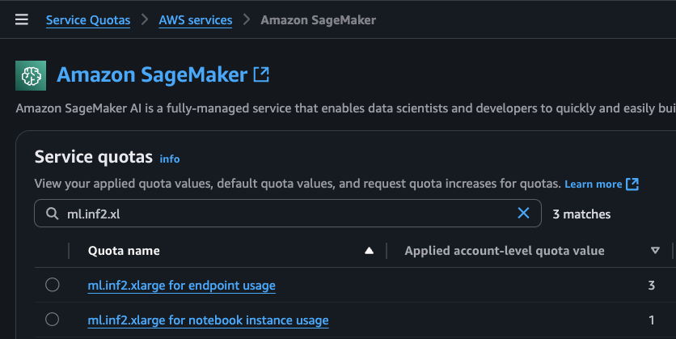

# 2. 환경 준비 하기
## 2.1 SageMaker Notebook Instance 생성하기
생성은 여기 [SageMaker AI Notebook instance](https://docs.aws.amazon.com/sagemaker/latest/dg/nbi.html) 가이드를 확인 해주시고, 아래는 중요 내용만 기술 하겠습니다.
아래와 같이 SageMaker Notebook Instance 를 생성시에, instance type 을 ml.inf2.xlarge, 스토리지는 128 GB 지정 합니다.
- [sm_notebook.png](img/sm_notebook.png)
role은 기존 것 혹은 새로운 role 을 생성하십시오. 그리고 role 은 AmazonSageMakerFullAccess, AmazonS3FullAccess 이 필요하고, SageMakr 의 신뢰 관계도 필요 합니다.
- 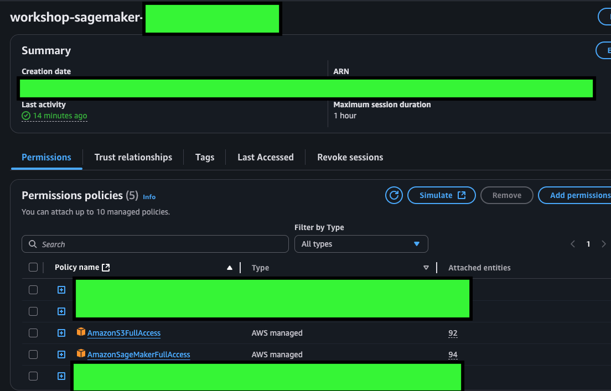
- 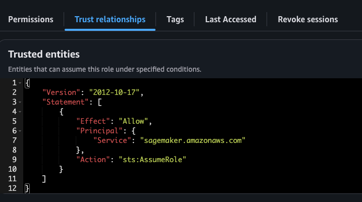


## 2.2 SageMaker Notebook Instance 열기 및 깃 리포 다운로드
쥬피터 노트북을 오픈하고, 터미널을 열어서 아래와 같이 Git Repo 를 클로닝 해주세요.

```    
pwd
cd SageMaker/
pwd
git clone https://github.com/aws-samples/aws-ai-ml-workshop-kr.git
```       
- 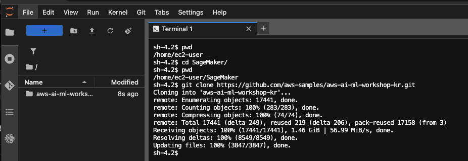
- 
## 2.3 도커 이미지 다운로드 위치 변경
용량의 큰 docker image 및 대용량의 Python Package 를 설치하면, 디폴트의 File System 의 사이즈가 부족합니다. 그래서 추가로 용량이 큰 File System 으로 경로를 변경 합니다.

```    
docker info | grep "Docker Root Dir"
sudo systemctl stop docker docker.socket
sudo mkdir -p /etc/docker 
sudo tee /etc/docker/daemon.json << EOF
{
  "data-root": "/home/ec2-user/SageMaker/docker-data"
}
EOF

sudo systemctl enable docker    # 자동 시작 설정
sudo systemctl start docker     # 즉시 시작

docker info | grep "Docker Root Dir"
df -h
```    
- 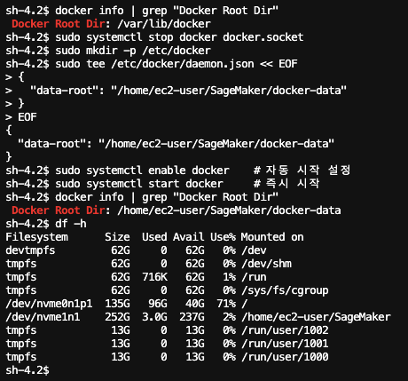


# 3. AWS Neuron 기반의 Optimum-neuron 0.0.28 도커 다운로드 받기
## 3.1 최신 도커 이미지 정보
- 2025.5.26 일 현재 [v1.2-hf-tgi-0.0.28-pt-2.1.2-inf-neuronx-py310](https://github.com/aws/deep-learning-containers/releases?q=tgi&expanded=true) 이 버전이 최신 버전 입니다.
- 이 도커 이미지는 SageMaker Endpoint 를 생성시에 "추론 도커 이미지" 로 동일하게 사용합니다.
  정확한 Docker Image 이름은 아래와 같습니다. (us-west-2 리젼의 경우)
  
    ```  
      763104351884.dkr.ecr.us-west-2.amazonaws.com/huggingface-pytorch-tgi-inference:2.1.2-optimum0.0.28-neuronx-py310-ubuntu22.04-v1.2 
    ```    
    
## 3.2 최신 도커 이미지 다운로드 하기
```  
# AWS ECR 로그인 하기
aws ecr get-login-password --region us-west-2 | docker login --username AWS --password-stdin 763104351884.dkr.ecr.us-west-2.amazonaws.com 

docker pull 763104351884.dkr.ecr.us-west-2.amazonaws.com/huggingface-pytorch-tgi-inference:2.1.2-optimum0.0.28-neuronx-py310-ubuntu22.04-v1.2 

docker image ls
```  
- 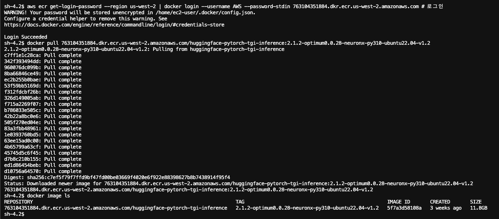

## 3.3 도커의 Optimum-neuron 버전 확인하기
다운로드 받은 도커 이미지의 Optimum-neuron 의 버전 및 Neuron-cc 의 버전 등을 확인 합니다.

```    
# 도커 안으로 들어가기
docker run -it --entrypoint /bin/bash \
763104351884.dkr.ecr.us-west-2.amazonaws.com/huggingface-pytorch-tgi-inference:2.1.2-optimum0.0.28-neuronx-py310-ubuntu22.04-v1.2
# 명령어 실행
optimum-cli env
```    

- 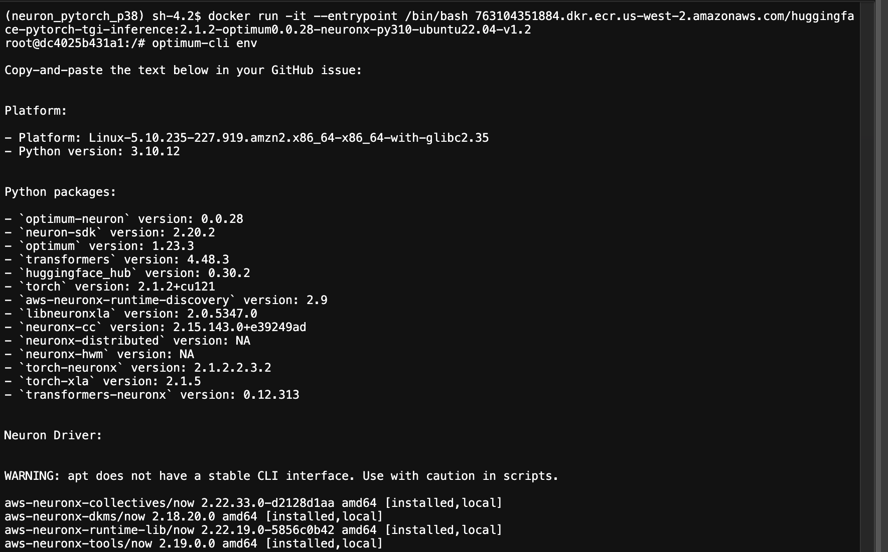

# 4. 모델 컴파일 하기
한국어 파인 튜닝된 [MLP-KTLim/llama-3-Korean-Bllossom-8B](https://huggingface.co/MLP-KTLim/llama-3-Korean-Bllossom-8B) 을 Neuron 을 사용할 수 있게 컴파일 하겠습니다. 

```
cd ~/SageMaker/

time docker run --entrypoint optimum-cli \
  -v $(pwd)/data:/data \
  --privileged \
  763104351884.dkr.ecr.us-west-2.amazonaws.com/huggingface-pytorch-tgi-inference:2.1.2-optimum0.0.28-neuronx-py310-ubuntu22.04-v1.2 \
  export neuron \
  --model MLP-KTLim/llama-3-Korean-Bllossom-8B \
  --batch_size 4 \
  --sequence_length 4096 \
  --auto_cast_type fp16 \
  --num_cores 2 \
  /data/llama-3-Korean-Bllossom-8B-recompiled
```

- 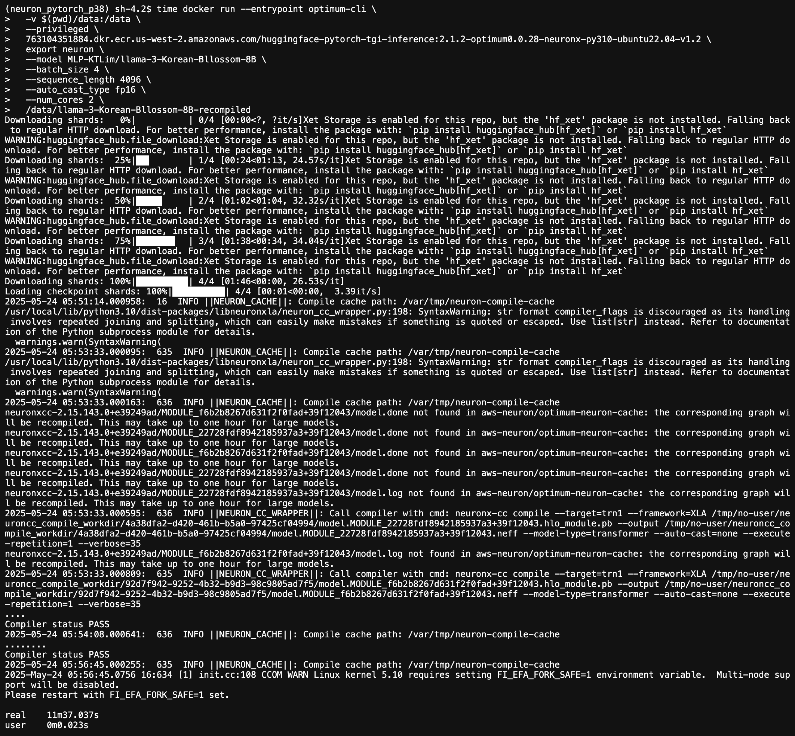
  
# 5. 모델 서빙 테스트 
## 5.1 도커 컨테이너의 TGI 로 모델 서빙
아래를 실행하면 이미지 처럼 나오면 모델 서빙 준비가 됨.
```
docker run -p 8080:8080 \
  -v $(pwd)/data:/data \
  --privileged \
  -e HF_MODEL_ID=/data/llama-3-Korean-Bllossom-8B-recompiled \
  -e HF_NUM_CORES=2 \
  -e HF_BATCH_SIZE=4 \
  -e HF_SEQUENCE_LENGTH=4096 \
  -e HF_AUTO_CAST_TYPE=fp16 \
  -e MAX_BATCH_SIZE=4 \
  -e MAX_INPUT_LENGTH=2048 \
  -e MAX_TOTAL_TOKENS=4096 \
  -e MESSAGES_API_ENABLED=true \
  763104351884.dkr.ecr.us-west-2.amazonaws.com/huggingface-pytorch-tgi-inference:2.1.2-optimum0.0.28-neuronx-py310-ubuntu22.04-v1.2
```
- 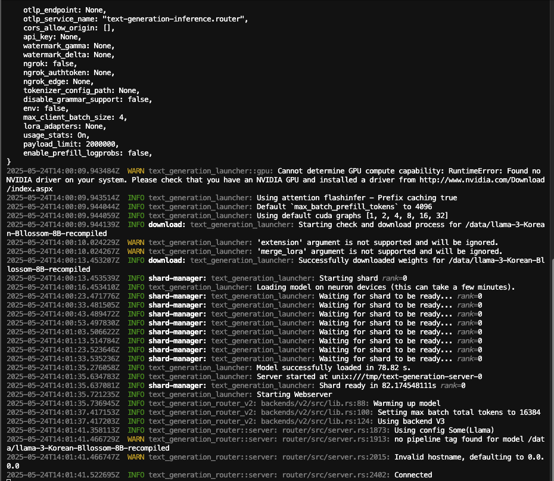


## 5.2. Completion API 형태로 curl 실행
- 아래 curl 명령어를 실행 합니다.아래의 추론 명령 형식은 [TGI Official Git Repo](https://github.com/huggingface/text-generation-inference) 를 참고 하세요.

```
curl 127.0.0.1:8080/generate \
-X POST \
-d '{"inputs":"딥러닝이 뭐야?","parameters":{"max_new_tokens":512}}' \
-H 'Content-Type: application/json'
```

- 아래는 total_time="25.099483509s" validation_time="336.958µs" queue_time="24.691µs" inference_time="25.09912212s" time_per_token="49.021722ms" 의 걸린 시간을 보여 줍니다.    
    - 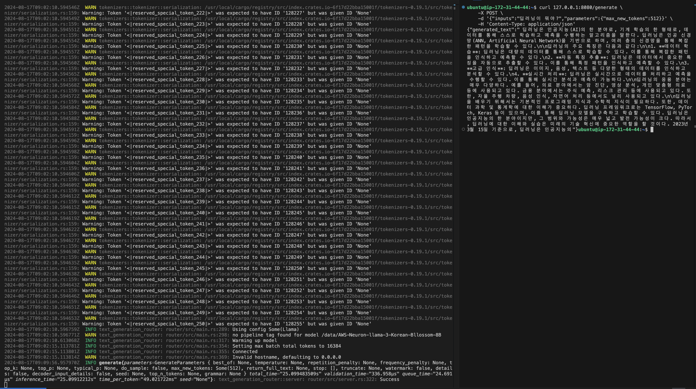

## 5.3. Message API 형태로 curl 실행
- 아래 명령어를 실행 합니다.

```
curl localhost:8080/v1/chat/completions \
    -X POST \
    -d '{
"model": "tgi",
"messages": [
    {
    "role": "system",
    "content": "당신은 인공지능 전문가 입니다."
    },
    {
    "role": "user",
    "content": "딥러닝이 무엇입니까?"
    }
],
"stream": false,
"max_tokens": 512
}' \
    -H 'Content-Type: application/json'  
```

- 아래는 total_time="24.338049835s" validation_time="394.38µs" queue_time="38.361µs" inference_time="24.337617254s" time_per_token="49.266431ms 시간을 보여주고, 위의 결과와 유사 합니다.
    - 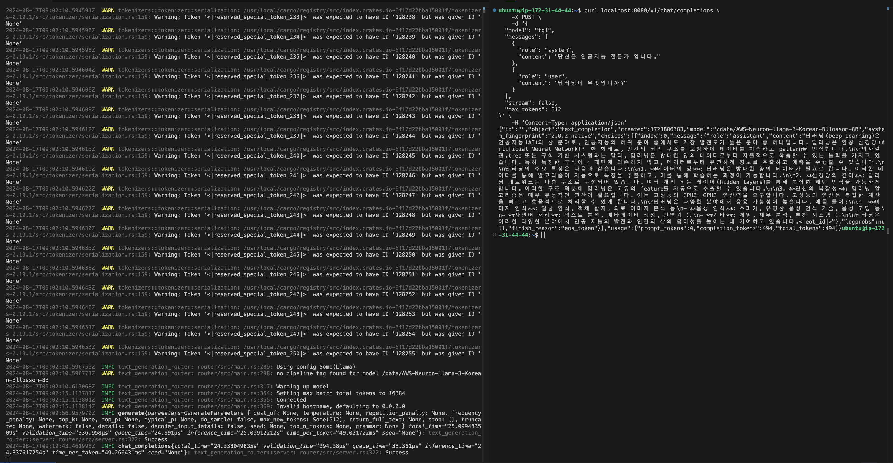

## 5.4. Inferentia2 의 Neuron Core 사용량 확인
- 아래 내용은 위의 "추론 테스트 하기 (Message API)" 실행 중에, 스크린샷 화면 입니다. 두개의 코어가 거의 다 사용되고 있고, Memory 19.4 GB 사용되고 있습니다. 
    -          

# 6. Neuron Model 을 Hugging Face Hub 로 업로드
- Hugging Face Hub 에 모델을 업로드하기 위해서는 "쓰기용" HF Writable Token 이 필요 합니다., 이후에 아래와 같이 명령어를 사용하여 로긴 하세요.
    - 토큰을 환경 변수에 저장
        ```
        export API_TOKEN=<HF Writable Token 입력>
        ```
    - HF 에 로그인
        ```
        huggingface-cli login --token $API_TOKEN
        ```
- 아래와 같이 Gonsoo/AWS-NeuronCC-2-14-llama-3-Korean-Bllossom-8B 에 업로드
    ```
        huggingface-cli upload  Gonsoo/AWS-HF-optimum-neuron-0-0-28-llama-3-Korean-Bllossom-8B \
        ./data/llama-3-Korean-Bllossom-8B-recompiled --exclude "checkpoint/**"
    ```
    - 위의 명령어의 실행 화면 입니다. 
    - 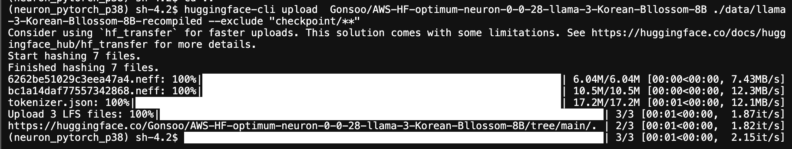
- Hugging Face Hub 에 등록된 모델 화면 입니다.<br><br>
    - 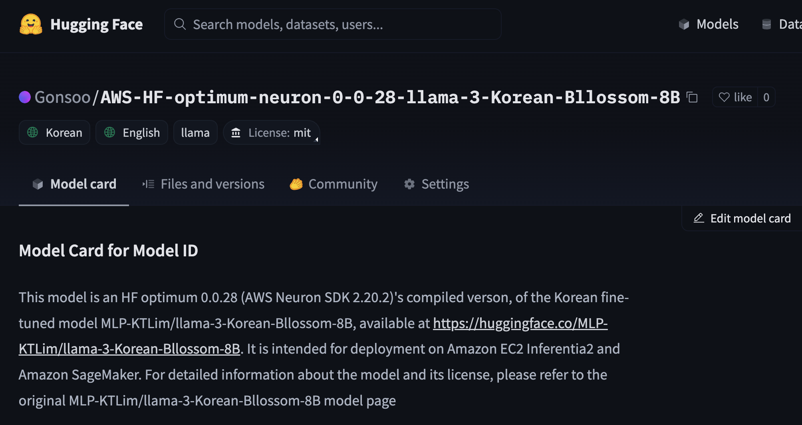

# 7. SageMaker Inference Endpoint 생성
고생 하셨습니다. 이제 이렇게 로컬에서 "한국어 파인 튜닝 모델" 의 컴파일 및 모델 서빙 테스트 된 것을 SageMaker Endpoint 생성하여 추론 하겠습니다. 아래 노트북을 실행 하세요.
- [01-deploy-llama-3-neuron-moel-inferentia2](notebook/01-deploy-llama-3-neuron-moel-inferentia2.ipynb)
- [02-deploy-llama-3-neuron-moel-inferentia2-from-S3](notebook/02-deploy-llama-3-neuron-moel-inferentia2-from-S3.ipynb)
- [03-deploy-qwen-2-5-instruct-neuron-moel-inferentia2](notebook/03-deploy-qwen-2-5-instruct-neuron-moel-inferentia2.ipynb)
---
Contributor: 문곤수 (Gonsoo Moon)