# Llama-2-13b 모델을 inf2.32xlarge 에서 추론하기

Last Update: Feb 23, 2024

---

이 튜토리얼은 inf2.32xlarge 로 Llama-2-13b 모델을 로드하여 추론을 위한 가이드 입니다. 아래의 노트북을 실행 하기 위함 입니다. 
- [Run Hugging Face meta-llama/Llama-2-13b autoregressive sampling on Inf2 & Trn1](https://github.com/aws-neuron/aws-neuron-samples/blob/master/torch-neuronx/transformers-neuronx/inference/meta-llama-2-13b-sampling.ipynb)

이를 위해서 단계별로 가이드 제공을 합니다. 또한 AWS Neuron Documentation 의 내용을 기본으로 했으며, <u>추후 업데이트로 인한 아래의 가이드가 에러 발생시에는 AWS Neuron Documentation 를 참조 해주시기 바랍니다.</u>

- [AWS Neuron Documentation](https://awsdocs-neuron.readthedocs-hosted.com/en/latest/)
<br>
<p>

# 1. 기본 사전 단계
## Quota 준비 
- 먼저 AWS 계정에 아래에 해당되는 기본적인 [Quota](https://docs.aws.amazon.com/servicequotas/latest/userguide/intro.html) 가 필요 합니다. [inf2.48xlarge](https://awsdocs-neuron.readthedocs-hosted.com/en/latest/general/arch/neuron-hardware/inf2-arch.html) 는 vCPU 가 192개 필요하므로 Running On-Demand Inf Instances 가 192 개 이상 있어야 합니다. 
- 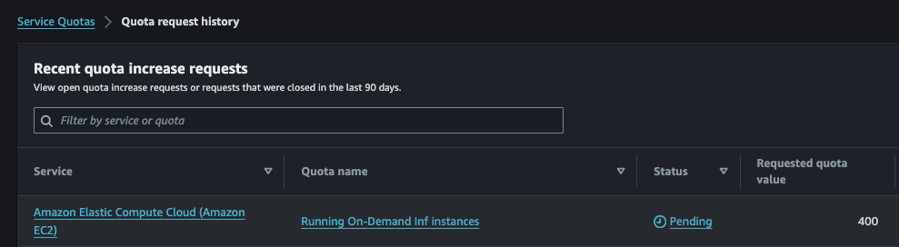

# 2. 기본 환경 셋업
아래의 단계는 [PyTorch Neuron (“torch-neuronx”) Setup on Ubuntu 20 with DLAMI Pytorch](https://awsdocs-neuron.readthedocs-hosted.com/en/latest/general/setup/neuron-setup/pytorch/neuronx/ubuntu/torch-neuronx-ubuntu20-pytorch-dlami.html#setup-torch-neuronx-ubuntu20-dlami-pytorch) 단계를 따라깁니다. 
- <u>이 웹페이지를 열고, 아래 내용을 참조하면서 실행 하시기 바랍니다. </u>

##  2.1. Launch the Instance (inf2.48xlarge EC2 생성)
- Region: us-west-2, Subnet: us-west-2c, AZ: usw2-az3 에서 진행 했음.
- AMI, Instance Type 지정. 
    - 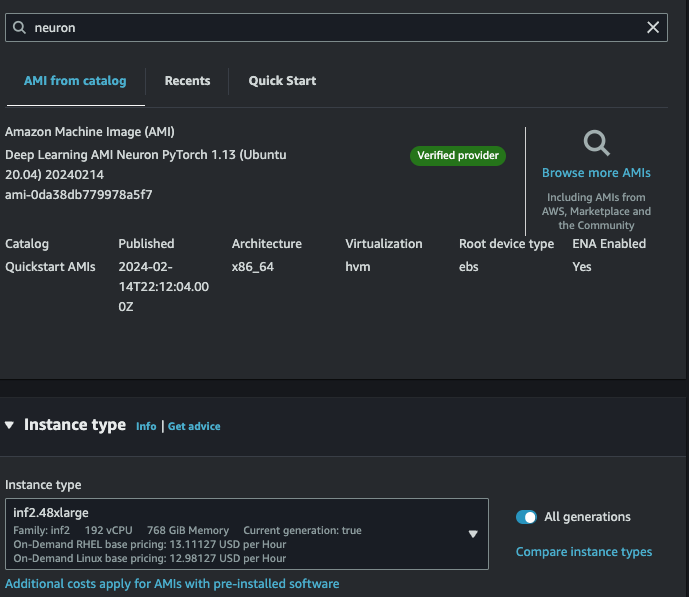
- [중요] <u>Storage 는 500 GB 로 수정해주세요.</u>
- Trouble Shooting: Error
    - inf2.48xlarge EC2 런칭시에 아래와 같은 에러:
        - Failed to start the instance i-04c1XXXXXXXX The requested configuration is currently not supported. Please check the documentation for supported configurations.
    - 솔루션
        - 위의 이유는 해당 Region 및 Availability Zone (AZ) 에 해당 EC2 가 부족하여 발생하는 에러 입니다. EC2 생성시에 Network 부분의 Subnet 을 바꾸어서 해보세요. 그래도 에러가 발생하면 AWS Account 팀에 문의 바랍니다. 

## 2.2 EC2 Connection
- 편하신 방법으로 EC2 에 SSH 로 연결하시면 됩니다. 저는 로컬에서 VS Code Remote Connection 으로 연결 하였습니다. 
- 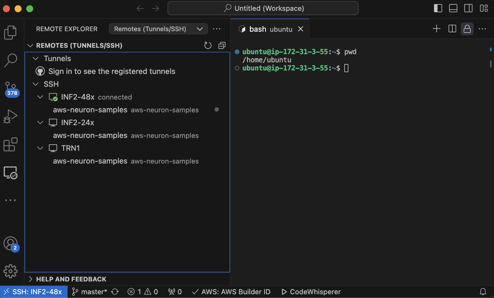
## 2.3 Update Neuron Drivers
- 해당 명령어를 실행 해주세요. 아래와 같이 실행 해주세요.
- 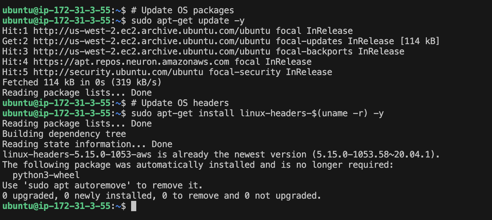
## 2.4 Get Started with Pytorch DLAMI
- 해당 명령어를 실행 해주세요. 
- 이후에 버전 확인을 해주세요. (아래는 2024. 02. 23 기준)
    - ```dpkg -l | grep neuron```
    - 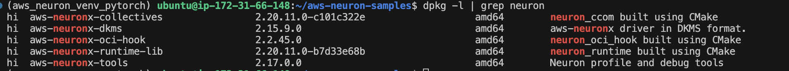

## 2.5 Install Transformers NeuronX (transformers-neuronx)
- [Transformers NeuronX (transformers-neuronx)](https://awsdocs-neuron.readthedocs-hosted.com/en/latest/libraries/transformers-neuronx/index.html) 웹페이지를 여시고, Setup 에 있는 아래 명령어를 실행 합니다. 
    - ```pip install transformers-neuronx --extra-index-url=https://pip.repos.neuron.amazonaws.com```
- 버전 확인을 합니다.
    - ```pip list | grep transformers-neuronx```
    - 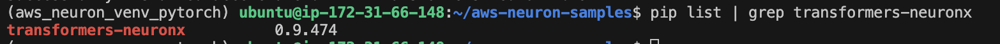

# 3. LLama-2-13-B 실행 위한 환경 준비

## 3.1. AWS Neuron Samples Git 다운로드
- 아래와 같이 Git 을 다운로드 합니다.
    - ```git clone https://github.com/aws-neuron/aws-neuron-samples.git```
- 노트북, Run Hugging Face meta-llama/Llama-2-13b autoregressive sampling on Inf2 & Trn1, 오픈 합니다.   
    - [Run Hugging Face meta-llama/Llama-2-13b autoregressive sampling on Inf2 & Trn1](https://github.com/aws-neuron/aws-neuron-samples/blob/master/torch-neuronx/transformers-neuronx/inference/meta-llama-2-13b-sampling.ipynb)
    - 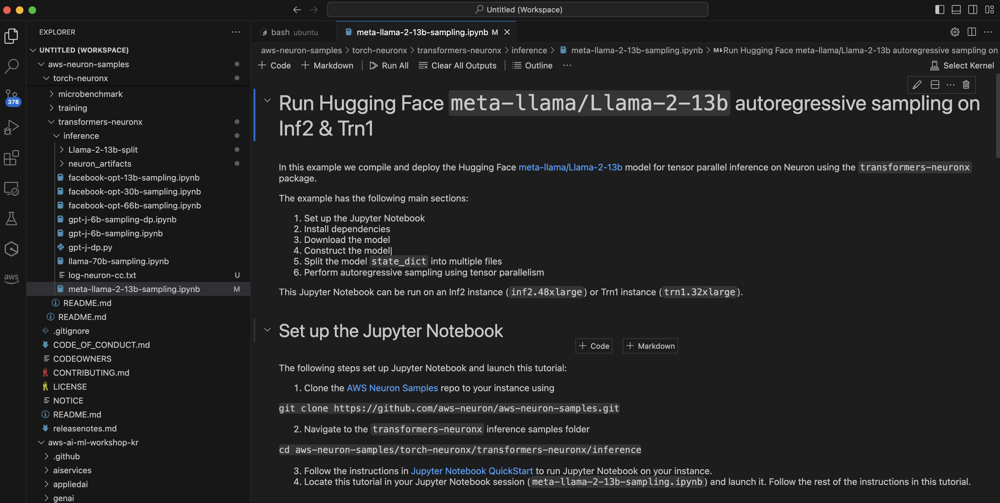
    - 위 그림의 상단에 "Select Kernel" 이 있습니다. 아래의 그림 처럼 Jupyter Kernel 인 Python(torch-neuronx) 커널이 보이기 위해서, 왼쪽에 Extention 을 통하여 Jupyter 를 설치를 해주시면, Python(torch-neuronx) 이 보이실 거고, 클릭해서 선택하시면 됩니다. 
    - 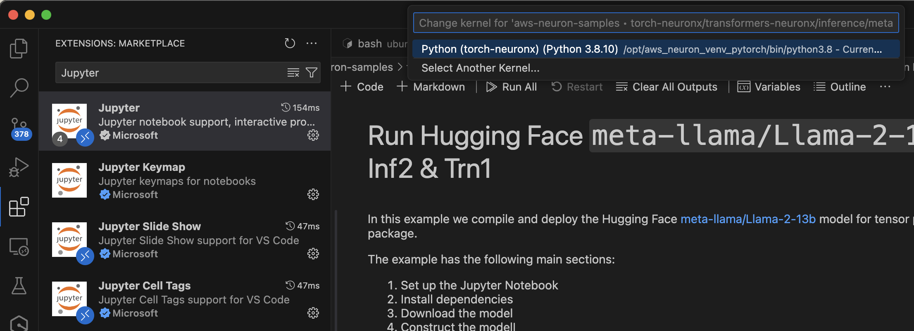

# 4. LLama-2-13-B 데이터 셋 다운로드.
- 위의 노트북에 아라처럼 가이드가 있습니다. 꼭 읽어 보시고 따라 하세요.
- 기본적인 단계는 이렇습니다.
    - (1) 메타의 웹페이지에 가서 모델 다운로드에 필요한 정보 (이름, 이메일 주소 등)를 입력 합니다.
    - (2) 이후에 메타로 부터 이메일이 도착 합니다. (저의 경우는 1분 안에 도착 하였습니다.)
    - (3) 이메일을 열면, [메타 라마의 Git](https://github.com/facebookresearch/llama) 을 다운로드 하고, download.sh 을 실행합니다.
    - (4) download.sh 을 실행하면 이메일에 동봉된 URL 을 입력하라고 합니다.
        - 
    - (5) 이후에 다운로드 하고자 하는 모델명을 입력하면, 다운로드가 됩니다.

# 5. LLama-2-13-B 데이터 셋을 Hugging Face Format 으로 변경
- 노트북 가이드에 따르면 아래와 같은 명령어를 통해서 바꿀 수 있습니다.
    ```
    python transformers/src/transformers/models/llama/convert_llama_weights_to_hf.py \
        --input_dir /home/ubuntu/llama/llama-2-13b \
        --model_size 13Bf \
        --output_dir ./Llama-2-13b
    ```
- 위를 실행하기 위해서 몇가지의 단계가 필요 합니다.
    - (1) transformer git 다운로드 합니다
        ```
        git clone https://github.com/huggingface/transformers.git
        ```
    - (2) 아래와 같이 aws_neuron_venv_pytorch 가상 환경에서 sentencepiece 를 설치 합니다
    - (3) 다운로드가 된 tokenizer.model  tokenizer_checklist.chk 파일을 예로 /home/ubuntu/llama/llama-2-13b 에 옮깁니다. 다운로드시에 토큰나이저는 다운로드 폴더에 저장되고, 모델 가중치는 이의 하위 폴더에 저장 됩니다. 그래서 하나의 폴더에 토큰나이저, 모델 가중치의 파일이 모두 같은 곳에 있게 합니다. 
    - (4) 위의 명령어에 해당 인자를 제공하여 실행 합니다. 아래와 같이 Huggingface format 의 파일로 변경 됩니다.
        - 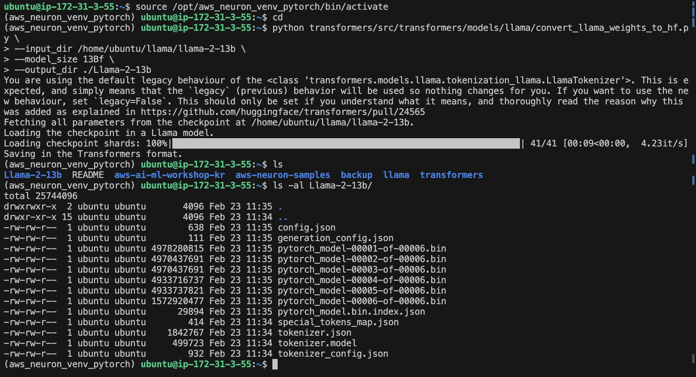

# 6. 노트북 실행
## 6.1. Construct the model
- 아래와 같이 Huggingface format 의 모델를 로딩 합니다.
- 
## 6.2. Compile and load model in neuron cores (24 neuron cores)
- inf2.48xlarge 는 12 개의 Accelerator 가 있고, 1개당 2개의 neuron core 가 있어서, 총 24개 입니다. 그래서 tp_degree=24 로 설정 했습니다, 이후에 실행하면 아래와 같이 컴파일이 되고, 모델이 neuron core 24 개에 로딩 됩니다. 이 과정은 컴파일이 수반됩니다. 컴파일이 안되면 "에러" 메세지가 출력이 됩니다. 
- 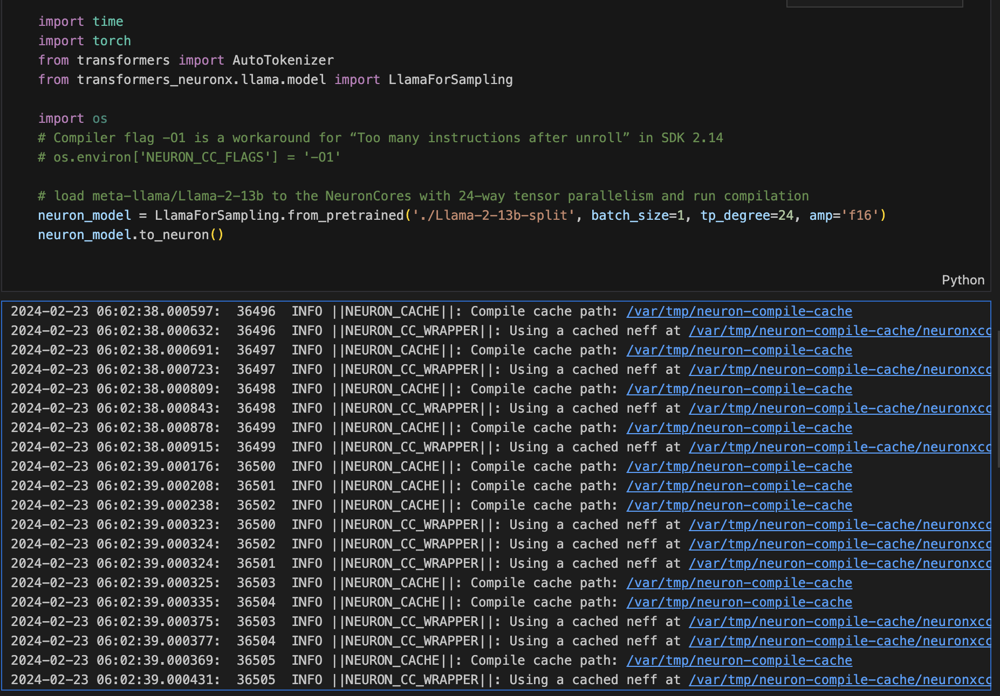
## 6.3. Inference 
- 토큰나이저를 로딩하고, text 를 input_id 로 변환 후에 추론 ("생성") 을 합니다.
- 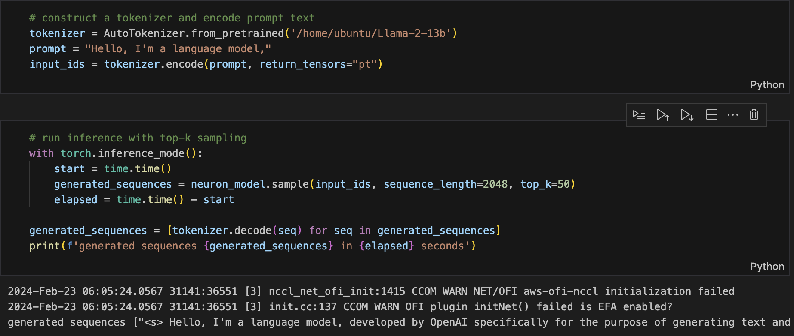
    

여기까지 오셨으면 성공 하셨습니다. 축하 드립니다. ^^

---
Contributor: 문곤수 (Gonsoo Moon)
---