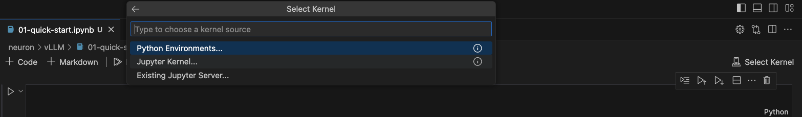

#  AWS Inferentia 기반 위에 vLLM offline 추론하기

Last Update: Mar 31, 2024

---

이 튜토리얼은 inf2.48xlarge 로 vLLM 에서 Offline 추론을 위한 가이드 입니다. 
아래의 내용은 [vLLM Project Git Repo](https://github.com/vllm-project/vllm) 의 [examples/offline_inference_neuron.py](https://github.com/vllm-project/vllm/blob/main/examples/offline_inference_neuron.py) 를 노트북에서 실행한 예시 입니다.


<p> 

# 1. 기본 사전 단계
## Quota 준비 
- 먼저 AWS 계정에 아래에 해당되는 기본적인 [Quota](https://docs.aws.amazon.com/servicequotas/latest/userguide/intro.html) 가 필요 합니다. [inf2.48xlarge](https://awsdocs-neuron.readthedocs-hosted.com/en/latest/general/arch/neuron-hardware/inf2-arch.html) 는 vCPU 가 192개 필요하므로 Running On-Demand Inf Instances 가 192 개 이상 있어야 합니다. 
- 

# 2. 기본 환경 
- vLLM 의 공식 가이드,[vLLM Installation on Neuron](https://docs.vllm.ai/en/latest/getting_started/neuron-installation.html#) , 을 아래에 실행 합니다. 다만, 2024년 3월 31일 현재 소스로 부터 vLLM 설치가 에러가 발생하여 pip install vllm 으로 설치 합니다.

##  2.1. Launch the Instance (inf2.48xlarge EC2 생성)
- Region: us-east-1, Subnet: us-east-1c, AZ: use1-az6 에서 진행 했음.
- AMI, Instance Type 지정. 
    - 
- [중요] <u>Storage 는 200 GB 로 수정해주세요.</u>
- Trouble Shooting: Error
    - inf2.48xlarge EC2 런칭시에 아래와 같은 에러:
        - Failed to start the instance i-04c1XXXXXXXX The requested configuration is currently not supported. Please check the documentation for supported configurations.
    - 솔루션
        - 위의 이유는 해당 Region 및 Availability Zone (AZ) 에 해당 EC2 가 부족하여 발생하는 에러 입니다. EC2 생성시에 Network 부분의 Subnet 을 바꾸어서 해보세요. 그래도 에러가 발생하면 AWS Account 팀에 문의 바랍니다. 

## 2.2 EC2 Connection
- 편하신 방법으로 EC2 에 SSH 로 연결하시면 됩니다. 저는 로컬에서 VS Code Remote Connection 으로 연결 하였습니다. 
- 


## 2.3 필요 Neuron Driver 및 필요 패키지 설치
- vLLM 의 공식 가이드,[vLLM Installation on Neuron](https://docs.vllm.ai/en/latest/getting_started/neuron-installation.html#) 의 참조해서 설치 하신 후에 아래와 같이 버전을 확인 합니다. 

- Step 1. Install drivers and tools
    - 
- Step 2. Install transformers-neuronx and its dependencies    
    - 
- Step 3. Install vLLM from pip (Source 로 부터 설치는 Mar 31, 2024 현재 에러가 발생하여 PIP 로 설치 합니다.)
    - 아래 PIP 로 실행 
        ```
        pip install vllm
        ```
    - 이후에 아래와 같이 설치 됩니다. (_C 모듈 설치 됨)
        - 
- Step 4. neuron 모듈을 수동으로 카피 (이 과정은 추후에 버그 수정이 되면 안해도 됩니다.)
    - 아래 파일을 다운로드 받고, vllm.model_executor.models.neuron 의 폴더 내용을 아래의 그림과 같이 복사 합니다. 그리고 neuron 폴더 안에 __init__.py 파일을 생성 해주어야 합니다.
        - https://github.com/vllm-project/vllm/archive/refs/tags/v0.3.3.tar.gz
        - 
    


# 3.코드 실행
## 3.1 examples/offline_inference_neuron.py 실행
- VS Code 열기
    - 
- 터미널을 열고, 설치된 가상 환경으로 진입후에 해당 파일을 실행 함.
    -     

## 3.2 examples/offline_inference_neuron.py 내용을 Jupyter Notebook 에서 실행
- VS Code에 Jupyter Extension 설치
    - 
- Jupyter Kenel 선택
    - 
- Python (touch-neuronx) 선택
    - 
- 아래를 클릭하여 노트북을 샐행 하세요.
    - [01-offline_inference_neuron.ipynb](01-offline_inference_neuron.ipynb)


<p>

---

- 여기까지 오셨으면 성공 하셨습니다. 축하 드립니다. ^^
- Contributor: 문곤수 (Gonsoo Moon)