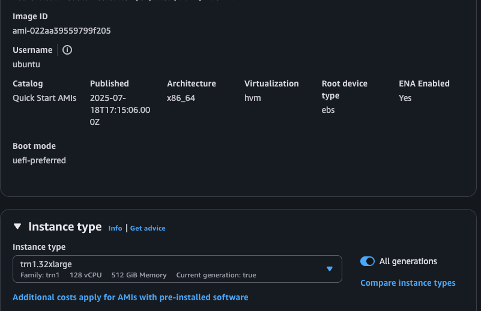
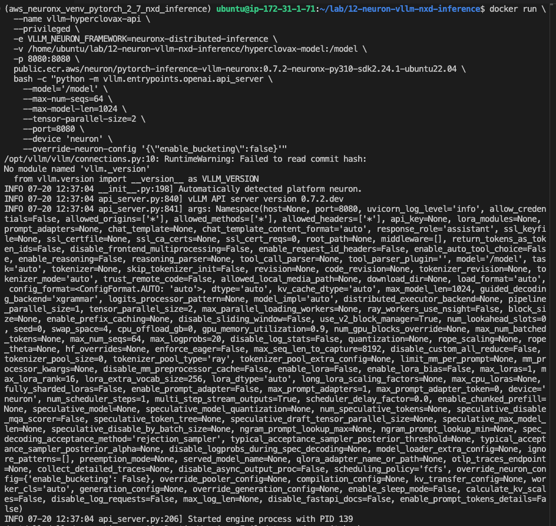
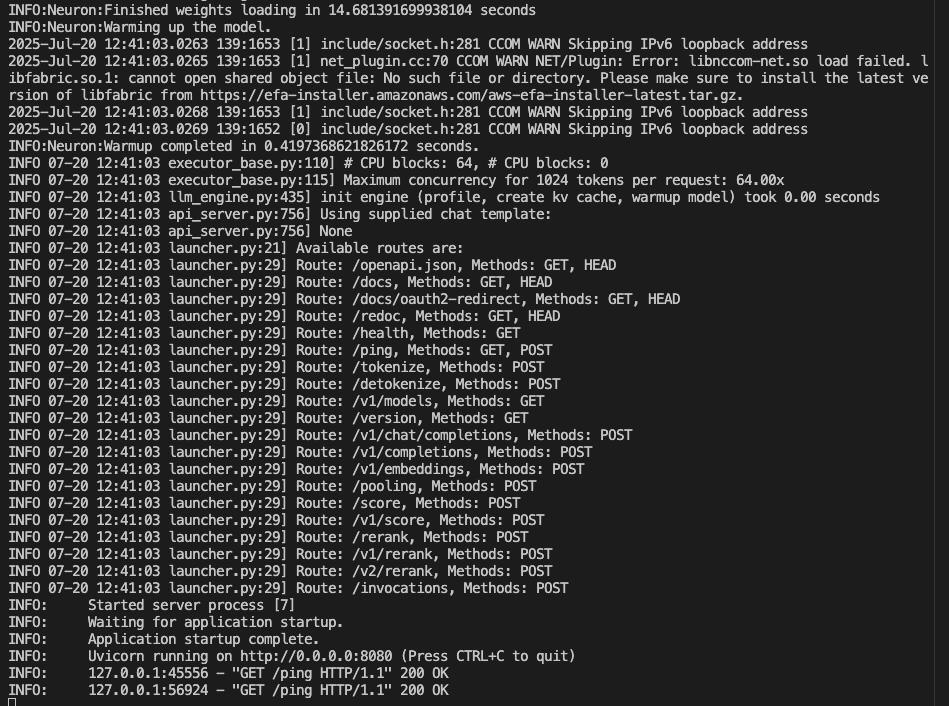
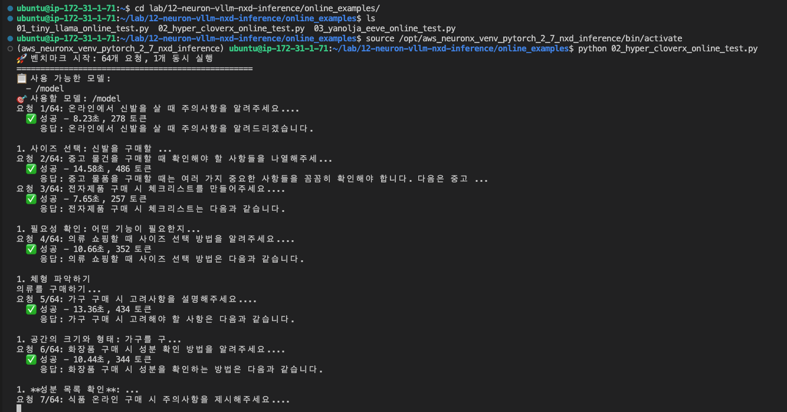
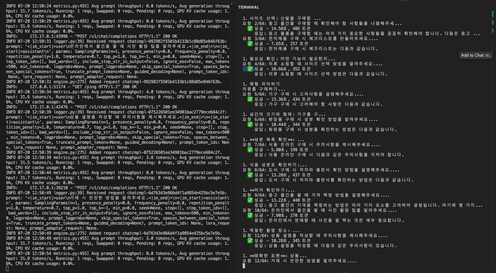

# AWS Neuron 과 vLLM 이용한 LLM 서빙 (예: HyperCLOVAX-SEED-Text-Instruct-1.5B)

Last Updated: July 20, 2025


# 0. Test 완료된 제공 모델 종류
- [TinyLlama-1.1B-Chat-v1.0](https://huggingface.co/TinyLlama/TinyLlama-1.1B-Chat-v1.0)
- [Llama-3-Korean-Bllossom-8B](https://huggingface.co/MLP-KTLim/llama-3-Korean-Bllossom-8B)
- [Qwen_25_7B_instruct](https://huggingface.co/Qwen/Qwen2-7B-Instruct)
- [HyperCLOVAX-SEED-Text-Instruct-1.5B](https://huggingface.co/naver-hyperclovax/HyperCLOVAX-SEED-Text-Instruct-1.5B)
- [Yanolja_EEVE-8B](https://huggingface.co/yanolja/EEVE-Korean-10.8B-v1.0)

- 유투브 데모: 
    - [Run vllm integrated with AWS Neuron on AWS Trainium for HyperCLOVAX-SEED-Text-Instruct-1.5B](https://www.youtube.com/watch?v=XYW3xwrLQGQ) 

# 1.EC2 인스턴스 설치
- 다음 가이드를 따라 하세요. --> [NxD Inference Setup Guide](https://awsdocs-neuron.readthedocs-hosted.com/en/latest/libraries/nxd-inference/nxdi-setup.html#option-1-launch-an-instance-using-a-neuron-dlami)
    - 인스턴스는 처음에는 inf2.xlarge 혹은 inf2.xlarge 혹은 trn1.2xlarge 를 사용하세요. 
        - 아래의 예시는 inf2.24xlarge 이므로 --tensor-parallel-size=2 로 설정해서 사용하세요.
    - 가능하면 처음에는 아래와 같은 AMI (2025.07.20 시점) 를 사용하세요.
        - 

# 2. 사전 환경 설치
- 최근 Docker Version:  vLLM 0.7.2 다운로드 하기
    - [Neuron Docker Repo](https://github.com/aws-neuron/deep-learning-containers/blob/2.24.1/docker/vllm/inference/0.7.2/Dockerfile.neuronx)
    ```
    docker pull public.ecr.aws/neuron/pytorch-inference-vllm-neuronx:0.7.2-neuronx-py310-sdk2.24.1-ubuntu22.04
    ```    
- 코드 리포 클로닝
    ```    
    git clone https://github.com/gonsoomoon-ml/lab.git
    cd 12-neuron-vllm-nxd-inference
    source /opt/aws_neuronx_venv_pytorch_2_7_nxd_inference/bin/activate
    ```        

# 3. Offline 모델 컴파일 및 추론
1. Docker Container 실행
    ```    
    docker run -d --name neuron-vllm \
            -v $(pwd):/workspace \
            -v ~/.cache/huggingface:/root/.cache/huggingface \
            -v ~/.cache/neuron:/root/.cache/neuron \
            --privileged public.ecr.aws/neuron/pytorch-inference-vllm-neuronx:0.7.2-neuronx-py310-sdk2.24.1-ubuntu22.04 \
            tail -f /dev/null    
    ```    
2. Docker Container 진입
    ```
    docker exec -it neuron-vllm /bin/bash    
    ```    
3. offline 코드 실행 ( 여러 모델의 경우가 있으니, 골라서 실행 하셔도 됩니다.)
    ```    
    python /workspace/01_TinyLlama-1.1B-Chat-v1.0.py
    ```    
        
# 4. Online 모델 컴파일 및 추론
1. 모델 로컬에 다운로드
    ```    
    export HF_TOKEN=<Your HF Key>
    huggingface-cli download naver-hyperclovax/HyperCLOVAX-SEED-Text-Instruct-1.5B --local-dir ./hyperclovax-model
    ```    
2. vllm 도커 실행하기
    ```    
    docker run \
        --name vllm-hyperclovax-api \
        --privileged \
        -e VLLM_NEURON_FRAMEWORK=neuronx-distributed-inference \
        -v /home/ubuntu/lab/12-neuron-vllm-nxd-inference/hyperclovax-model:/model \
        -p 8080:8080 \
        public.ecr.aws/neuron/pytorch-inference-vllm-neuronx:0.7.2-neuronx-py310-sdk2.24.1-ubuntu22.04 \
        bash -c "python -m vllm.entrypoints.openai.api_server \
            --model='/model' \
            --max-num-seqs=64 \
            --max-model-len=1024 \
            --tensor-parallel-size=2 \
            --port=8080 \
            --device 'neuron' \
            --override-neuron-config '{\"enable_bucketing\":false}'"
    ```     
- vllm 도커 실행 예시 화면
    - 
- vllm 도커 실행 완료 화면
    - 
3. 스크립트 실행 하기
    ```     
    cd lab/12-neuron-vllm-nxd-inference/online_examples/
    ls
    source /opt/aws_neuronx_venv_pytorch_2_7_nxd_inference/bin/activate
    python 02_hyper_cloverx_online_test.py 
    ```     
- 스크립트 실행 화면
    -     
- vLLM 서빙 및 출력 결과
    -         
- vLLM 서빙 및 뉴런 사용량
    -         


# A. Reference
* [NxD Inference Features Configuration Guide](https://awsdocs-neuron.readthedocs-hosted.com/en/latest/libraries/nxd-inference/developer_guides/feature-guide.html#nxdi-feature-guide)
* [Models supported in Transformers NeuronX and NxD Inference model hubs](https://awsdocs-neuron.readthedocs-hosted.com/en/latest/libraries/nxd-inference/developer_guides/migrate-from-tnx-to-nxdi.html)
* [vLLM](https://docs.vllm.ai/en/v0.6.0/index.html)
* [OpenAI Compatible Server](https://docs.vllm.ai/en/v0.6.0/serving/openai_compatible_server.html)