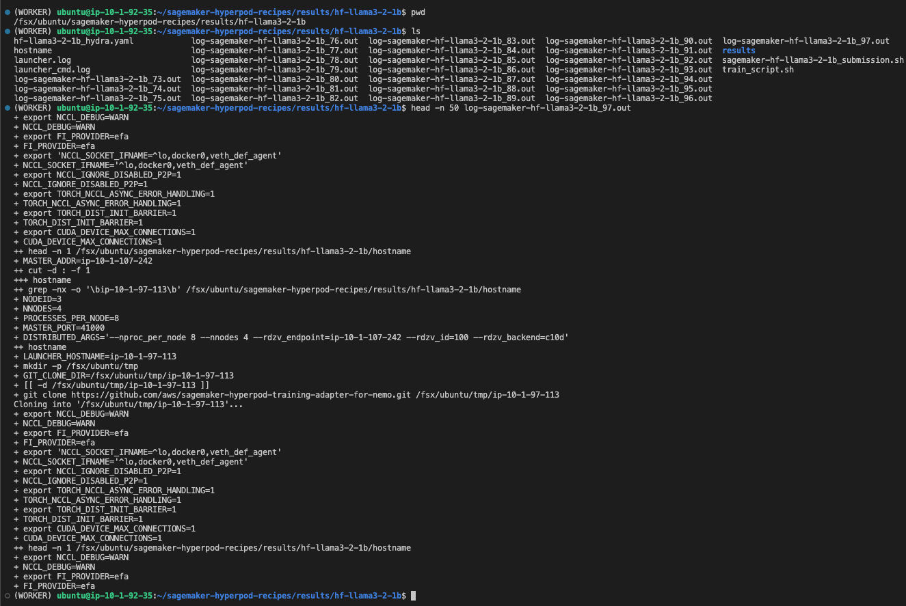
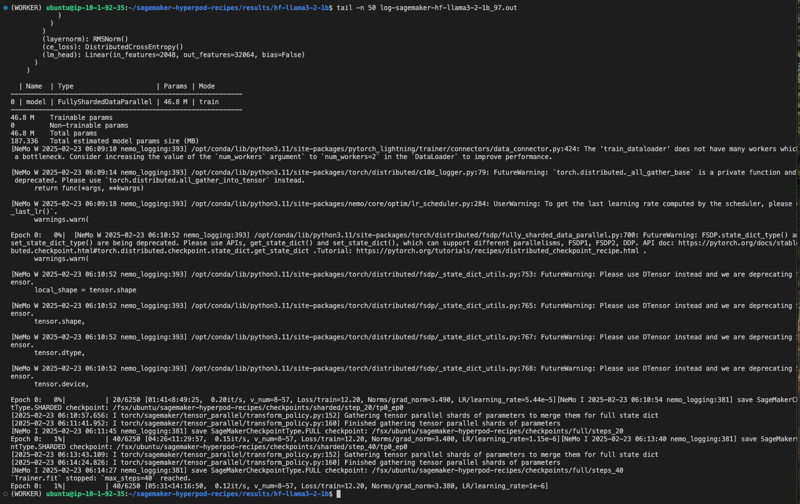

# Lab: SageMaker HyperPod Recipes 따라 해보기 - llama3_2_1b Pre-Training on  g5.48xlarge 4대

Last Update: Feb 23, 2025

이 랩은 Workshop: [Amazon SageMaker HyperPod](https://catalog.workshops.aws/sagemaker-hyperpod/en-US) 의 "7. SageMaker HyperPod recipes (p5/trn)" 의 내용입니다. 이 가이드는 p5.48xlarge 1 대에 기반해서 작성되어 있습니다. llama3_2_1b 를 g5.48xlarge 4대로 설정 파일 등을 수정해서 실행하는 랩 입니다. 또한 기존의 가이드의 설명이 부족한 부분의 정보를 추가해서 조금 더 쉽게 따라하게 만든 랩 입니다. 
-  SageMaker HyperPod Recipes 뿐만 아니라, 본인이 가지고 있는 "기존 코드 변경 없이" SageMaker HyperPod 을 사용하는 것은 [기존 모델 훈련 스크립트를 SageMaker HyperPod 에서 실행하기](https://github.com/aws-samples/aws-ai-ml-workshop-kr/tree/master/genai/aws-gen-ai-kr/30_fine_tune/06-llama3-sagemaker-hyperpod) 를 참고 하세요.

## 1 선수 내용
[Workshop: Amazon SageMaker HyperPod](https://catalog.workshops.aws/sagemaker-hyperpod/en-US) 의 0. Prerequisites, 1. Cluster Setup, 3. FSDP (p4/p5) 의 단계를 완료 해 주세요. Cluster Setup - Computing node 로서 ml.g5.48xlarge 4대로 클러스터 노드를 구성 하시면 됩니다.


## 2 Git Repo 이해: Amazon SageMaker HyperPod recipes 
- [Amazon SageMaker HyperPod recipes ](https://github.com/aws/sagemaker-hyperpod-recipes.git) 를 클로닝해서 작업을 해야 하는데요, 클로닝 후의 폴더 및 구조 입니다.
- 중요 폴더 및 파일
    - launcher_scripts/llama/run_hf_llama3_2_1b_seq8k_gpu_p5x1_pretrain.sh
        - 실제 모델 훈련의 런칭 셀 입니다.
    - recipes_collection/config.yaml file
        - 전체적인 Cluster 구동 설정 파일 (에: slurm/k8s, 훈련 도커 컨테이너 이미지, p5 instnace 설정 여부 등)     
    - recipes_collection/llama/hf_llama3_2_1b_seq8k_gpu_p5x1_pretrain.yaml
        -  trainer (Node 개수 등), checkpoint, model training, fine-tuning, learning rate/optimizer, data config 의 설정 파일 입니다. 
    ```
    |-launcher_scripts
    | |-mistral
    | |-custom_script
    | |-llama
    | | |-run_hf_llama3_2_1b_seq8k_gpu_p5x1_pretrain.sh
    | | |-gonsoo_run_hf_llama3_2_1b_seq8k_gpu_p5x1_pretrain.sh # 원본에서 수정 파일
    | |-mixtral
    | |-deepseek
    | |-custom_model
    |-template
    |-smdistributed-modelparallel.sqsh # Squash Docker Image generated by Enroot command
    |-validations_wrapper.py
    |-scripts
    |-recipes_collection
    | |-recipes
    | | |-fine-tuning
    | | | |-dee`pseek
    | | | |-llama
    | | |-training
    | | | |-mixtral
    | | | |-llama
    | | | | |-hf_llama3_2_1b_seq8k_gpu_p5x1_pretrain.yaml
    | | | | |-gonsoo_hf_llama3_2_1b_seq8k_gpu_p5x1_pretrain.yaml # 원본 파일의 수정 버전
    | | | |-custom_model
    | | | | |-falcon.yaml
    | | | |-mistral
    | |-cluster
    | | |-slurm.yaml
    | | |-sm_jobs.yaml
    | | |-k8s.yaml
    | |-config.yaml
    |-results
    | |-hf-llama3-2-1b
    | | |-launcher.log
    | | |-results
    | | |-hf-llama3-2-1b_hydra.yaml
    | | |-hostname
    | | |-train_script.sh
    | | |-sagemaker-hf-llama3-2-1b_submission.sh
    | | |-log-sagemaker-hf-llama3-2-1b_77.out
    | | |-log-sagemaker-hf-llama3-2-1b_78.out
    | | |-log-sagemaker-hf-llama3-2-1b_79.out
    |-Config
    |-README.md
    |-main.py
    |-launcher
    |-tests
    |-requirements.txt
    ```

## 3. 단계별 실험 방법 
### 3.1 아래의 가상 경로를 생성 (중요: Python3.9 이상이어야 함.) 
    ```
    cd ~/
    python3 -m venv ${PWD}/venv
    source venv/bin/activate
    python --version
    ```
### 3.2 Git 클로닝 : sagemaker-hyperpod-recipes
- 아래 반드시 --recursive 로 클로닝 해야 함. 내부 폴더에 추가적인 Git 클로닝을 함.
    ```
    git clone --recursive https://github.com/aws/sagemaker-hyperpod-recipes.git
    cd sagemaker-hyperpod-recipes
    pip3 install -r requirements.txt    
    ```
- 위 실행시 이와 같은 에러가 발생하면 아래와 같이 조치를 해야함.
    ```
    git@github.com: Permission denied (publickey). 
    fatal: Could not read from remote repository. 
    ```
- 조치 내용
    -  Claude Sonnet3.5 해결 답변
    ```
        이 에러는 SSH 키가 GitHub에 등록되지 않아서 발생하는 문제입니다. HTTPS 방식으로 클론하는 것으로 변경하거나, SSH 키를 설정하면 해결할 수 있습니다.
        또는 SSH 키를 설정하고 싶으시다면:

        SSH 키 생성:
        ssh-keygen -t ed25519 -C "your_email@example.com"
        
        SSH 키 확인:
        cat ~/.ssh/id_ed25519.pub
        
        이 공개키를 GitHub 계정의 Settings → SSH and GPG keys에 등록

        SSH 연결 테스트:
        ssh -T git@github.com
    ```

### 3.3 SageMaker Training Docker Image 를 squash 파일로 성성
- [중요] 25.2.3 일 현재 SageMaker Training Docker Image 와 ECR 로그인의 계정이 틀려서, 에러 발생 함. 참조: [Ask to fix "Usage Guide" #25
](https://github.com/aws/sagemaker-hyperpod-recipes/issues/25)
    ```
    REGION=us-east-1 # cluster 가 생성된 region 명
    IMAGE="658645717510.dkr.ecr.${REGION}.amazonaws.com/smdistributed-modelparallel:2.4.1-gpu-py311-cu121"
    aws ecr get-login-password --region "${REGION}" | docker login --username AWS --password-stdin 658645717510.dkr.ecr.${REGION}.amazonaws.com
    enroot import -o $PWD/smdistributed-modelparallel.sqsh dockerd://${IMAGE}
    ```

### 3.4 SageMaker Training Docker Image Squash 를 container 경로 지정
- SageMaker Training Docker Image 를 squash 파일의 경로를 아래 설정 파일에 추가 해야 함.
    - 파일 위치: recipes_collection/config.yaml 
        ```
        container: /fsx/ubuntu/sagemaker-hyperpod-recipes/smdistributed-modelparallel.sqsh
        ```

### 3.5 데이터 준비
- 데이터가 준비되면 TRAIN_DIR, VAL_DIR 에 지정하면 되지만, 동작 여부를 판단 하기 위해서 합성데이터를 사용하는 아래 옵션을 추가 함. recipes.model.data.use_synthetic_data=true 를 아래 파일에 추가 함.
    - File 위치: launcher_scripts/llama/gonsoo_run_hf_llama3_2_1b_seq8k_gpu_p5x1_pretrain.sh
        ```
        SAGEMAKER_TRAINING_LAUNCHER_DIR=${SAGEMAKER_TRAINING_LAUNCHER_DIR:-"$(pwd)"}

        TRAIN_DIR="${TRAIN_DIR}" # Location of training dataset
        VAL_DIR="${VAL_DIR}" # Location of validation dataset

        EXP_DIR=$SAGEMAKER_TRAINING_LAUNCHER_DIR
        EXP_DIR="${EXP_DIR}" # Location to save experiment info including logging, checkpoints, etc.

        HYDRA_FULL_ERROR=1 python3 ${SAGEMAKER_TRAINING_LAUNCHER_DIR}/main.py \
            recipes=training/llama/gonsoo_hf_llama3_2_1b_seq8k_gpu_p5x1_pretrain \
            base_results_dir=${SAGEMAKER_TRAINING_LAUNCHER_DIR}/results \
            recipes.run.name="hf-llama3-2-1b" \
            recipes.exp_manager.exp_dir=$EXP_DIR \
            recipes.model.data.train_dir=$TRAIN_DIR \
            recipes.model.data.val_dir=$VAL_DIR \
            recipes.model.data.use_synthetic_data=true \ # 새로이 추가
        ```

### 3.6 Instance Type 변경
- p5.48xlarge 를 g5.48xlarge 로 변경 
    - 파일 위치: recipes_collection/config.yaml file
        ```
        # instance_type: p5.48xlarge
        instance_type: g5.48xlarge
        ```

### 3.7 Instance Count 및 tensor_model_parallel_degree 변경
GPU 메모리가 부족하여 에러 발생함.  num_nodes:4, tensor_model_parallel_degree: 4 로 변경 함
- 실행할 노드의 개수를 수정
    - 파일 위치: recipes_collection/recipes/training/llama/gonsoo_hf_llama3_2_1b_seq8k_gpu_p5x1_pretrain.yaml
        ```
        # Basic pytorch lightning trainer config
        trainer:
        devices: 8
        num_nodes: 4

        # Memory saving /distributed training configs
        # tensor_model_parallel_degree: 1
        tensor_model_parallel_degree: 4
        ```

### 3.8 fp8 사용 여부 변경
- fp8 를 False 로 변경
    - 파일 위치: recipes_collection/recipes/training/llama/gonsoo_hf_llama3_2_1b_seq8k_gpu_p5x1_pretrain.yaml
        ```
        fp8: False
        # fp8: True
        # fp8_amax_history_len: 1024
        # fp8_amax_compute_algo: max
        ```

### 3.9 launch script 실행
- 아래와 같이 런치 스크립트를 실행합니다.
    ```
    bash launcher_scripts/llama/gonsoo_run_hf_llama3_2_1b_seq8k_gpu_p5x1_pretrain.sh
    ```
- 

## 4 실행 결과 확인
- 런치 스크립트를 실행한 이후에 /fsx/ubuntu/sagemaker-hyperpod-recipes/results/hf-llama3-2-1b 폴더가 생성되고, log-sagemaker-hf-llama3-2-1b_97.out 파일을 보았습니다. (실행을 계속 하면 log-sagemaker-hf-llama3-2-1b_??.out 파일의 일련 번호가 바뀌어서 계속 로그로 남습니다.)
- 아래는 head 50 으로 처음 생성 로그 입니다.
    - 
- 아래는 tail 100 으로 처음 생성 로그 입니다.     
    - 

#### 4.1 Checkpoint 파알 확인 (확인 중 !!! )
- 현재로 실행 로그에는 Checkpoint 생성이 된다고 하지만, 실제 파일 시스템에는 존재하지 않아서 확인 중 입니다.


## 5 설정 파일 상세
### 5.1 recipes_collection/config.yaml file 내용
```
# Original Copyright (c), NVIDIA CORPORATION. Modifications © Amazon.com

# defaults:
#   - _self_
#   - cluster: slurm  # set to `slurm`, `k8s` or `sm_jobs`, depending on the desired cluster
#   - recipes: training/llama/hf_llama3_8b_seq16k_gpu_p5x16_pretrain # select desired config inside the training directory
#   - override hydra/job_logging: stdout

defaults:
  - _self_
  - cluster: slurm  # set to `slurm`, `k8s` or `sm_jobs`, depending on the desired cluster
  - recipes: training/llama/hf_llama3_2_1b_seq8k_gpu_p5x1_pretrain.yaml # select desired config inside the training directory
  - override hydra/job_logging: stdout

cluster_type: slurm  # bcm, bcp, k8s or sm_jobs. If bcm, k8s or sm_jobs, it must match - cluster above.
# If using sm_jobs cluster_type, set sm_jobs_config. See cluster/sm_jobs.yaml for example.

hydra:
  run:
    dir: .
  output_subdir: null

debug: False

# instance_type: p5.48xlarge
instance_type: g5.48xlarge
# base_results_dir: null  # Location to store the results, checkpoints and logs.
base_results_dir: /fsx/ubuntu/sagemaker-hyperpod-recipes

# container: null
container: /fsx/ubuntu/sagemaker-hyperpod-recipes/smdistributed-modelparallel.sqsh
git:
  repo_url_or_path: null
  branch: null
  commit: null
  entry_script: null
  token: null
  update_adapter: false # if true it will re-install the Adapter code but not its dependencies

env_vars:
  NCCL_DEBUG: WARN  # Logging level for NCCL. Set to "INFO" for debug information

# Do not modify below, use the values above instead.
training_config: ${hydra:runtime.choices.recipes}

```
### 5.2 launcher_scripts/llama/gonsoo_run_hf_llama3_2_1b_seq8k_gpu_p5x1_pretrain.sh
```
SAGEMAKER_TRAINING_LAUNCHER_DIR=${SAGEMAKER_TRAINING_LAUNCHER_DIR:-"$(pwd)"}
echo "SAGEMAKER_TRAINING_LAUNCHER_DIR: "
echo $SAGEMAKER_TRAINING_LAUNCHER_DIR

TRAIN_DIR="${TRAIN_DIR}" # Location of training dataset
VAL_DIR="${VAL_DIR}" # Location of validation dataset

EXP_DIR=$SAGEMAKER_TRAINING_LAUNCHER_DIR
EXP_DIR="${EXP_DIR}" # Location to save experiment info including logging, checkpoints, etc.


HYDRA_FULL_ERROR=1 python3 ${SAGEMAKER_TRAINING_LAUNCHER_DIR}/main.py \
    recipes=training/llama/gonsoo_hf_llama3_2_1b_seq8k_gpu_p5x1_pretrain \
    base_results_dir=${SAGEMAKER_TRAINING_LAUNCHER_DIR}/results \
    recipes.run.name="hf-llama3-2-1b" \
    recipes.exp_manager.exp_dir=$EXP_DIR \
    recipes.model.data.train_dir=$TRAIN_DIR \
    recipes.model.data.val_dir=$VAL_DIR \
    recipes.model.data.use_synthetic_data=true \
```

### 5.3 recipes_collection/recipes/training/llama/gonsoo_hf_llama3_2_1b_seq8k_gpu_p5x1_pretrain.yaml
```
# Original Copyright (c), NVIDIA CORPORATION. Modifications © Amazon.com

# Basic run information configs
run:
  name: llama3-2-1b
  results_dir: ${base_results_dir}/${.name}
  time_limit: "6-00:00:00"
  model_type: hf # huggingface for our recipes

# Basic pytorch lightning trainer config
trainer:
  devices: 8
  num_nodes: 4
  accelerator: gpu
  precision: bf16
  max_steps: 40
  log_every_n_steps: 1
  val_check_interval: 1
  limit_val_batches: 0 # Number of batches per each validation run, set to 0 to disable validation.

# Basic pytorch lightning experiment config
# Config for checkpoint/tensorboard etc

exp_manager:
  exp_dir: "/fsx/ubuntu/sagemaker-hyperpod-recipes/checkpoints"
  name: experiment
  create_tensorboard_logger: True
  create_checkpoint_callback: True
  # Configs to save checkpoint with a fixed interval
  # Note: These config will not work with auto checkpoint mode
  checkpoint_callback_params:
    # Set save_top_k = 0 to disable sharded checkpointing
    save_top_k: 1
    every_n_train_steps: 20
    monitor: "step"
    mode: "max"
    save_last: True
  checkpoint_dir: ${recipes.exp_manager.exp_dir}/checkpoints/
  resume_from_checkpoint: null
  # Enable auto_checkpoint to automatically calculate the checkpoint interval and resume from checkpoint
  auto_checkpoint:
    enabled: False
  export_full_model:
    # Set every_n_train_steps = 0 to disable full checkpointing
    every_n_train_steps: 20
    save_last: True

################# Predefined configs ##########################
use_smp_model: True # Enable sagemaker model parallelism
distributed_backend: nccl


# Model training configs
model:
  model_type: llama_v3
  # Base configs
  train_batch_size: 2
  val_batch_size: 1
  seed: 12345
  grad_clip: 1.0
  log_reduced_training_loss: True

  # Memory saving /distributed training configs
  # tensor_model_parallel_degree: 1
  tensor_model_parallel_degree: 4
  expert_model_parallel_degree: 1
  context_parallel_degree: 1
  moe: False
  activation_checkpointing: False
  activation_loading_horizon: 1
  delayed_param: True
  offload_activations: False

  # FSDP Configs
  sharding_strategy: hybrid_shard
  forward_prefetch: True
  shard_degree: 8
  backward_fetch_policy: backward_pre
  auto_wrap_policy: transformer_auto_wrap_policy
  limit_all_gathers: False
  use_orig_param: True

  # FP8 config for g5.12xlarge
  fp8: False
  # fp8: True
  # fp8_amax_history_len: 1024
  # fp8_amax_compute_algo: max

  # Model architecture
  max_context_width: 8192
  max_position_embeddings: ${.max_context_width}
  num_hidden_layers: 16
  hidden_size: 2048
  num_attention_heads: 32
  intermediate_size: 8192
  initializer_range: 0.02
  layernorm_epsilon: 1e-5
  vocab_size: 128256
  num_key_value_heads: 8
  use_flash_attention: True
  rope_theta: 500000.0
  # rope scaling for llama3
  rope_scaling:
    rope_type: llama3
    factor: 32.0
    high_freq_factor: 4.0
    low_freq_factor: 1.0
    original_max_position_embeddings: 8192

  tie_word_embeddings: true

  # Finetuning config
  do_finetune: False
  # The path to resume from, needs to be HF compatible
  hf_model_name_or_path: null
  # PEFT config
  peft:
    peft_type: null # lora

  precision: ${recipes.trainer.precision}
  ################# End of Predefined configs ##########################

  # Learning rate and optimizer configs
  lr_decay_iters: ${recipes.trainer.max_steps}
  # Optimizer
  optim:
    name: adamw
    lr: 0.0001
    weight_decay: 0.01
    betas:
    - 0.9
    - 0.95
    sched:
      name: CosineAnnealing
      warmup_steps: 0
      constant_steps: 0
      min_lr: 0.000001

  # Data configs
  data:
    train_dir: null
    val_dir: null
    dataset_type: hf
    use_synthetic_data: False

  # Profiling configs
  # Viztracer profiling options
  viztracer:
    enabled: false
```