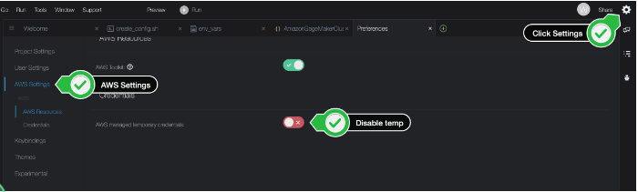
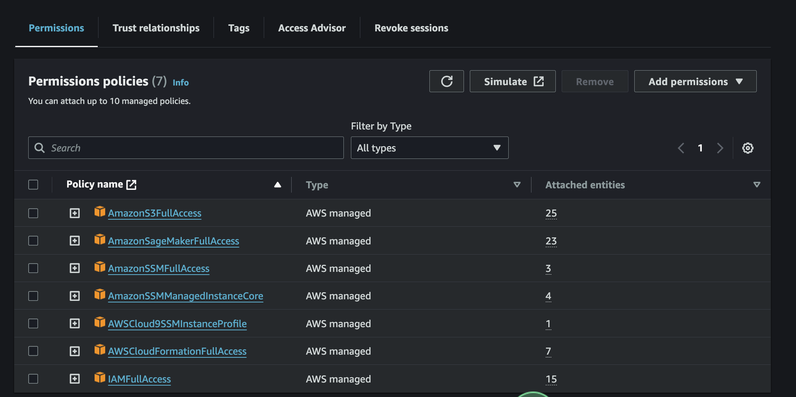
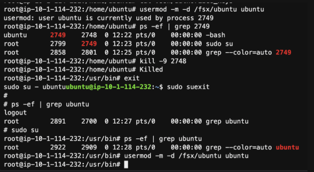
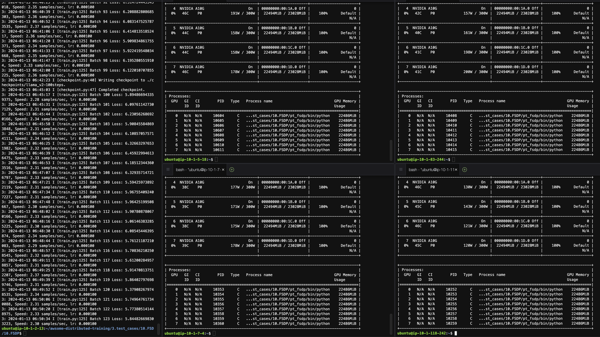

# SageMaker-HyperPod-Step-By-Step
아래의 가이드는 두 개의 자료를 기반으로 하였습니다. Amazon SageMaker HyperPod Workshop 은 HyperPod 의 환경 세팅을 주로 참고 하였고, 거의 내용이 비슷합니다. 하지만, 일부 에러 및 추가 설명을 하였습니다. 아래 내용과 같이 보셔도 좋습니다. Get Started Training Llama 2 with PyTorch FSDP in 5 Minutes 는 Llama2 의 모델 훈련을 실행하는데 초점을 두었습니다. 
- [Amazon SageMaker HyperPod Workshop](https://catalog.workshops.aws/sagemaker-hyperpod/en-US)
- [Get Started Training Llama 2 with PyTorch FSDP in 5 Minutes](https://github.com/aws-samples/awsome-distributed-training/tree/main/3.test_cases/10.FSDP)

# 0. Tutorial Demo Video
이 가이드에 대한 데모 비디오 입니다. 아래의 단계를 Step By Step 으로 따라가서 만들었습니다. Nover Version Video 가 17:54 초의 긴 시간이어서, Short Version Video (1:52 초) 도 생성 했습니다. 참고 하시기 바랍니다.

- [(Shorter Vesrion) Llama-7B Full Parameter Tuning on Amazon SageMaker HyperPod](https://www.youtube.com/watch?v=enCWRYN6sPs&t=0s)
- [(Normal Vesrion) Llama-7B Full Parameter Tuning on Amazon SageMaker HyperPod](https://www.youtube.com/watch?v=B5dmxrJbP3Y)


# 1. Environment
전체적인 환경은 (1) VPC, (2) 공용 스토리지로써 FsX Luster, (3) 클러스터 생성 및 접근을 위한 Client 역할을 하는 Cloud9, (4) HyperPod 클러스터, (5) LifeCycle Scripts 등이 저장되는 S3 Bucket, (6) 클러스터안에서 훈련 잡을 수행하는 IAM Role 로 구성되어 있습니다
- 아키텍처
    - 
- Region: 
    - 아래 가이드는 us-east-1 에서 실행 하였습니다.
- 선제 필수 요건
    - ml.g5.48xlarge 4 개가 실행할 계정에 Quota 배정이 되어 있어야 합니다.
    - 
    - ml.c5.xlarge 1개가 실행할 계정에 Quota 배정이 되어 있어야 합니다.

# 2. Setup Infra Environment
## 2.1. Create VPC: 
- 새로운 창을 열고 아래의 URL 을 붙여 넣기 하시고, 스텝에 따라 해주세요. 
    ```
    https://us-east-1.console.aws.amazon.com/cloudformation/home?region=us-east-1#/stacks/quickcreate?templateURL=https://awsome-distributed-training.s3.amazonaws.com/templates/Vpc.yaml&stackName=sagemakervpc
    ```    
    - 아래를 제외하고는 모두 디폴트로 넣어 주셔도 됩니다.
    - Stack name 은 디폴트로 `sagemakervpc` 로 사용하셔도 됩니다. 만일 이 이름을 변경하면 (예: `sagemakervpc02`), 두 번재 스텝인 "Create FSX Luster" 단계의 `NetworkStack`항목의 이름인 `sagemakervpc` 와 일치 시켜야 합니다. 
    - [중요] Availability Zone configuration for the subnets 항목의 값을 수정해야 합니다.
        - us-east-1 에서 실행의 경우에는 use1-az4, use1-az1, use1-az2 와 같은 값을 제공해야 합니다.
        - 아래는 관련 에러 화면 입니다. 참고 하세요.
            - 
## 2.2. Create FSX Luster
- 새로운 창을 열고 아래의 URL 을 붙여 넣기 하시고, 스텝에 따라 해주세요. 
    ```
    https://us-east-1.console.aws.amazon.com/cloudformation/home?region=us-east-1#/stacks/quickcreate?templateURL=https://awsome-distributed-training.s3.amazonaws.com/templates/FSxLustre.yaml&stackName=fsxlustre&param_NetworkStack=sagemakervpc
    ```
- 모두 디폴트로 하시면 되고, 아래 항목만 주의 하세요.
- "Create VPC" 단계의 Stack name 을 `NetworkStack` 항목의 이름인 `sagemakervpc` 와 일치 시켜야 합니다. 변경시 (예: `sagemakervpc02`) 이름을 일치 시켜야 합니다.
## 2.3. Cloud9 설치
- 설치는 아래 경로의 3번 항목을 참조해서 해주시기 바랍니다.
    ```
    https://catalog.workshops.aws/sagemaker-hyperpod/en-US/00-setup/02-own-account
    ```
    

## 2.4. Setup Cloud9
* install AWS CLI
    ```
    curl "https://awscli.amazonaws.com/awscli-exe-linux-x86_64.zip" -o "awscliv2.zip"
    unzip awscliv2.zip
    sudo ./aws/install --update
    ```
- First we need to disable the temporary credentials provided by Cloud9. Click on settings in the upper right hand corner > ⚙️ icon. Select AWS Settings > Disable aws managed temporary credentials
    - 


- Check the version is >= 2.14.3:
    ```
    aws --version
    ```    
- AWSCloud9SSMAccessRole 에 아래와 같은 권한 추가 필요 합니다. IAM Console 에서 이 Role 을 찾고 아래 정책을 추가 해주세요. 
    * AmazonS3FullAccess
    * AmazonSageMakerFullAccess
    * AmazonSSMFullAccess
    * AmazonSSMManagedInstanceCore
    - AWSCloudFormationFullAccess    
    * IAMFullAccess  
    * AWSCloud9SSMInstanceProfile
    - 


# 3. Setup Role, Bucket
## 3.1. Create IAM Role and Policy
 - 다시 Cloud9 콘솔로 되돌아 옵니다.
 - create_config.sh 를 다운로드 합니다.
    ```bash
    cd ~/environment
    curl 'https://static.us-east-1.prod.workshops.aws/public/5f0540d3-5a46-474e-87cd-ad022949e30c/static/scripts/create_config.sh' --output create_config.sh    
    ```
- create_config.sh 안에 VPC, FsX Luster 를 생성하기 위한 스택 이름이 "하드 코딩" 되어 있습니다. 아래 이름을 사용하셨다고 하면, 에러 없이 작업이 될 것이고, 만약에 이름이 수정 되었으면 아래를 변경 해주세요.  (예: sagemakervpc01,fsxlustre01 )
    ```
    : "${STACK_ID_VPC:=sagemakervpc}"
    : "${STACK_ID_FSX:=fsxlustre}"
    ```
 -  ~/environment/env_vars 에 변수를 저장하기 위해서 셀을 실행 합니다.
    ```bash
    bash create_config.sh
    ```
 - 모든 환경 변수를 적용 합니다.
     ```bash
    source ~/environment/env_vars
    ```

- Confirm all the environment variables were correctly set:
    ```
    cat ~/environment/env_vars
    ```
- Create IAM Role    
    - 여기서는 `AmazonSagemakerClusterExecutionRole-Demo` 의 이름으로 생성함. 필요시에 이 이름을 수정하면 되고, 아래 언급된 모든 곳에 "이름"을 수정해야 합니다.
    ```bash
    cat > trust_relationship.json << EOF
    {
        "Version": "2012-10-17",
        "Statement": [
            {
                "Effect": "Allow",
                "Principal": {
                    "Service": "sagemaker.amazonaws.com"
                },
                "Action": "sts:AssumeRole"
            }
        ]
    }
    EOF

    aws iam create-role \
        --role-name AmazonSagemakerClusterExecutionRole-Demo \
        --assume-role-policy-document file://trust_relationship.json
    ```

- Export Role
    ```
    # export the role arn to the ~/environment/env_vars file
    ROLE=$(aws iam list-roles --query 'Roles[?RoleName==`AmazonSagemakerClusterExecutionRole-Demo`]' | jq '.[0].Arn' |  tr -d '"')
    echo "export ROLE=$ROLE" >> ~/environment/env_vars
    ```
- Attach policy
    ```
    aws iam attach-role-policy \
    --role-name AmazonSagemakerClusterExecutionRole-Demo \
    --policy-arn arn:aws:iam::aws:policy/AmazonSageMakerClusterInstanceRolePolicy
    ```

- Create VPC Policy and Attach it
    ```
    cat > vpc_policy.json << EOF 
    {
    "Version": "2012-10-17",
    "Statement": [
        {
            "Effect": "Allow",
            "Action": [
                "ec2:CreateNetworkInterface",
                "ec2:CreateNetworkInterfacePermission",
                "ec2:DeleteNetworkInterface",
                "ec2:DeleteNetworkInterfacePermission",
                "ec2:DescribeNetworkInterfaces",
                "ec2:DescribeVpcs",
                "ec2:DescribeDhcpOptions",
                "ec2:DescribeSubnets",
                "ec2:DescribeSecurityGroups",
                "ec2:DetachNetworkInterface"
            ],
            "Resource": "*"
        },
        {
            "Effect": "Allow",
            "Action": "ec2:CreateTags",
            "Resource": [
                "arn:aws:ec2:*:*:network-interface/*"
            ]
        }
    ]
    }
    EOF
    # create additional policy needed for FSx Lustre mount
    POLICY=$(aws iam create-policy \
        --policy-name AmazonSagemakerVPCPolicy \
        --policy-document file://vpc_policy.json | jq '.Policy.Arn' |  tr -d '"')

    # attach additional policy to the role we created above
    aws iam attach-role-policy \
        --role-name AmazonSagemakerClusterExecutionRole-Demo \
        --policy-arn $POLICY
    ```
## 3.2. Create S3 bucket and Lifecycle script
- Create bucket
    ```
    # generate a unique name for the bucket
    BUCKET="sagemaker-lifecycle-$(python3 -S -c 'import uuid; print(str(uuid.uuid4().hex)[:10])')"

    # create the bucket
    aws s3 mb s3://${BUCKET}

    # save the bucket name for later
    echo "export BUCKET=$BUCKET" >> ~/environment/env_vars
    ```
- Download the Lifecycle scripts    
    ```
    git clone https://github.com/aws-samples/awsome-distributed-training/
    cd awsome-distributed-training/1.architectures/5.sagemaker-hyperpod/LifecycleScripts/
    ```
-  upload to the bucket
    ```
    # upload data
    aws s3 cp --recursive base-config/ s3://${BUCKET}/src
    ```    

# 4. Create Cluster 
* ClusterName 설정.
    - [중요] 아래에 ClusterName 을 입력하세요.
    ```
    echo "export CLUSTER_NAME=ml-4-g5-48x-cluster" >> ~/environment/env_vars
    cd ~/environment
    source ~/environment/env_vars
    ```
- Create cluster-config.json:
    - [중요] 필요시 InstanceType, InstanceCount 를 수정해서 사용하세요.
    ```
    cat > cluster-config.json << EOL
    {
        "ClusterName": "${CLUSTER_NAME}",
        "InstanceGroups": [
        {
            "InstanceGroupName": "controller-machine",
            "InstanceType": "ml.c5.xlarge",
            "InstanceCount": 1,
            "LifeCycleConfig": {
            "SourceS3Uri": "s3://${BUCKET}/src",
            "OnCreate": "on_create.sh"
            },
            "ExecutionRole": "${ROLE}",
            "ThreadsPerCore": 1
        },
        {
            "InstanceGroupName": "worker-group-1",
            "InstanceType": "ml.g5.48xlarge",
            "InstanceCount": 4,
            "LifeCycleConfig": {
            "SourceS3Uri": "s3://${BUCKET}/src",
            "OnCreate": "on_create.sh"
            },
            "ExecutionRole": "${ROLE}",
            "ThreadsPerCore": 1
        }
        ],
        "VpcConfig": {
        "SecurityGroupIds": ["$SECURITY_GROUP"],
        "Subnets":["$SUBNET_ID"]
        }
    }
    EOL
    ```    
- Create provisioning_parameters.json:
    ```
    instance_type=$(cat cluster-config.json | jq '.InstanceGroups[1].InstanceType')
    cat > provisioning_parameters.json << EOL
    {
    "version": "1.0.0",
    "workload_manager": "slurm",
    "controller_group": "controller-machine",
    "worker_groups": [
        {
        "instance_group_name": "worker-group-1",
        "partition_name": ${instance_type}
        }
    ],
    "fsx_dns_name": "${FSX_ID}.fsx.${AWS_REGION}.amazonaws.com",
    "fsx_mountname": "${FSX_MOUNTNAME}"
    }
    EOL
    ```        
- Upload that configuration to S3:
    ```
    # copy to the S3 Bucket
    aws s3 cp provisioning_parameters.json s3://${BUCKET}/src/
    ```
- Verify configuration on S3
    - [중요] "fsx_dns_name" 이름이 잘 기재되었는지 확인이 필요 합니다.
    ```
    aws s3 cp s3://${BUCKET}/src/provisioning_parameters.json -
    ```    
- Create the cluster:
    ```
    aws sagemaker create-cluster \
    --cli-input-json file://cluster-config.json \
    --region $AWS_REGION
    ```    
- Describe the state of the cluster:
    ```
    aws sagemaker describe-cluster --cluster-name $CLUSTER_NAME --region $AWS_REGION
    ```
- 약 15-20분 이후에 클러스터가 생성 됨.
    -     

# 5. Setup Cluster 
-  install the SSM Session Manager Plugin
    - 아래는 Amazon Linux2 로 가정함.
    ```
    sudo yum install -y https://s3.amazonaws.com/session-manager-downloads/plugin/latest/linux_64bit/session-manager-plugin.rpm
    ```
- download a script easy-ssh.sh
    ```
    wget https://raw.githubusercontent.com/aws-samples/awsome-distributed-training/main/1.architectures/5.sagemaker-hyperpod/easy-ssh.sh
    chmod +x easy-ssh.sh
    ```
- easy_ssh Command to Head Node
    ```
     ./easy-ssh.sh -c controller-machine $CLUSTER_NAME
    ```    
-  switch to the ubuntu user:
    ```
    sudo su - ubuntu
    ```
- FileSystem 확인 (FsX Luster)   
    - /fsx 폴더가 보여야 함.
    ```
    df -h
    ```

# 6. SSH Access to compute node
- move the ubuntu user home directory to /fsx/ubuntu
    - ubuntu 유저가 로그인이 되어 있어, usermod 명령어 실행시에 에러가 발생하면 `ps -ef | grep ubuntu` 를 통해서 프로세스를 확인하고, 프로세스를 죽입니다.
    - 
    ```
    exit
    sudo su # go back to root user
    usermod -m -d /fsx/ubuntu ubuntu
    ```
- ensure all compute nodes have the same home directory
    - [중요] 아래에서 "4" 는 Compute Node 개수 만큼 기술 해야 합니다. 
    ```
    srun -N 4 usermod -d /fsx/ubuntu ubuntu
    ```
- login as ubuntu and ensure the home directory is correct:
    ```
    sudo su - ubuntu
    pwd # should show /fsx/ubuntu
    ```
- generate a new keypair and then copy it to authorized_keys file:
    ```
    # on headnode
    cd ~/.ssh
    ssh-keygen -t rsa -q -f "$HOME/.ssh/id_rsa" -N ""
    cat id_rsa.pub >> authorized_keys
    ```
- ssh into one of the compute nodes
    ```
    salloc -N 1
    ssh $(srun hostname)
    pwd # should show /fsx/ubuntu
    ```
- make sure you exit to the Head Node:    
    ```
    exit
    ```
- Run exit one more time to cancel the srun job:    
    ```
    exit
    ```
# 7. Train Llama2
- Git Repo:  https://github.com/aws-samples/awsome-distributed-training/
- Log in as ubuntu on HeadNode
    ```
    sudo su - ubuntu
    ```
- install git
    ```
    sudo apt install git
    ```
- Clone git
    ```
    git clone https://github.com/aws-samples/awsome-distributed-training/
    ```
- Move to the case example
    ```
    cd /fsx/ubuntu/awsome-distributed-training/3.test_cases/10.FSDP
    ```
- Run 0.create_conda_env.sh
    ```
    bash 0.create_conda_env.sh
    ```
- modify train parameters in 1.distributed-training.sbatch          
    - 아래 라임을 알맞게 수정하세요.
        - `#SBATCH --nodes=4 # number of nodes to use, 4 p4d(e) = 32 A100 GPUs`
    - `declare -a TORCHRUN_ARGS=( --nproc_per_node=8` 
    - 아래는 포트 번호를 지정 해줍니다. (수정 안하셔도 됩니다.)
        - `--rdzv_endpoint=$(hostname):29500 \`
    - 아래의 파라미터는 추가 했습니다. 추가해서 사용하세요.
        ```
        --train_batch_size=1 \
        --val_batch_size=4 \
        --epochs=1 \
        --validation_batches=1 \   
        ```     
    - 아래의 세팅으로 하면 총 5000 번의 Step 이 수행됩니다. 50번 마다 checkpoint 를 남기게 되어 있습니다. 이 또한 적당하게 수정해서 사용하세요.
        ```
        --checkpoint_freq=50 \
        ```           

    ```
    #!/bin/bash

    # Copyright Amazon.com, Inc. or its affiliates. All Rights Reserved.
    # SPDX-License-Identifier: MIT-0

    #SBATCH --nodes=4 # number of nodes to use, 4 p4d(e) = 32 A100 GPUs
    #SBATCH --job-name=FSDP # name of your job
    #SBATCH --exclusive # job has exclusive use of the resource, no sharing

    set -ex;

    ###########################
    ###### User Variables #####
    ###########################

    ###########################
    ## Environment Variables ##
    ###########################

    ## Plenty of EFA level variables
    #export FI_EFA_USE_DEVICE_RDMA=1 # use for p4d
    #export FI_EFA_FORK_SAFE=1
    #export FI_LOG_LEVEL=1
    #export FI_PROVIDER=efa
    export NCCL_DEBUG=INFO

    ###########################
    ####### Torch Dist  #######
    ###########################

    declare -a TORCHRUN_ARGS=(
        --nproc_per_node=8 \
        --nnodes=$SLURM_JOB_NUM_NODES \
        --rdzv_id=$SLURM_JOB_ID \
        --rdzv_backend=c10d \
        --rdzv_endpoint=$(hostname):29500 \
    )

    export TORCHRUN=./pt_fsdp/bin/torchrun
    export TRAIN_SCRIPT=./train.py

    ############################
    # Llama 2 Training Params ##
    ############################

    # max_context_width=4096 --> 2048

    declare -a TRAINING_ARGS=(
        --max_context_width=2048 \
        --num_key_value_heads=32 \ # 7b: 32 13b: 40 70b: 8
        --llama_intermediate_size=11008 \ # 7b: 11008 13b: 13824 70b: 28672
        --hidden_width=4096 \ # 7b: 4096 13b: 5120 70b: 8192
        --num_layers=32 \ # 7b: 32 13b: 40 70b: 80
        --num_heads=32 \ # 7b: 32 13b: 40 70b: 64
        --model_type=llama_v2 \
        --tokenizer="hf-internal-testing/llama-tokenizer" \
        --checkpoint_freq=500 \
        --validation_freq=500 \
        --checkpoint_dir=./checkpoints \
        --train_batch_size=1 \
        --val_batch_size=4 \
        --epochs=1 \
        --validation_batches=1 \    
        --resume_from_checkpoint=./checkpoints
    )

    srun -l ${TORCHRUN} "${TORCHRUN_ARGS[@]}" $TRAIN_SCRIPT "${TRAINING_ARGS[@]}"
    ubuntu@ip-10-1-114-232:~/awsome-distributed-training/3.test_cases/10.FSDP$ 
    ```
- Job 의 실행 정보를 확인 합니다.
    ```
    sinfo
    squeue
    ```
- 훈련 셀을 실행합니다.
    ```
    sbatch 1.distributed-training.sbatch
    ```
- 훈련 결과를 확인 합니다. (slum-1.out 은 예시 입니다.)
    ```
    ls
    tail -30 sluum-1.out
    ```    
- 실형 결과 화면
    - 아래는 훈련이 진행되고 있고, 4개의 Compute Node 에서의 GPU 사용 현황을 보고 있습니다.
        - 
    - 아래는 최종 실행이 완료된 결과 입니다.
        - 

# 8. 리소스 정리
- **아래를 참조하셔서 리소스 정리 꼭 해주세요. 엄청난 돈이 지불 될 수 있습니다.**
    - Delete the S3 bucket:
        ```
        aws s3 rb --force s3://${BUCKET}
        ```
    - Delete the cluster
        ```
        aws sagemaker delete-cluster --cluster-name ${CLUSTER_NAME}
        ```
    - Delete FsX Luster
        - CloudFormation Service 에석 생성한 스택을 삭제 합니다. 
            - 참조: [AWS CloudFormation 콘솔에서 스택 삭제](https://docs.aws.amazon.com/ko_kr/AWSCloudFormation/latest/UserGuide/cfn-console-delete-stack.html)
    - Delete VPC
        - FsX Luster 와 동일하게 삭제 합니다.
    - Delete Cloud9
        - Cloud9 에서 삭제 합니다.
    


