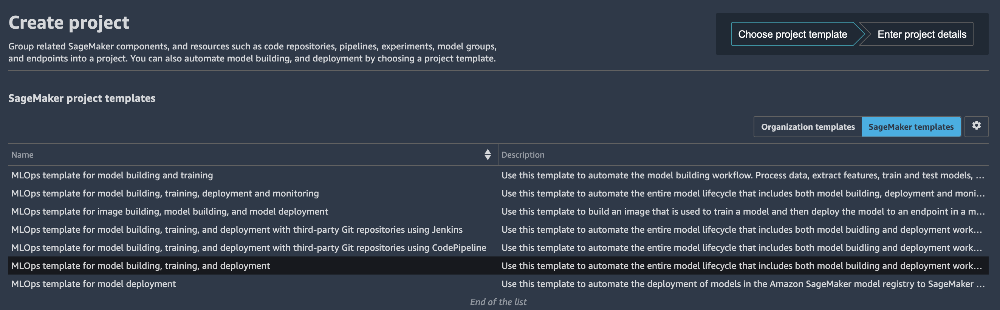
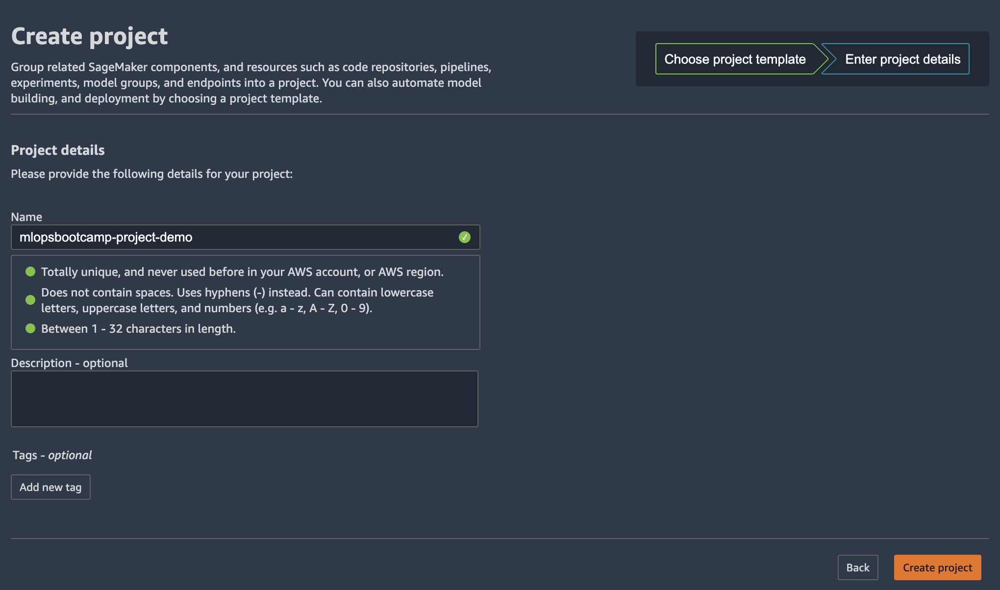
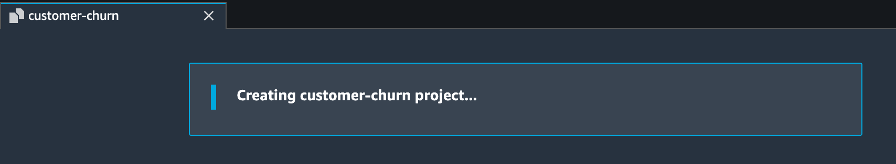
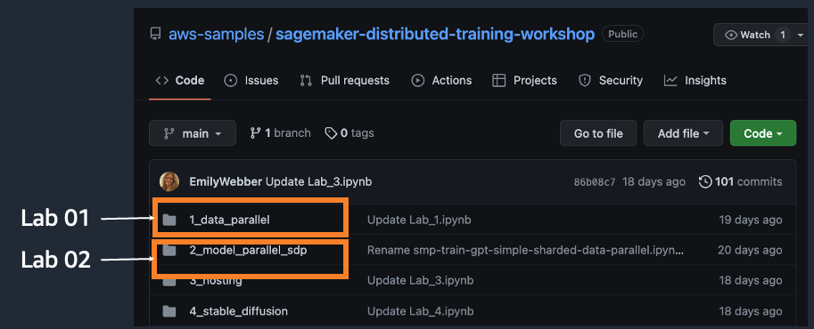
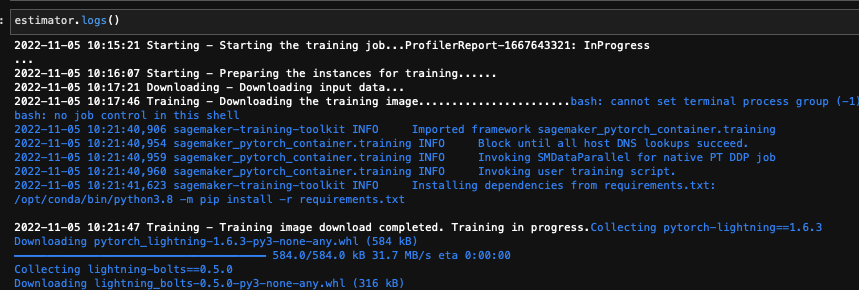
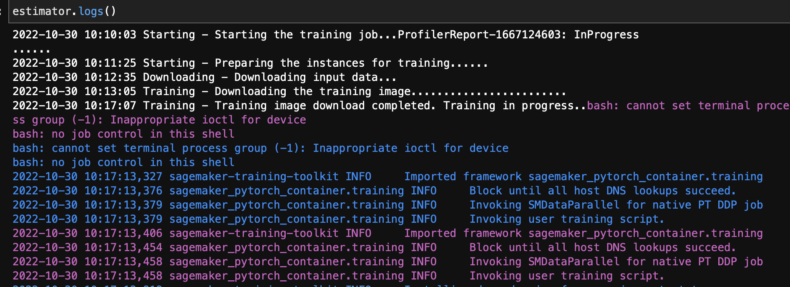
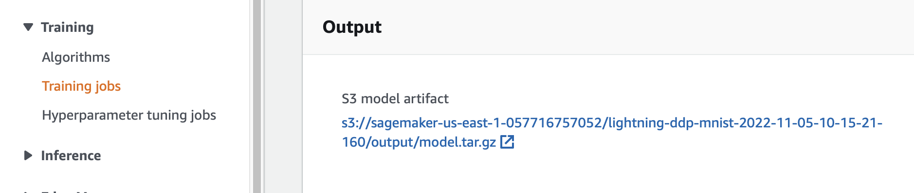
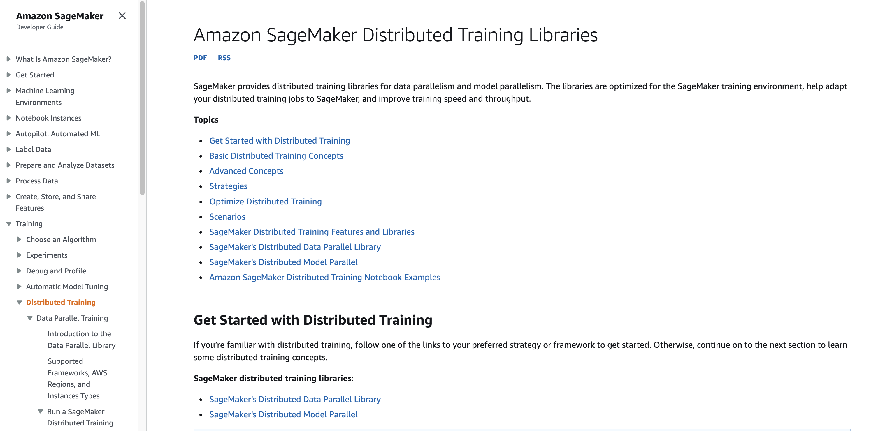
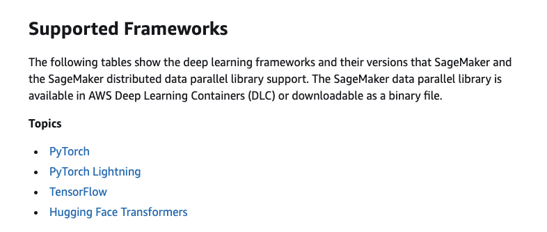

# 2022 AWS Seoul MLOps 및 분산 훈련 워크샵 실습 가이드
- 날짜
    - 2022.11.08 ~ 11.09 (화, 수)
- 참조 : 메인 이벤트 페이지
    - [MLOps 및 분산 훈련 워크샵 일정](https://mlops-distributed-training-korea-2022.splashthat.com/)
    
<br>

# 1. 실습 환경 구성
- <a href="prerequisite/README.md" target="_blank">이벤트 엔진 환경 구성 가이드</a>

## 1.1. Day1 ML Ops
- ML Ops 실습 해시 코드
    - us-west-2: <b><a href="http://bit.ly/3hk3IpC" target="_blank">link</a></b>
    - eu-west-1: <b><a href="http://bit.ly/3zQArt6" target="_blank">link</a></b>
- SageMaker Studio 기본 생성 사용

## 1.2. Day2 분산 훈련
- 분산 훈련 실습 해시 코드
    - us-east-1 <b></b>
- SageMaker Notebook <b>`ml.m5.xlarge`</b> 로 생성

<br>

# 2. Day1: MLOps 실습 상세
## 2.1. Day1 MLOps 실습 링크
- URL:
    - https://docs.aws.amazon.com/sagemaker/latest/dg/sagemaker-projects-walkthrough.html

## 2.2. Day1 MLOps 실습 내용
먼저 이 MLOps 템플릿을 구축, 교육 및 배포하면 어떤 AWS 서비스가 시작되는지 자세히 살펴보겠습니다.나중에 맞춤형 사용 사례에 맞게 스켈레톤을 수정하는 방법을 살펴보겠습니다.

1. 먼저 SageMaker Studio에서 구성 요소 및 레지스트리 메뉴에서 프로젝트 메뉴를 선택하도록 합니다.


2. Project 를 선택한 후 "Create Project" 를 클릭합니다.

    Project 페이지에서 사전 구성된 SageMaker MLOps 템플릿을 시작할 수 있습니다.이 실습에서는 모델 구축, 훈련 및 배포를 위한 MLOps 템플릿을 위해 SageMaker Project 템플릿 선택을 클릭합니다.

<div>

</div>

3. 다음 페이지에서 프로젝트 이름과 간단한 설명을 입력하고 "Create Project" 를 선택합니다.
    

<div>

</div>

프로젝트를 만드는 데 시간이 좀 걸립니다.

<div>

</div>

이 템플릿을 시작하면 기본적으로 모델 구축 파이프라인이 시작되며 SageMaker Pipeline 자체를 사용하는 데는 비용이 들지 않지만 시작한 서비스들에 대한 요금이 부과됩니다. 비용은 지역에 따라 다릅니다. 다음 [링크](https://calculator.aws/#/addService?nc2=pr)를 통해 비용에 대한 확인이 가능합니다.

4. MLOps 템플릿에서 프로젝트를 만든 후 다음 아키텍처가 배포됩니다.


아키텍처에는 다음과 같은 AWS 서비스 및 리소스가 포함되어 있습니다.

* SageMaker 프로젝트를 통해 제공되는 MLOps 템플릿은 사용자가 Studio 도메인에서 프로젝트를 활성화하면 자동으로 가져오는 AWS 서비스 카탈로그 포트폴리오를 통해 제공됩니다.

* AWS CodeCommit에는 두 개의 리포지토리가 추가되었습니다.

 * 첫 번째 리포지토리는 데이터 처리, 모델 교육, 모델 평가 및 정확도를 기반으로 한 조건부 모델 등록 단계를 포함하여 다단계 모델 구축 파이프라인을 생성하기 위한 스캐폴딩 코드를 제공합니다.pipeline.py 파일에서 볼 수 있듯이 이 파이프라인은 잘 알려진 UCI Abalone 데이터세트에서 XGBoost 알고리즘을 사용하여 선형 회귀 모델을 학습시킵니다.이 리포지토리에는 AWS CodePipeline 및 AWS CodeBuild에서 파이프라인을 자동으로 실행하는 데 사용하는 빌드 사양 파일도 포함되어 있습니다.

 * 두 번째 저장소에는 모델 배포를 위한 코드 및 구성 파일과 품질 게이트를 통과하는 데 필요한 테스트 스크립트가 들어 있습니다.또한 이 리포지토리는 AWS CloudFormation 템플릿을 실행하여 스테이징 및 프로덕션을 위한 모델 엔드포인트를 생성하는 CodePipeline 및 CodeBuild를 사용합니다.

* 두 개의 코드 파이프라인 파이프라인:

 * ModelBuild 파이프라인은 ModelBuild CodeCommit 리포지토리에 새 커밋이 이루어질 때마다 파이프라인을 처음부터 끝까지 자동으로 트리거하고 실행합니다.

 * 새 모델 버전이 모델 레지스트리에 추가되고 상태가 승인됨으로 표시될 때마다 ModelDeploy 파이프라인이 자동으로 트리거됩니다.보류 또는 거부됨 상태로 등록된 모델은 배포되지 않습니다.

* 파이프라인에서 생성된 출력 모델 아티팩트를 위한 Amazon Simple Storage Service (Amazon S3) 버킷이 생성됩니다.

* SageMaker 파이프라인은 다음 리소스를 사용합니다. 

 * 이 워크플로에는 모델을 트레이닝하고 평가하는 유방향 비순환 그래프 (DAG) 가 포함되어 있습니다.파이프라인의 각 단계는 계보를 추적하고 중간 단계를 캐시하여 파이프라인을 빠르게 다시 실행할 수 있습니다.템플릿 외에도 SDK를 사용하여 파이프라인을 만들 수도 있습니다.

 * SageMaker 파이프라인 내에서 SageMaker 모델 레지스트리는 모델 버전과 각 아티팩트를 추적합니다. 여기에는 모델 버전 생성 방식에 대한 계보 및 메타데이터가 포함됩니다.여러 모델 버전이 하나의 모델 그룹 아래에 그룹화되고 레지스트리에 등록된 새 모델은 자동으로 버전 관리됩니다.또한 모델 레지스트리는 모델 버전에 대한 승인 워크플로를 제공하고 여러 계정에 모델을 배포할 수 있도록 지원합니다.boto3 패키지를 통해 모델 레지스트리를 사용할 수도 있습니다.

* 세이지메이커 엔드포인트 2개:

 * 레지스트리에서 모델이 승인되면 아티팩트가 스테이징 엔드포인트에 자동으로 배포된 다음 수동 승인 단계가 이어집니다.

 * 승인되면 동일한 AWS 계정의 프로덕션 엔드포인트에 배포됩니다.

학습 작업, 파이프라인, 모델, 엔드포인트와 같은 모든 SageMaker 리소스와 이 실습에 나열된 AWS 리소스에는 프로젝트 이름과 고유한 프로젝트 ID 태그가 자동으로 지정됩니다.

<br>

# 3. Day2: 분산 훈련 실습 상세

## 3.1. Day2 분산 훈련 실습 링크 및 내용
- Git Repo:
    - Distributed Training Workshop on Amazon SageMaker
- URL: 
    - https://github.com/aws-samples/sagemaker-distributed-training-workshop
- 실습 내용
    - 

<br>

## 3.2. Lab01 : Amazon SageMaker 기반 데이터 병렬화(Data Parallelism) 실습

### 3.2.1. Lab01 코드 개요 (`Lab_1.ipynb`)
#### (1) pytorch-lightning 설치를 위해서 `requirements.txt` 생성
```python
%%writefile scripts/requirements.txt
pytorch-lightning == 1.6.3
lightning-bolts == 0.5.0
```
#### (2) 모델 훈련 코드 준비 (`mnist.py`)
```python
# 파이토치 라이트닝 “환경” 준비
from pytorch_lightning.plugins.environments.lightning_environment import LightningEnvironment
env = LightningEnvironment()
env.world_size = lambda: int(os.environ.get("WORLD_SIZE", 0))
env.global_rank = lambda: int(os.environ.get("RANK", 0))

# 파이토치 라이트닝 Trainer 에 strategy=ddp 와 함께 생성.
import pytorch_lightning as pl
trainer = pl.Trainer(max_epochs=args.epochs, strategy=ddp, devices=num_gpus, num_nodes=num_nodes, default_root_dir = args.model_dir)

# 파이토치 라이트닝 Trainer 에 MNIST 모델 및 데이타 제공하여 훈련
trainer.fit(model, datamodule=dm)
```

#### (3) AWS Deep Learning Container (DLC)  준비
```python
image_uri = '763104351884.dkr.ecr.{}.amazonaws.com/pytorch-training:1.12.0-gpu-py38-cu113-ubuntu20.04-sagemaker'.format(region)
```
#### (4) SageMaker Estimator 생성
```python
estimator = PyTorch(
  entry_point="mnist.py",
  base_job_name="lightning-ddp-mnist",
  image_uri = image_uri,
  role=role,
  source_dir="scripts",
  # configures the SageMaker training resource, you can increase as you need
  instance_count=1,
  instance_type=instance_type,
  py_version="py38",
  sagemaker_session=sagemaker_session,
  distribution={"pytorchddp":{"enabled": True}},
  debugger_hook_config=False,
  # profiler_config=profiler_config,
  hyperparameters={"batch_size":32, "epochs": epoch},
  # enable warm pools for 20 minutes
  keep_alive_period_in_seconds = 20 *60
)
```

#### (5) SageMaker Estimator 의 fit() 함수 실행
```python
# Passing True will halt your kernel, passing False will not. Both create a training job. 
estimator.fit(wait=False)
```

#### (6) 모델 학습 Job 생성 및 훈련 실행


#### (7) 멀티 노드 분산 훈련 (예: `ml.g4dn.12xlarge` 2대 사용)
- estimator 에 instance_count 의 실행할 노드 수만 제공

```python
estimator = PyTorch(
  ## instance_count = 2 로 설정시 2개의 노드 (예: ml.g4dn.12xlarge 2대)
  instance_count=2,
)
```
- 모델 훈련 Job 의 실행 로그를 보면 2개의 노드가 훈련을 실행 함.


#### (8) S3에 모델 아티펙트 (가중치 파일) 생성
- 위치: 
    - SageMaker Console -> 왼쪽 메뉴의 Training -> Training Jobs -> 해당 Training Jobs 클릭 -> 아래쪽에 Output 섹션 확인  


### 3.2.2. Demo Video on YouTube
- [PyTorch DDP on SageMaker Distributed Data Parallel](https://www.youtube.com/watch?v=0VWENkgPuYg)


<br>

## 3.3. Lab02 : Amazon SageMaker 기반 모델 병렬화(Model Parallelism) 실습

### 3.3.1. Lab02 코드 개요 (`Lab_2.ipynb`)

#### (1) 모델 훈련 코드 준비
- 스크립트 개요
    - `train_gpt_simple.py`: The entrypoint script passed to the Hugging Face estimator in this notebook. This script is responsible for end to end training of the GPT-2 model with SMP. You can follow the comments to learn where the SMP API is used.
    - `data_pipeline.py`: 훈련 데이터를 준비하기 위한 Datapipeline 함수.
    - `data_prep_512.py`: openwebtext 데이터셋을 다운로드 및 전처리
    - `learining_rate.py`: 학습률 조정
    - `requirements.txt`: 허깅페이스 transformers 라이브러리를 비롯한 의존성 패키지 설치
    - `memory_tracker.py`: 메모리 사용량 추정
    - `sharded_data_parallel_checkpoint.py`: 분할 데이터 병렬화를 위한 체크포인트 유틾리티 함수

- 파이프라인 병렬화를 위한 `@smp.step` 데코레이터 정의
```python
@smp.step
def train_step(model, optimizer, input_ids, attention_mask, args):
    loss = model(input_ids=input_ids, attention_mask=attention_mask, labels=input_ids)["loss"]
    model.backward(loss)
    return loss

@smp.step
def test_step(model, input_ids, attention_mask):
    loss = model(input_ids=input_ids, attention_mask=attention_mask, labels=input_ids)["loss"]
    return loss
```

- 텐서 병렬화 설정
```python
model = smp.DistributedModel(model, trace_device="gpu", backward_passes_per_step=args.gradient_accumulation)
...
optimizer = smp.DistributedOptimizer(
        optimizer, 
        static_loss_scale=None, 
        dynamic_loss_scale=True,
        dynamic_loss_args={"scale_window": 1000, "min_scale": 1, "delayed_shift": 2},
        )
```

#### (2) AWS Deep Learning Container (DLC)  준비
```python
image_uri = f'763104351884.dkr.ecr.{region}.amazonaws.com/pytorch-training:1.12.0-gpu-py38-cu113-ubuntu20.04-sagemaker'
```

#### (3) (Optional) Amazon FSx for Lustre 설정
SageMaker는 훈련 시작 시, 데이터셋을 S3에서 훈련 인스턴스 스토리지 (EBS) 로 다운로드합니다. 이 때, 데이터셋 크기가 수백 기가바이트~수 테라바이트인 경우 다운로드 시간이 많이 소요되기에 전체 훈련 시간이 큰 폭으로 증가합니다. FSx for Lustre는 고성능 컴퓨팅 및 분산 훈련에 최적화된 완전 관리형 파일 시스템으로, 데이터셋이 저장된 S3 버킷에 연결하면 S3에서 FSx로 객체가 자동으로 복사됩니다. 대규모 데이터셋을 지연 로드하기에 높은 스루풋을 가지며, 더 빠른 랜덤 액세스 및 쓰기를 지원하기에 훈련 시간을 크게 절감할 수 있습니다.

```python
if use_fsx:
    from sagemaker.inputs import FileSystemInput

    # Specify FSx Lustre file system id.
    file_system_id = ""

    # Specify the SG and subnet used by the FSX, these are passed to SM Estimator so jobs use this as well
    fsx_security_group_id = ""
    fsx_subnet = ""

    # Specify directory path for input data on the file system.
    # You need to provide normalized and absolute path below.
    # Your mount name can be provided by you when creating fsx, or generated automatically.
    # You can find this mount_name on the FSX page in console.
    # Example of fsx generated mount_name: "3x5lhbmv"
    base_path = ""

    # Specify your file system type.
    file_system_type = "FSxLustre"

    train = FileSystemInput(
        file_system_id=file_system_id,
        file_system_type=file_system_type,
        directory_path=base_path,
        file_system_access_mode="rw",
    )

    data_channels = {"train": train, "test": train}
```

#### (4) SageMaker Estimator 생성
```python
smp_estimator = PyTorch(
    entry_point="train_gpt_simple.py",
    source_dir=os.getcwd(),
    role=role,
    instance_type=instance_type,
    volume_size=volume_size,
    instance_count=instance_count,
    sagemaker_session=sagemaker_session,
    distribution={
        "mpi": {
            "enabled": True,
            "processes_per_host": processes_per_host,
            "custom_mpi_options": mpioptions,
        },
        "smdistributed": {
            "modelparallel": {
                "enabled": True,
                "parameters": {
                    "ddp": True,
                    "skip_tracing": True,
                    "delayed_parameter_initialization": hyperparameters["delayed_param"] > 0,
                    "offload_activations": hyperparameters["offload_activations"] > 0,
                    "activation_loading_horizon": hyperparameters["activation_loading_horizon"],
                    "sharded_data_parallel_degree": hyperparameters["sharded_data_parallel_degree"],
                    "fp16": hyperparameters["fp16"] > 0,
                    "bf16": hyperparameters["bf16"] > 0,
                    # partitions is a required param in the current SM SDK so it needs to be passed,
                    "partitions": 1,
                },
            }
        },
    },
    framework_version="1.12",
    py_version="py38",
    output_path=s3_output_location,
    checkpoint_s3_uri=checkpoint_s3_uri if not use_fsx else None,
    checkpoint_local_path=hyperparameters["checkpoint-dir"] if use_fsx else None,
    metric_definitions=metric_definitions,
    hyperparameters=hyperparameters,
    debugger_hook_config=False,
    disable_profiler=True,
    base_job_name=base_job_name,
    **kwargs,
)
)
```

#### (5) SageMaker Estimator 의 fit() 함수 실행
```python
# Passing True will halt your kernel, passing False will not. Both create a training job.
smp_estimator.fit(inputs=data_channels, logs=True)
```
### 3.3.2. Demo Video on YouTube
- [GPT-2 training using Amazon SageMaker Model Parallelism Library](https://youtu.be/TwkLh4QMTmc)
- [(Optional) Amazon FSx for Lustre setup Demo](https://youtu.be/oxRxW6qXDKI)
- [(Optional) Mask R-CNN Pre-training Demo w/ Amazon FSx for Lustre](https://youtu.be/oYhre0Ci9QM)

<br>

# References

## 분산 훈련 개발자 가이드 및 참조 자료
- 분산 훈련 개발자 가이드
    - [Amazon SageMaker Distributed Training Libraries](https://docs.aws.amazon.com/sagemaker/latest/dg/distributed-training.html)
    - 
- SageMaker Distributed Data Parallel (SM DDP)
    - [Supported Frameworks, AWS Regions, and Instances Types](https://docs.aws.amazon.com/sagemaker/latest/dg/distributed-data-parallel-support.html)
    - 
- SageMaker Distributed Model Parallel (SM DMP)
    - [Supported Frameworks, AWS Regions, and Instances Types](https://docs.aws.amazon.com/sagemaker/latest/dg/distributed-model-parallel-support.html)

## 분산 훈련 한국어 강연
가급적 아래 3개 강연을 순서대로 보시는 것을 권장드립니다.
- [Amazon SageMaker를 통한 대용량 모델 훈련 방법 살펴보기](https://www.youtube.com/watch?v=csr84BKbFeg)
- [Amazon SageMaker를 통한 딥러닝 분산 학습 및 디버거 프로파일링 활용하기](https://www.youtube.com/watch?v=lsTtoACAPj4)
- [실전! 대용량 데이터를 이용한 초거대 모델 학습 환경 만들기](https://www.youtube.com/watch?v=l1FSiRbEja4)

