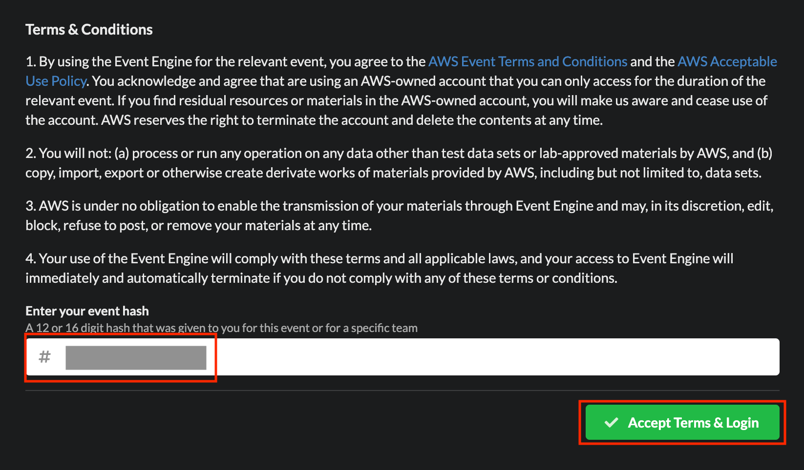
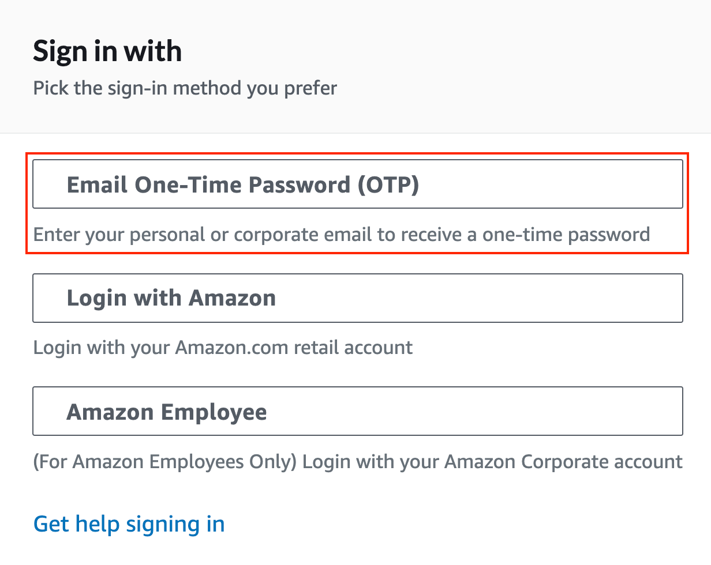
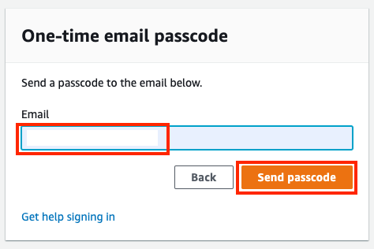
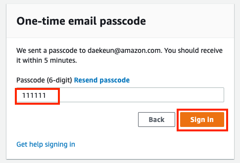
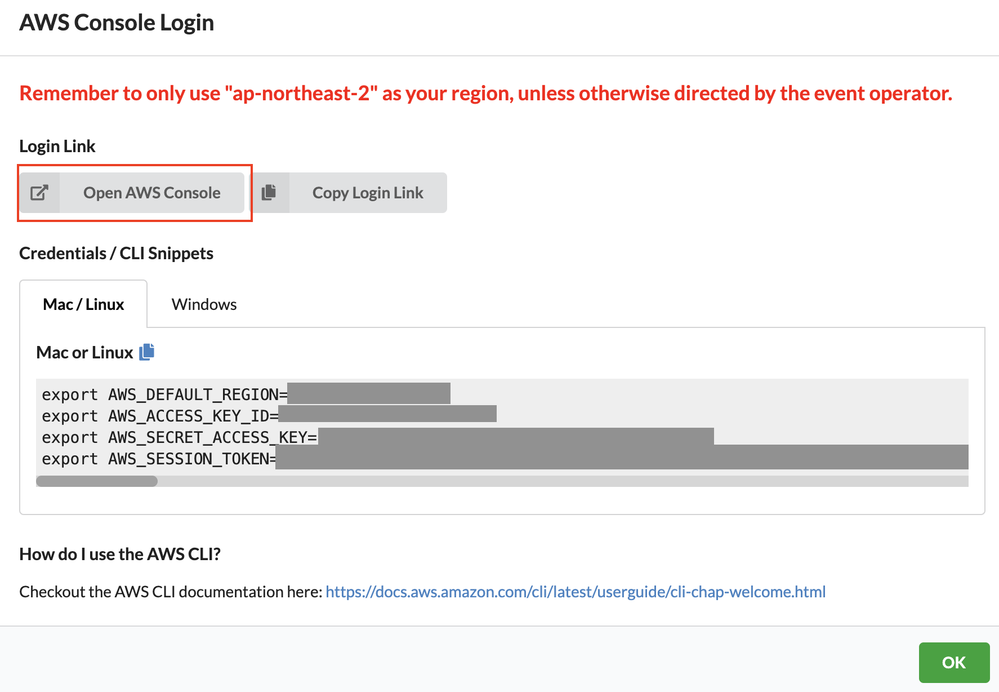
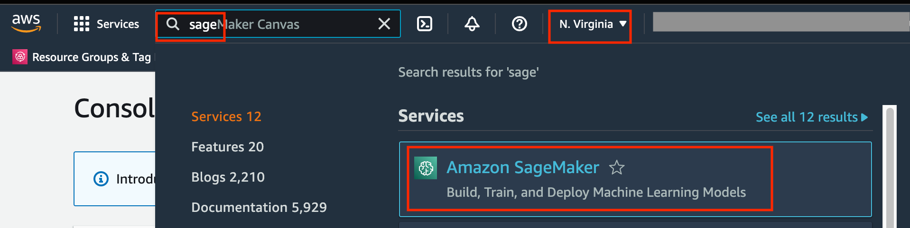

# AWS 실습 계정 접속 가이드 

--------

당일 세션은 AWS 서비스에 대한 세션과 핸즈온을 통해서 AWS 서비스를 경험하고 기술 공유를 통해 다양한 클라우드 경험을 얻을 수 있습니다. 핸즈온을 위해 인터넷이 가능한 랩탑을 준비해 주세요. (Chrome 또는 Firefox를 사용하셔야 하며, Explorer는 제대로 동작하지 않을 수 있습니다.) 

접속이 원활하지 않거나 핸즈온 수행에 어려움이 있다면, 발표자와 서포터에게 적극적으로 도움을 요청해 주세요.

## 접속 가이드

여러분께서는 실습용으로 생성된 임시 AWS 계정(Account)을 사용하여, 과금에 대한 걱정 없이 편리하게 핸즈온 랩을 진행하실 수 있습니다. 임시 AWS 계정 접속을 위해 아래 가이드대로 진행해 주세요.

**[주의] 실습용 AWS 임시 계정은 기본적으로는 핸즈온랩 당일 내지는 이벤트 일정에만 유효합니다.**

### 임시 AWS 계정 접속

* 핸즈온 당일, 웹 브라우저에서 제공된 링크 (예: https://dashboard.eventengine.run/login) 를 열거나 지급받은 12자리나 16자리 Hash 코드를 입력한 후 "Accept Terms & Login" 버튼을 클릭합니다.
 
 

 
 
 
* 이후 아래와 같은 화면이 나타나면, OTP 버튼을 클릭 후 One-Time Password (OTP)를 받을 여러분의 email 주소를 입력하여 주십시오.
 
 

 
 
 
* Email 주소 입력
 
 

 
 
 
* 이메일 체크 후 6자리의 passcode를 입력합니다.
 
 

 
 
 
* 유효한 Hash 코드 및 Passcode가 입력되었다면, **Team Dashboard** 페이지로 이동합니다. 아래를 참조하여 **AWS Console** 버튼을 클릭합니다.
 
 
 * [주의] 핸즈온 시작 전에 로그인하시면, **Event Not Running**이 출력됩니다. 이는 정상적인 화면이며, 핸즈온 시작 시간부터 아래의 화면으로 전환됩니다.
  
  

    

 
 
 
* 상위 그림를 참조하여 "Open AWS Console" 버튼을 클릭합니다. 참고로, "Copy Login Link" 버튼을 클릭하여 로그인 링크를 메모장에 백업해 두었다가 AWS로 재접속 시에 백업한 로그인 링크로 접속이 가능합니다.
 
 

    

 
 
 
* 아래 그림처럼 AWS 콘솔 페이지로 이동합니다. 화면 우측 상단 리전(Region)을 확인하고 리전을 변경하지 말아 주세요.  곧바로 SageMaker로 접속하시려면, 맨 상단의 검색창에서 sage만 입력하시면 SageMaker 서비스를 쉽게 찾을 수 있습니다. 
 
 

    

 
 
 