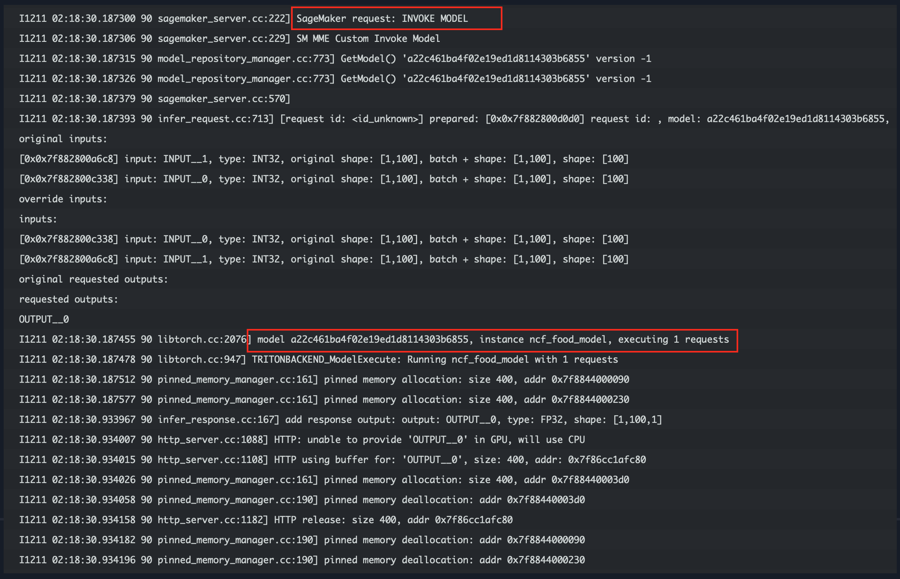

# Triton Serving on SageMaker Endpoint

# 1. 배경
NVidia Triton 으로 모델 서빙 서버를 사용하면, 여러가지의 장점이 있습니다. 하나의 예로 여러개의 모델을 동시에 GPU 서버 (Multi-Model Endpoints, MME) 에서 서빙할 수 있습니다. 여기서는 Neural Collaborative Filtering (NCF) 알고즘을 훈련하여 최종적으로 SageMaker Endpoint 에 서빙하는 것을 "Step-By-Step" 으로 실습 합니다.

# 2. 개발 단계
현재 폴더에 8개의 노트북을 실행하면 아래의 단계를 모두 할 수 있습니다. 1개의 모델의 개발 플로우, 2개 모델의 개발 플로우를 모두 할 수 있습니다. 

# 3. 실행 결과
아래는 2개의 모델 (ncf_food_model, ncf_fashion_model) 을 SageMaker Endpoint 에 배포를 하고 나서, ncf_food_model 에 추론 요청과 결과를 받았습니다. 이 때 SageMaker Endpoint 에서 남긴 로그를 CloudWatch 에서 확인한 것 입니다. "Invode Model --> Executing Request --> Deallocate Memory" 까지의 로그 입니다. 

# 4. 실행 파일 설명
### [중요 사항] 
- 이 워크샵은 ml.g4dn.xlarge, ml.p3.2xlarge, ml.p3.8xlarge, ml.p3.16xlarge "세이지 메이커 노트북 인스턴스"의 `conda_python3`에서 테스트 되었습니다.
- 이 2_Triton_Inference 폴더는 이 깃 리포의 다른 워크샵과 상관이 없이 독립적으로 실행이 가능합니다. 세이지 메이커 노트북을 ml.g4dn.xlarge 정도의 인스턴스를 선택하여 생성하시고 아래와 같이 순서대로 실행하시면 됩니다. 이미 다른 폴더 (예: 1_Train) 를 실행하셨다면 그냥 아래를 실행하시면 됩니다.

### [실행 순서] 
- 0.0.Setup-Environment.ipynb
    - 필요한 파이썬 패키지 설치 및 로컬 모드 셋업
- 1.0.WarmingUp-Hello-Triton.ipynb    
    - Triton 추론의 처음 시작하기
- 1.1.Prepare-Dataset.ipynb
    - 데이타 준비하여 S3 에 업로딩
- 1.2.NCF-Train_Local_Script_Mode.ipynb
    - NCF 모델을 로컬 모드 및 클라우드 모드로 훈련
- 2.1.Triton-Single-Model-Docke-Servingr.ipynb
    - NVidia Triton Docker 로 한개 NCF 모델 서빙
- 2.2.Triton-SM-Single-Model-Serving.ipynb
    - SageMaker Endpoint 에 한개 NCF 모델을 로컬 모드 및 클라우드 모드로 서빙
- 3.1.Triton-Multiple-Server-Docker-Serving.ipynb
    - NVidia Triton Docker 로 두개의 NCF 모델 서빙
- 3.2.Triton-SM-Multiple-Model-Serving.ipynb
    - SageMaker Endpoint 에 두개 NCF 모델을 클라우드 모드로 서빙

# A. 참고
- Serve multiple models with Amazon SageMaker and Triton Inference Server
    - ResNet50, YOLOv5, BERT-base 의 3개의 모델을 서빙하는 블로그 입니다.
    - https://aws.amazon.com/blogs/machine-learning/serve-multiple-models-with-amazon-sagemaker-and-triton-inference-server/
- Achieve low-latency hosting for decision tree-based ML models on NVIDIA Triton Inference Server on Amazon SageMaker
    - Decision Tree-Based ML Models 를 서빙하는 블로그
    - https://aws.amazon.com/blogs/machine-learning/achieve-low-latency-hosting-for-decision-tree-based-ml-models-on-nvidia-triton-inference-server-on-amazon-sagemaker/
- Deploy fast and scalable AI with NVIDIA Triton Inference Server in Amazon SageMaker
    - Dynamic Batching 설정 등을 소개 하는 블로그
    - https://aws.amazon.com/blogs/machine-learning/deploy-fast-and-scalable-ai-with-nvidia-triton-inference-server-in-amazon-sagemaker/
- Use Triton Inference Server with Amazon SageMaker
    - 세이지 메이커 개발자 가이드 입니다.
    - https://docs.aws.amazon.com/sagemaker/latest/dg/triton.html
-  amazon-sagemaker-examples/sagemaker-triton GitHub repo
    - sagemaker-triton 공식 샘플
    - https://github.com/aws/amazon-sagemaker-examples/tree/main/sagemaker-triton    
-  amazon-sagemaker-examples/sagemaker-mme GitHub repo
    - sagemaker-mme (Multi-Models Endpoints) 공식 샘플
    - https://github.com/aws/amazon-sagemaker-examples/tree/main/multi-model-endpoints/mme-on-gpu/cv
- INTRODUCTION TO TORCHSCRIPT
    - PyTorch 의 중간 표현 (Intermidiate Representation) 인 TorchScript 의 변환에 대한 가이드 입니다.
    - https://pytorch.org/tutorials/beginner/Intro_to_TorchScript_tutorial.html
- PyTorch JIT and TorchScript
    - Eager(Research), Script(Production) mode 개념 설명과 BERT, Resnet 의 예시 코드 보여 줌.
    - https://towardsdatascience.com/pytorch-jit-and-torchscript-c2a77bac0fff
- NVIDIA Triton Inference Server
    - NVIDIA 공식 페이지
    - https://developer.nvidia.com/nvidia-triton-inference-server