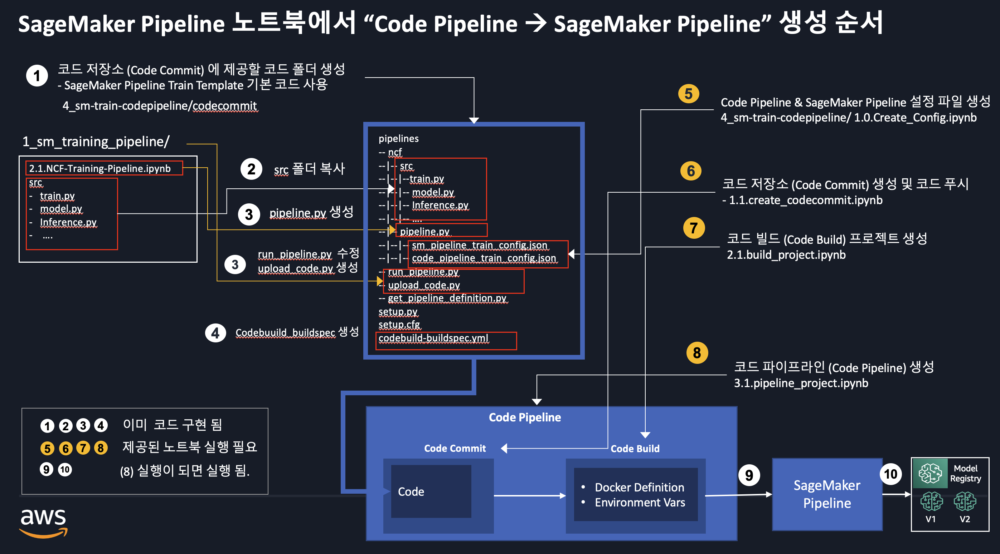
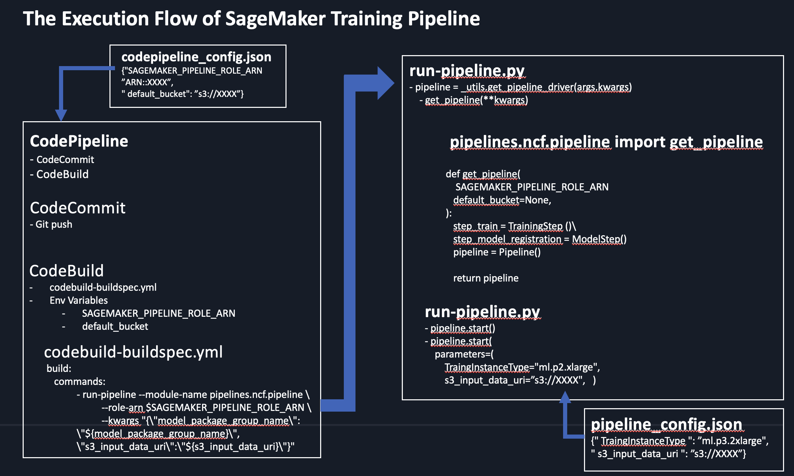

# Lab4: 4_sm_train_codepipeline
- 모델 훈련을 위해서 code pipeline 을 SageMaker pipeline 과 연결.

# 1. Code Pipeline 및 SageMaker 모델 훈련 파이프라인 생성하기

아래의 그림은 (1) SageMaker Pipeline 노트북 (1_sm_training_pipeline/2.1.NCF-Training-Pipeline.ipynb) 과 (2) Code Pipeline 배운 내용 (3_hello-codepipeline) 을 바탕으로 Code Pipeline, SageMaker 모델 훈련 파이프라인을 생성하는 순서를 보여 주고 있습니다.

# 2. 실습 파일 

- (옵션) 0.0.create-pipeline.py-buildspec.yml.ipynb
    - 작동 방식에 대한 설명 입니다. 일단 스킵 하시고, 나중에 와서 보시기 바랍니다.
- 1.0.Create_Config.ipynb
    - Config.json 을 생성하는 노트북
- 1.1.create_codecommit.ipynb
    - 코드 리파지토리 생성 및 코드 복사
- 2.1.build_project.ipynb
    - 빌드 프로젝트 생성
- 3.1.pipeline_project.ipynb
    - 코드 파이프라인 생성

- (옵션) codecommit/sagemaker-pipelines-project.ipynb
    - code pipeline 없이 codecommit/pipelines/ncf/pipeline.py 를 테스트하기 위한 노트북 입니다.
    

# 3. 업무 적용시 작업 순서
- 이 모듈의 전체적인 생성 가이드 입니다.
    - [SageMaker 훈련 파이프라인 생성 가이드](0.0.create-pipeline.py-buildspec.yml.ipynb)
    - 
