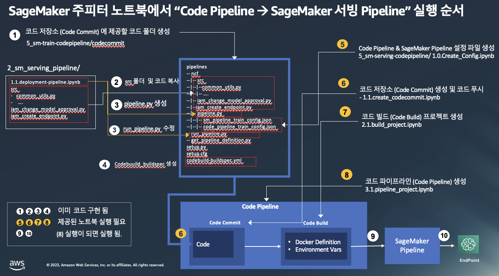

# Lab5: 5_sm_serving_codepipeline
- 모델 서빙을 위해서 code pipeline 을 SageMaker pipeline 과 연결.

# 1. Code Pipeline 및 SageMaker 모델 서빙 파이프라인 생성하기

아래 그림은 "4_sm-train-codepipeline" 와 비슷하게 Code Pipeline, SageMaker 모델 서빙 파이프라인을 생성하는 순서를 보여 주고 있습니다.

# 2. 실습 파일 

- 1.0.Create_Config.ipynb
    - Config.json 을 생성하는 노트북
- 1.1.create_codecommit.ipynb
    - 코드 리파지토리 생성 및 코드 복사
- 2.1.build_project.ipynb
    - 빌드 프로젝트 생성
- 3.1.pipeline_project.ipynb
    - 코드 파이프라인 생성
- (옵션) codecommit/sagemaker-pipelines-project.ipynb
    - code pipeline 없이 codecommit/pipelines/ncf/pipeline.py 를 테스트하기 위한 노트북 입니다.
    

