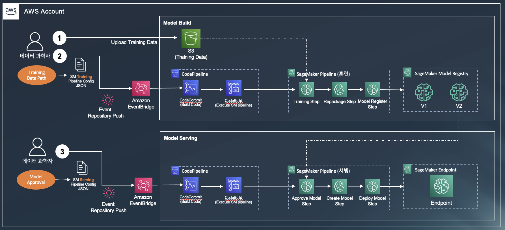
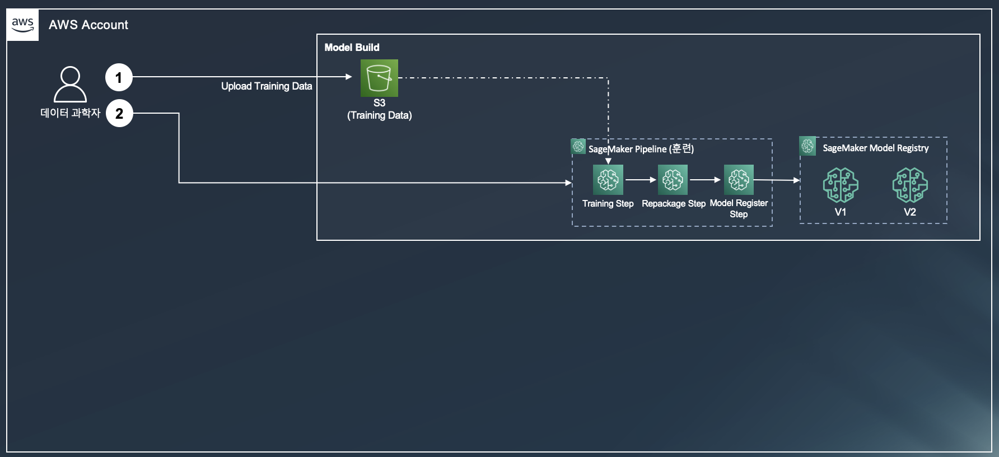
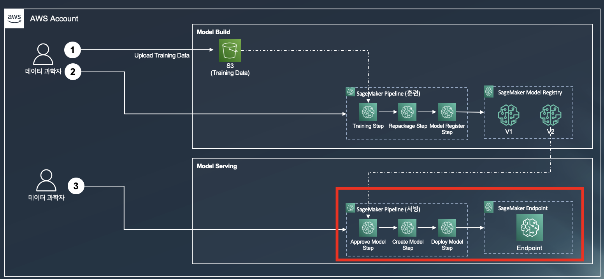
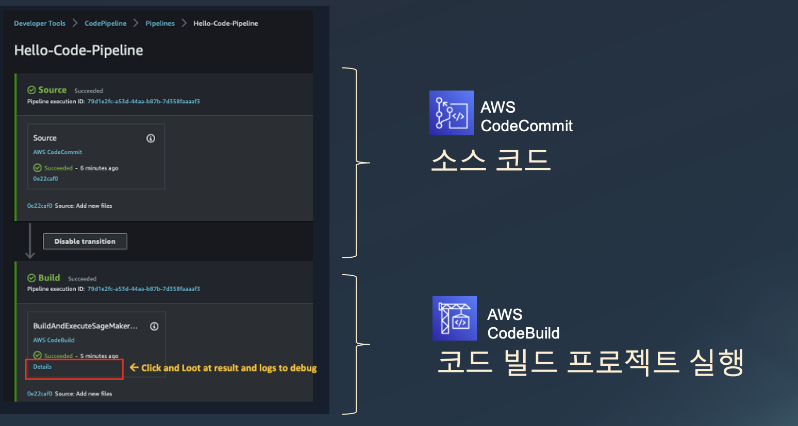
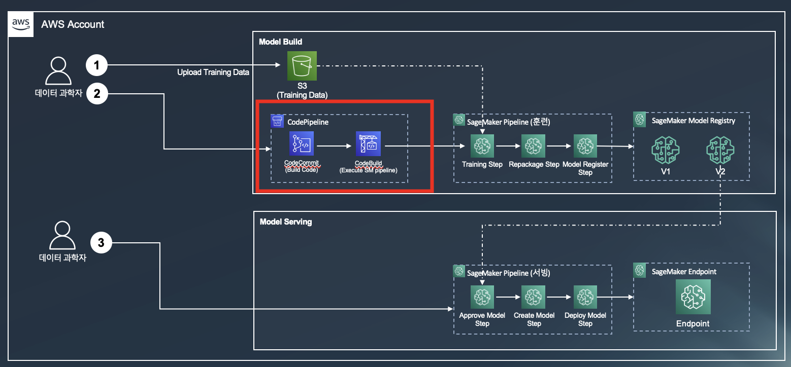
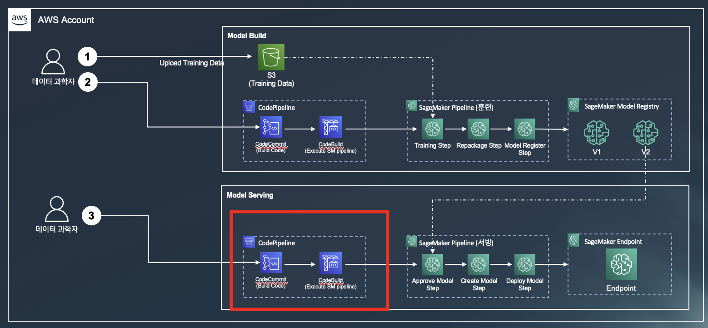
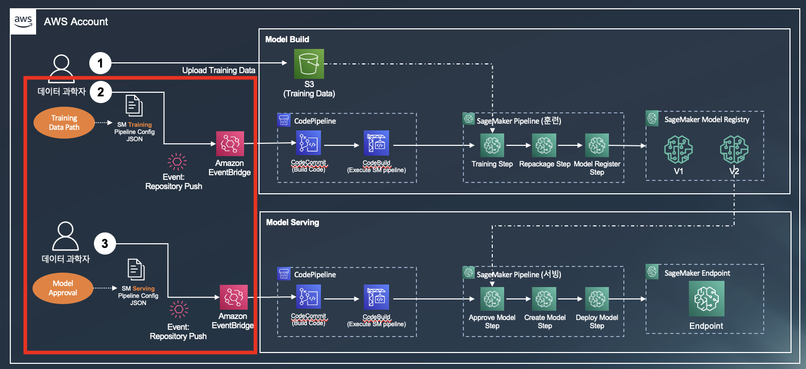

# MLOps 주요 내용

레고 블럭을 구성 하여 완성품 (예: 탑, 비행기, 배) 을 만들듯이, 데이터 과학자가 ML Ops 를 직접 구성하고 단계별로 만들어서 실행 할수 있을까요?  이 세션에서는 (1),(2) Amazon SageMaker Pipeline 으로 모델 훈련 및 서빙 파이프라인을 생성하는 방법, (3) CI/CD 연결을 위한 AWS  CodePipeline 의 튜토리얼 실습, (4),(5) CodePipeline 을 SageMaker Pipeline 으로 연결 하는 방법, 마지막으로 (6) 이벤트 스케줄러 생성 및 전체 과정 실행하기 를 배우게 됩니다.  이 모든 과정은 데이터 과학자에게 친숙한 쥬피터 노트북에서 진행이 됩니다. 이 과정을 마치시면 아래와 같은 "생성된 아키텍처"를 보실 수 있습니다.

# A. 구현 완료된 아키텍처

# B. 단계 별 레고 쌓기식의 아키텍쳐 변화

1. 모델 훈련 SageMaker Pipeline

2. 모델 서빙 SageMaker Pipeline

3. Code Pipeline Hello World 실습

4. 모델 훈련을 위한 Code Pipeline 을 SageMaker Pipeline 으로 연결

5. 모델 서빙을 위한 Code Pipeline 을 SageMaker Pipeline 으로 연결

6. 이벤트 (에: S3에 데이터 업로드) 발생하여 모델 훈련 및 추론 파이프라인 실행 하기

# C. 실습 설명

### [알림] 전 단계의 1_Train, 2_Inference 의 진행 없이 실습이 가능합니다.

## 0. 사전 작업
### [중요] 1_Train/0.0.Setup-Environment.ipynb 을 이미 하셨다면 스킵 하세요.
- 중복으로 다시 한번 실행하셔도 문제는 없습니다.
- [0_Setup_Environment](0_setup_environment/0.0.Setup-Environment.ipynb)
    - 전체 노트북의 시작이며, 필요한 패키지 및 환경 설정을 합니다.
        - 0.0.Setup-Environment.ipynb
    
## 1. 모델 훈련 SageMaker Pipeline
- [1_sm_training_pipeline](1_sm_training_pipeline/README.md)
    - 세이지 메이커 훈련 파이프라인을 구현 함.
        
## 2. 모델 서빙 SageMaker Pipeline
- [2_sm_serving_pipeline](2_sm_serving_pipeline/README.md)
    - 세이지 메이커 서빙 파이프라인을 구현 함.

## 3. Code Pipeline Hello World 실습
- [3_hello_codepipeline/](3_hello_codepipeline/README.md)
    - Code Pipeline 을 노트북에서 실행을 해보는 Hello World 버전 임.

## 4. 모델 훈련을 위한 Code Pipeline 을 SageMaker Pipeline 으로 연결
- [4_sm_train_codepipeline/](4_sm_train_codepipeline/README.md)
    - 모델 훈련 파이프라인을 노트북에서 실행을 해보는 실습

## 5. 모델 서빙을 위한 Code Pipeline 을 SageMaker Pipeline 으로 연결
- [5_sm_serving_codepipeline](5_sm_serving_codepipeline/README.md)
    - 모델 추론 파이프라인을 노트북에서 실행을 해보는 실습

## 6. 이벤트 (에: S3에 데이터 업로드) 발생하여 모델 훈련 및 추론 파이프라인 실행 하기
위의 단계  4, 5 를 통하여 우리는 모델 훈련 및 서빙 아키텍처를 구현 하였습니다. 이제 매일 S3 에 훈련 데이터가 업로드가 된다고 가정을 하고, S3 에 훈련 데이터가 업로드시에 모델 훈련을 합니다. 또한 모델 레지스트리의 모델 상태를 변경하여 추론 파이프라인이 동작을 해보시죠.

- [6_sm_eventbridge](6_sm_eventbridge/README.md)
