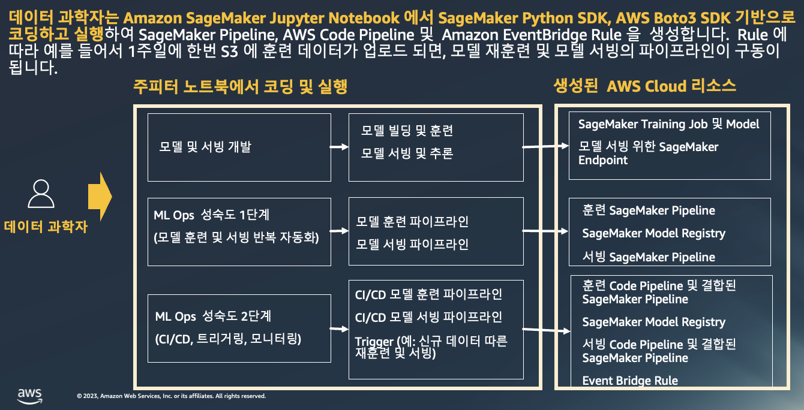
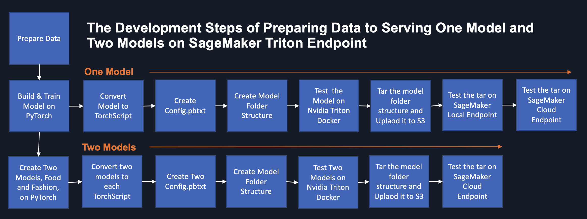
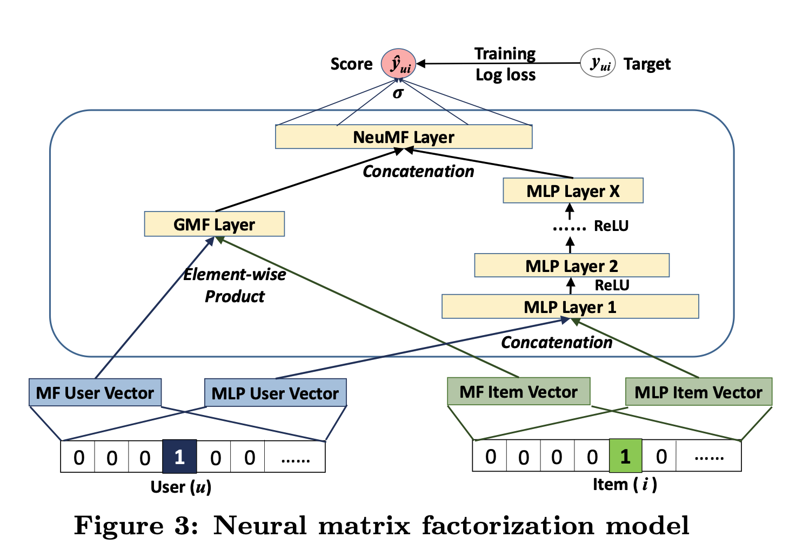

# 데이터 과학자가 직접 만들고 실행하는 모델 훈련, 모델 서빙 그리고 MLOPs
### - Training, Serving, and MLOPs for Neural Collaborative Filtering (NCF) algorithm On SageMaker

# A. 문제 정의
"주로 모델 개발에 능숙한 데이터 과학자가 주피터 노트북과 기본적인 클라우드 지식을 가지고, 기존의 오픈 소스의 알고리즘을 SageMaker 기반의 모델 훈련, 모델 서빙, 그리고 기본 단계 수준의  ML Ops 를 만들고 사용할 수 있을까?" 라는 질문을 가지고 이 워크샵을 만들게 되었습니다.

# B. 솔루션

# C. 모델 훈련, 모델 서빙 및 MLOps 구현 완료 후의 모습
####  바로가기 -> [ 데이터 과학자가 ML Ops 를 직접 구성하고 실행하는 MLOps](3_MLOps/README.md)

# D. 멀티 모델 서빙 (Multi Model Endpoint, MME backed by Triton)
기본적인 SageMaker Endpoint 를 통해서 모델 서빙도 가능하지만, 멀티 모델 서빙 부분도 Triton Inference on SageMaker 에서 단계별로 아래처럼 배울 수 있습니다.

# E. 사용된 기술 요소
- 훈련
    - Convert open source algorithm to SageMaker Training Script
    - SageMaker Script Mode, Local Mode
- 서빙
    - SageMaker PyTorch Serving, Local Mode, Bring Your Own Serving Container, Triton Inference on SageMaker
- MLOps
    - SageMaker Pipeline, CodeCommit, CodeBuild, CodePipeline, EventBridage

# F. 실습 하기
## 0. NCF 알고리즘 개요
[Neural Collaborative Filtering](https://arxiv.org/abs/1708.05031) 의 논문은 아래의 논문에 제시된 그림 처럼 Matrix Factorizaton (MF) 의 Linearity 와 Multi-Layer Perceptron(MLP) 의 Non-Linearity 를 앙상블하여 만든 알고리즘 입니다. 논문의 알고리즘 구현 
[A pytorch GPU implementation of He et al. "Neural Collaborative Filtering" at WWW'17](https://github.com/guoyang9/NCF) 를 참조 하였습니다. 사용된 데이터는 MovieLens의 유저, 아이템의 1,000,209 interaction data, 3,706 item, 6,040 user 데이터 세트를 사용하였습니다.

## 1. 워크샵 목표
### 1.1 목표
- 데이타 과학자가 `오픈 소스 코드를 SageMaker 위한 모델 빌딩, 모델 훈련, 모델 서빙` 을 합니다.
- 또한 데이타 과학자에게 어려운 MLOps 를 Jupyter Notebook 에서 구성 할 수 있는 실습을 제공 합니다.

## 2. 선행 조건
### 2.1. 이 워크샵을 위한 SageMaker Notebook 생성 및 역할, 권한 설정.
- 아래 링크를 클릭하셔서 진행 해주세요.
- [Setup_Environment](Setup_Environment/README.md)

## 3. 주요 실습 모듈
### 3.0. [알림] 실습 방법 아래의 3가지 임.
- 아래 3.1.모델 훈련 
    - 소요시간 약 1시간
- 아래 3.1.모델 훈련 과 3.2.모델 서빙 
    - 소요시간 약 1시간 30분
- 아래 3.3.Triton Inference Server 를 SageMaker Endpoint 에서 서빙
    - 소요시간 약 2시간    
- 아래 3.3. MLOps
    - 소요시간 약 2시간 30분
- 3개의 모듈을 모두할 경우에는 약 6시간이 소요 됨.
    
### 3.1. 모델 훈련
- 오픈 소스로 구현된 NCF 알고리즘을 SageMaker 에서 모델 훈련, 호로보드 및 SageMaker DDP (Distributed Data Parallel) 분산 훈련을 함.
    - [모델 훈련: 1_Train](1_Train/README.md)

### 3.2. 모델 서빙
- 위에서 모델 훈련된 모델 아티펙트를 모델 서빙을 함. 
    - [모델 서빙: 1_Inference](2_Inference/README.md)
    
### 3.3. Triton Inference Server 를 SageMaker Endpoint 에서 서빙
- 독립적인 모듈로 아래 링크 클릭 후에 가이드를 따라 가세요.
    - [Triton 서빙: 2_Triton_Inference](2_Triton_Inference/README.md)

### 3.4. MLOps
- Code Pipeline 읠 쉽게 Jupyter Notebook 에서 실행하면서 배우기
    - [MLOps: 3_MLOps](3_MLOps/README.md)

# G [중요] 리소스 정리: Clean up
### 아래 링크를 클릭하셔서, 가이드에 맞추어 리소스 정리를 꼭 해주시기 바랍니다.
[IMPORTANT: Workshop Cleanup](Setup_Environment/Cleanup-README.md)

# F. Reference:
## F.1. 논문 관련
- Paper Original Code: Neural Collaborative Filtering
    - 원본 파이토치 코드
    - https://github.com/hexiangnan/neural_collaborative_filtering
- Neural Collaborative Filtering - MLP 실험
    - 한글로 알고리즘에 대해서 잘 설명 됨.
    - https://doheelab.github.io/recommender-system/ncf_mlp/

## F.2. 세이지 메이커 관련
- 세이지 메이커로 파이토치 사용 
    - [Use PyTorch with the SageMaker Python SDK](https://sagemaker.readthedocs.io/en/stable/frameworks/pytorch/using_pytorch.html)
- Use PyTorch with the SageMaker Python SDK
    - https://sagemaker.readthedocs.io/en/stable/frameworks/pytorch/using_pytorch.html
- Amazon SageMaker Local Mode Examples
    - TF, Pytorch, SKLean, SKLearn Processing JOb에 대한 로컬 모드 샘플
        - https://github.com/aws-samples/amazon-sagemaker-local-mode
    - Pytorch 로컬 모드
        - https://github.com/aws-samples/amazon-sagemaker-local-mode/blob/main/pytorch_script_mode_local_training_and_serving/pytorch_script_mode_local_training_and_serving.py    
- Torch Serve ON AWS
    - https://torchserve-on-aws.workshop.aws/en/150.html
- Pytorch weight 저장에 대해 우리가 알아야하는 모든 것
    - https://comlini8-8.tistory.com/50
- Pytorch Dataset과 Dataloader 및 Sampler    
    - https://gaussian37.github.io/dl-pytorch-dataset-and-dataloader/    

