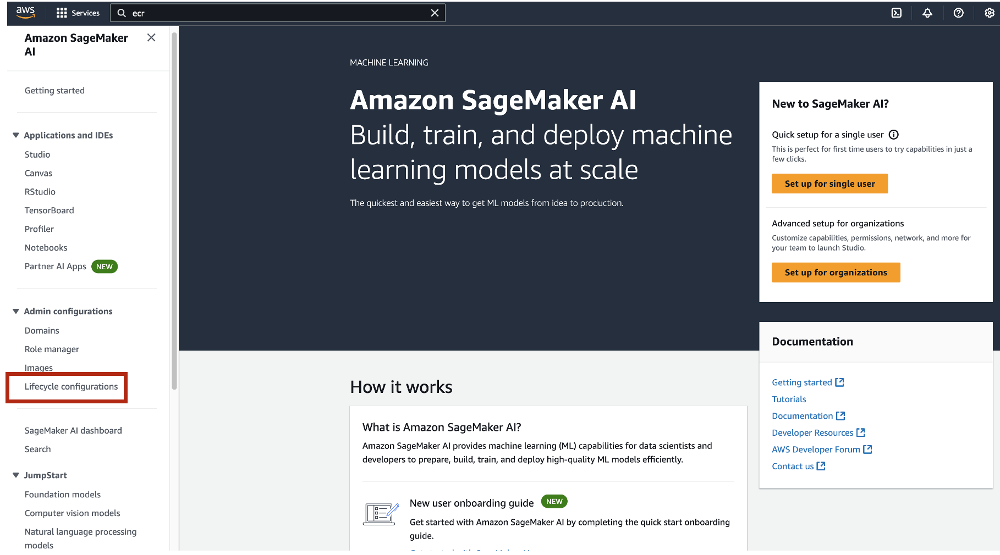
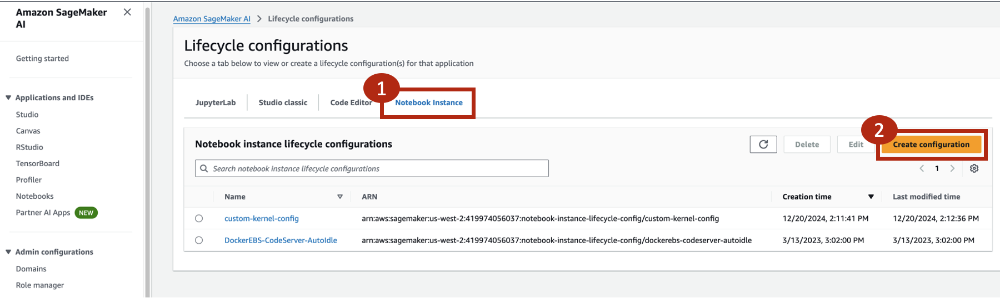
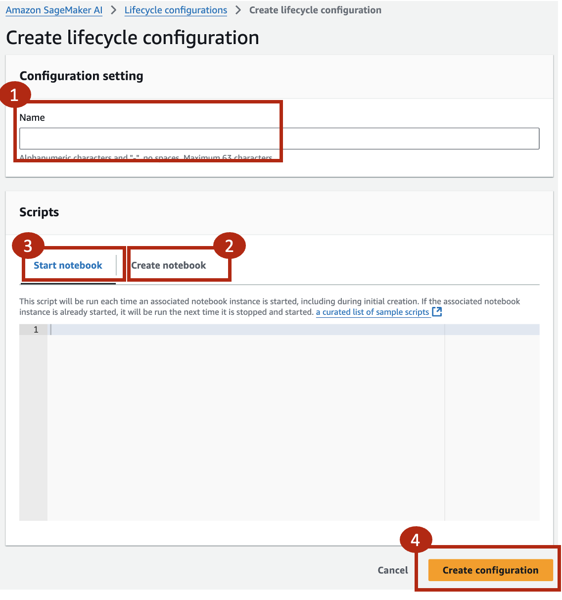
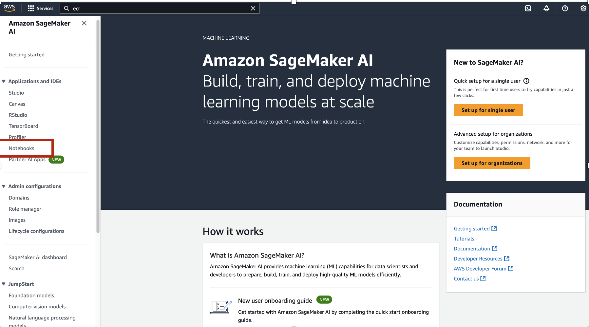
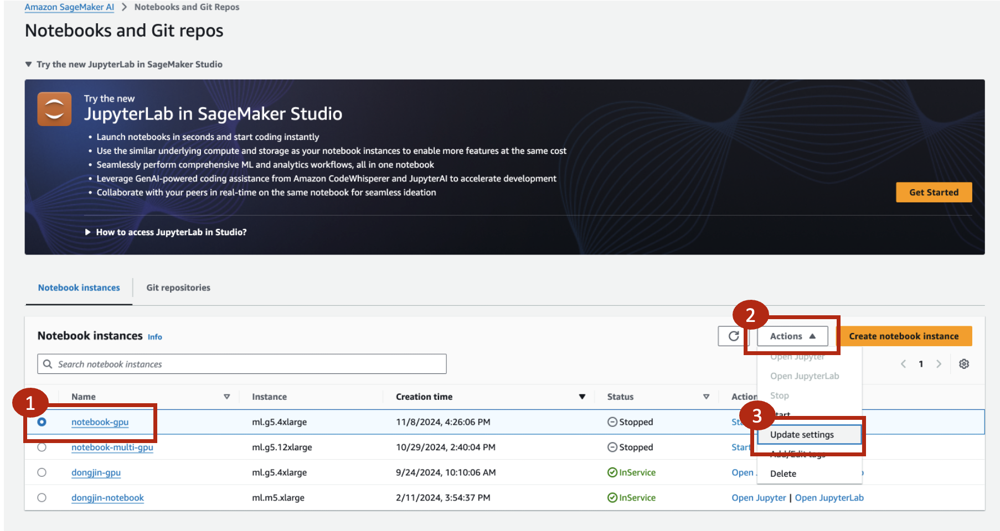
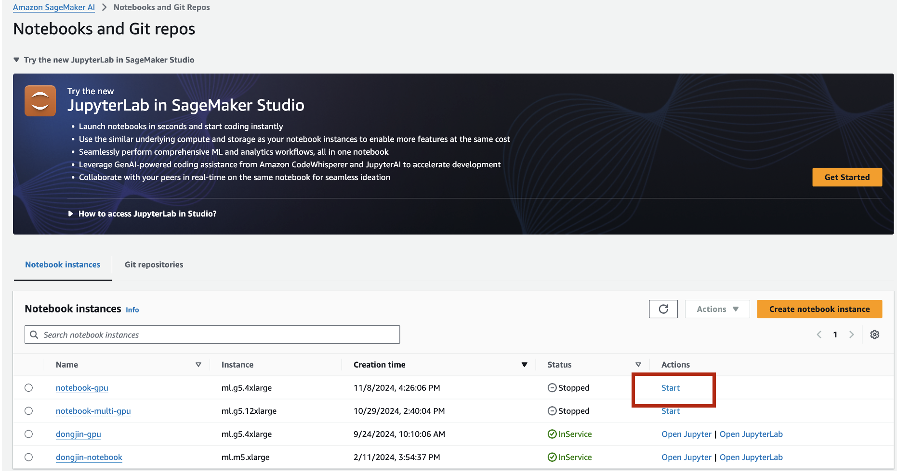

# SageMaker Lifecycle configurations

목적: Lifecycle cofig 기반 Notebook instance reboot시 custom kernel 유지

---

## 1. Create Lifecycle configurations
- #### **사전 준비사항 (매우 중요)**
    - SageMaker notebook instance를 생성합니다.
    - /SageMaker 경로에 custom kernel 생성에 필요한 package에 대한 requirements.txt를 생성합니다.
    - SageMaker notebook을 stop 한 후 아래 항목을 진행합니다.  
    
- #### SageMaker Concole에서 "Lifecycle configurations"를 선택합니다.


- #### "Notebook instance" -> **"Create configuration"**을 선택합니다.


- #### 다음 순서로 진행합니다: **"Configuration 이름설정"** -> **"Create notebook"** -> **"Start notebook"** -> **"Create configuration"** 


   - ##### "Create notebook": SageMaker notebook instance 생성 시 수행되는 script입니다. 여기서 Custom kernel을 생성합니다. 
   ---

```python
    #!/bin/bash
    set -e

    NOTEBOOK_USER="ec2-user"
    NOTEBOOK_DIR="/home/${NOTEBOOK_USER}/SageMaker"

    exec 1>${NOTEBOOK_DIR}/lifecycle_start.log 2>&1

    sudo -u ${NOTEBOOK_USER} bash << 'EOF'
        source /home/ec2-user/anaconda3/etc/profile.d/conda.sh
        cd /home/ec2-user/SageMaker

        for env_file in environment_*.yml; do
            if [ -f "$env_file" ]; then
                echo "Processing environment file: $env_file"
                env_name=$(basename "$env_file" .yml | sed 's/environment_//')

                if conda info --envs | grep -q "^$env_name "; then
                    conda env update -n $env_name -f "$env_file"
                else
                    conda env create -f "$env_file"
                fi

                conda activate $env_name
                python -m ipykernel install --user --name=$env_name --display-name "$env_name"

                if [ -f requirements.txt ]; then
                    pip install -r requirements.txt
                fi

                conda deactivate
            fi
        done
    EOF
```
   ---
    
   - ##### "Start notebook": SageMaker notebook instance reboot시 사용되는 script입니다. 여기서 기존 Custom kernel을 복구 합니다. 
       - EOF 코드 위 "./create_kernel.sh custom_kernel" 에서 **custom kernel** 이름을 지정할 수 있습니다.

   ---
```python
    #!/bin/bash
    set -e

    NOTEBOOK_USER="ec2-user"
    NOTEBOOK_DIR="/home/${NOTEBOOK_USER}/SageMaker"

    exec 1>${NOTEBOOK_DIR}/lifecycle_create.log 2>&1

    cat << 'EOF' > ${NOTEBOOK_DIR}/create_kernel.sh
    #!/bin/bash
    if [ $# -eq 0 ]; then
        echo "Error: Please provide name of conda virtual environment as an argument."
        echo "Usage example: ./create_kernel.sh MyEnv"
        exit 1
    fi

    VirtualEnv=$1
    conda create -y -n $VirtualEnv python=3.10.14
    source /home/ec2-user/anaconda3/etc/profile.d/conda.sh
    conda activate $VirtualEnv

    # Install packages
    rm -rf ~/.cache/pip/*
    pip install --upgrade pip
    pip install ipykernel
    python -m ipykernel install --user --name=$VirtualEnv --display-name "$VirtualEnv"
    pip install --no-cache-dir -r requirements.txt


    conda env export > ${NOTEBOOK_DIR}/environment_${VirtualEnv}.yml

    echo "Kernel $VirtualEnv has been created and environment saved"
    EOF

    chmod +x ${NOTEBOOK_DIR}/create_kernel.sh

    sudo -u ${NOTEBOOK_USER} bash << EOF
        cd ${NOTEBOOK_DIR}
        source /home/ec2-user/anaconda3/etc/profile.d/conda.sh
        ./create_kernel.sh custom_kernel
    EOF
```
---
- #### SageMaker Notebooks로 이동합니다.

---
- #### "정지된 상태의 SageMaker notebooks 선택" -> "Action" -> "Update setting" 선택합니다.

---
- #### "Addtional configuration" -> "Lifecycle configuration" -> "custom configuration" 선택합니다.

---
- #### SageMaker notebook을 시작합니다.


---
## Contributors
- <span style="#FF69B4;"> **Dongjin Jang, Ph.D.** (AWS AI/ML Specislist Solutions Architect) | [Mail](mailto:dongjinj@amazon.com) | [Linkedin](https://www.linkedin.com/in/dongjin-jang-kr/) | [Git](https://github.com/dongjin-ml) | [Hugging Face](https://huggingface.co/Dongjin-kr)</span>


