# [Action] SageMaker Pipeline Project 를 위한 사용자 정의 프로젝트 템플릿 생성 및 배포

이 솔루션은 [AWS Service Catalog](https://aws.amazon.com/servicecatalog/), [AWS CloudFormation](https://aws.amazon.com/cloudformation/), [SageMaker Projects](https://docs.aws.amazon.com/sagemaker/latest/dg/sagemaker-projects-whatis.html) 및 [SageMaker Pipelines](https://aws.amazon.com/sagemaker/pipelines/) 을 사용하여
세이지 메이커 환경에 재사용 가능하고 독립적인 ML 구성 요소를 제공하는 방법을 보여줍니다.


상세한 사항은 여기 블로그를 [Enhance your machine learning development by using a modular architecture with Amazon SageMaker projects](https://aws.amazon.com/blogs/machine-learning/enhance-your-machine-learning-development-by-using-a-modular-architecture-with-amazon-sagemaker-projects/) 참조 하세요.


# 1. 로컬 개발 환경을 만들기 위해서 아래의 CloudFormation 링크를 클릭하세요.
아래의 원문은 참조 히시고, 저희는 SageMaker Classic Notebook 을 **로컬 개발 환경** 으로 사용하겠습니다.
```
- [원문] Mac, Linux 와 같은 로컬 환경에서 하세요.
- [원문] 솔루션을 배포하려면 CloudFormation 템플릿을 패키징하고, Amazon S3 버킷에 템플릿을 업로드하고, 배포 명령을 실행할 수 있는 **관리자**(또는 **고급 사용자**) 권한이 있어야 합니다.

- [원문] [AWS CLI](https://aws.amazon.com/cli/)도 있어야 합니다. 없으면 [AWS CLI 설치, 업데이트 및 제거](https://docs.aws.amazon.com/cli/latest/userguide/cli-chap-install.html)를 참조하십시오.
```

아래 링크로 이동하셔서 클라우드 포메이션 스택 버튼을 클릭하여 클래식 세이지 메이커 노트북을 생성 합니다.
- [세이지메이커 노트북 생성 가이드](prerequsite/create-sm-nb-guide.md)


# 2. 위의 클라우드 포메이션이 완료 된 후에 솔루션 GitHub 리포지토리를 로컬 개발 환경에 복제합니다.


SageMaker Classic Notebook 의 쥬피터 랩 (혹은 쥬피트) 노트북을 오픈하시고, 터미널을 실행하여 아래를 실행하여 코드 리파지토리를 복사 합니다.

```sh
cd SageMaker
git clone https://github.com/gonsoomoon-ml/amazon-sagemaker-reusable-components-kr
cd amazon-sagemaker-reusable-components-kr
```
# 3. SageMaker 프로젝트 포트폴리오 배포
이 솔루션에는 [SageMaker 사용자 지정 프로젝트 템플릿](https://docs.aws.amazon.com/sagemaker/latest/dg/sagemaker-projects-templates-custom.html)이 포함되어 있어 Studio 에서 구체적으로 [SageMaker 기능 저장소](https://aws.amazon.com/sagemaker/feature-store/)로 기능 변환 및 수집 자동화를 위한 것입니다. 이 프로젝트 템플릿은 [AWS 서비스 카탈로그](https://aws.amazon.com/servicecatalog/) 제품(Product)으로 제공되며 **프로젝트** 아래 Studio **SageMaker 리소스** 메뉴에서 사용할 수 있습니다.

Studio를 시작하기 전에 필요한 모든 아티팩트를 프로비저닝하려면 다음 배포 단계를 따라야 합니다.

**위에서 다운로드한 코드 리파지토리에서 아래 두개의 노트북을 셀 단위로 실행하세요.**

1. 1.1 Package-Catalog-Portfolio-Product.ipynb 
    - 서비스 포트폴리오 카탈로그 및 프러덕트를 준비 및 패키징 합니다.
2. 2.1 Deploy-Catalog-Portfolio-Product.ipynb
    - 포트폴리오 및 프러덕트를 배포 합니다.


# 4. SageMaker Studio 생성
- **에빈트 엔진으로 실험을 하실 경우에는 이미 세이지 메이커 스튜디오가 생성이 되어 있을 수 있습니다. 그러면 이번 단계를 스킵 하세요.**

계정에 SageMaker Studio가 생성 및 구성되지 않은 경우 [Studio의 새 인스턴스 생성](https://docs.aws.amazon.com/sagemaker/latest/dg/gs-studio-onboard.html). 이미 Studio가 있는 경우 SageMaker 프로젝트 포트폴리오 배포 단계에서 계속할 수 있습니다.
1. [Amazon SageMaker 콘솔](https://console.aws.amazon.com/sagemaker/)을 엽니다.
1. **Amazon SageMaker Studio**를 선택합니다.
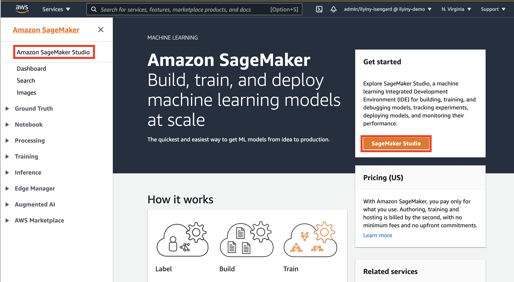
1. 구성 대화 상자에서 **표준 설정**, **AWS IAM(Identity and Access Management)**을 선택하고 계정 및 Studio 사용자에 대해 **SageMaker 프로젝트 및 JumpStart**가 활성화되어 있는지 확인합니다.


**권한** 구성에서 **새 역할 만들기**를 선택합니다. Studio IAM 역할에 대한 권한을 검토하고 필요한 경우 수정하고 수락합니다.
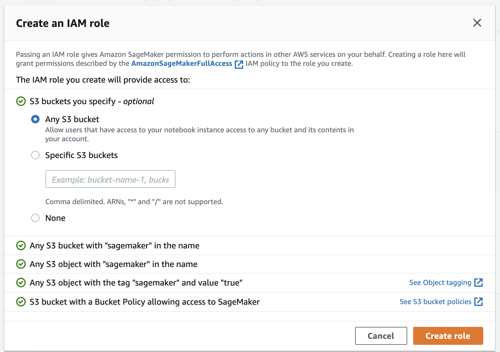
1. **네트워크 및 스토리지** 구성에서 Studio용 VPC 및 네트워크 액세스를 선택합니다. **VPC만** 옵션을 선택하는 경우 VPC에 인터넷 액세스 권한이 있는지 확인합니다.
- 제약 사항이 없으면 디폴트 VPC, 첫번째 subnet, 첫번째 보안 그륩을 선택 합니다.
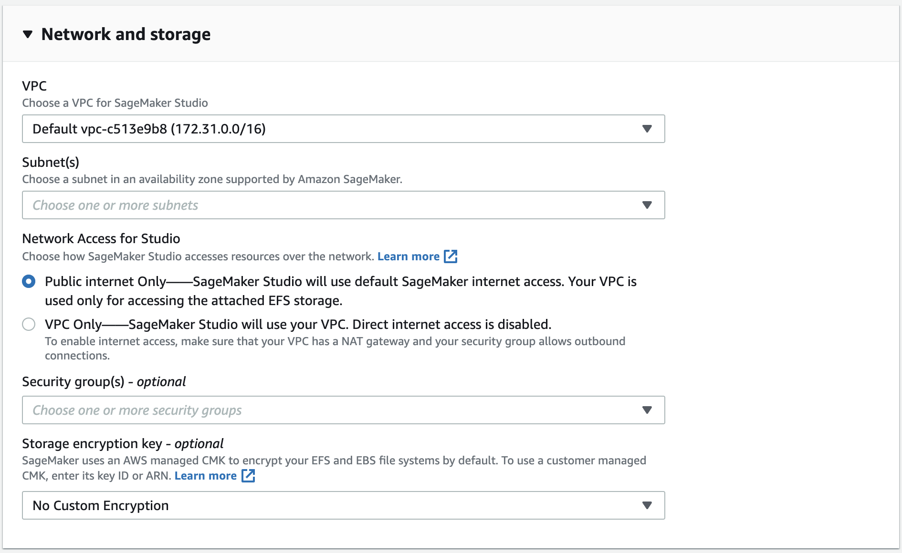
1. **제출**을 클릭합니다.


# 5. 세이지 메이커 프로젝트 생성 및 검증
- 이 단계는 서비스 카탈로그의 프러덕트가 배포가 되었기에, 세이지 메이커 스튜디오에서 세이지 메이커 프로젝트를 생성하고 실행 하는 단계 입니다.

## 5.1. 스튜디오 시작
- 이벤트 엔진에서 실습의 경우에는 "5.2 스튜디오 열기" 로 이동 하세요.

Studio를 시작하려면 [SageMaker Dashboard](https://console.aws.amazon.com/sagemaker/home?#/dashboard)로 이동하여 **Open SageMaker Studio**를 클릭하고 **Status**가 다음인지 확인해야 합니다. '준비'.
**Studio 요약** 창에서 계정 및 Studio 사용자에 대해 Amazon SageMaker 프로젝트 템플릿이 활성화되어 있는지 확인합니다.


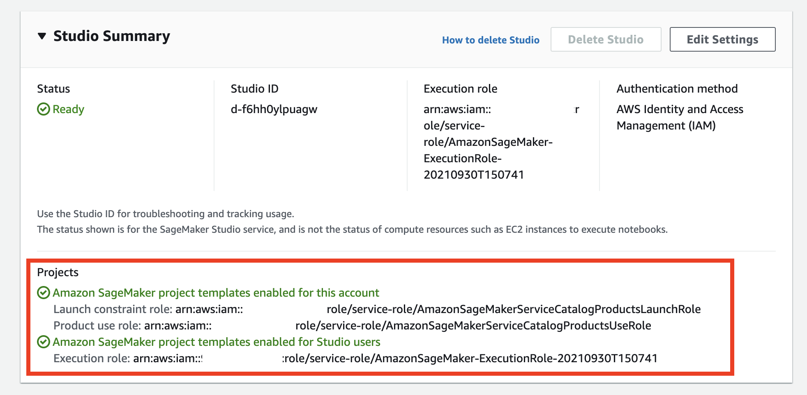

프로젝트가 비활성화이면 **Edit Settings** 를 클릭 합니다.

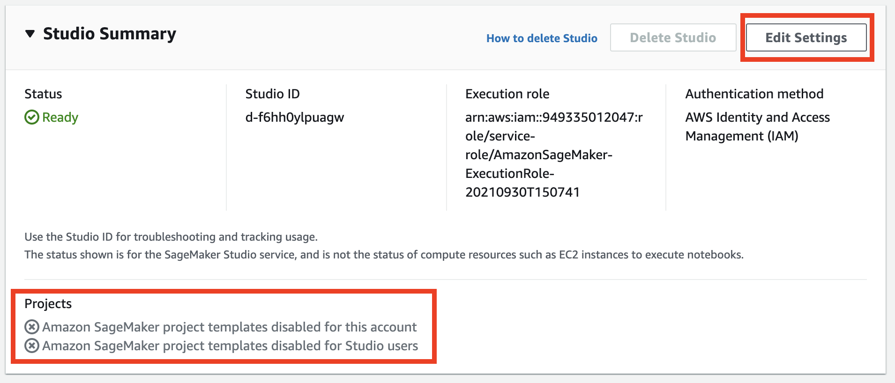

그리고 세팅 윈도우에서 활성화하고 제출을 클릭 합니다.


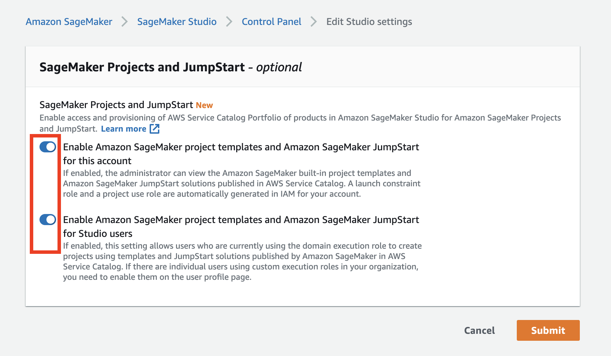

스튜디오 사용자가 없는 경우 SageMaker Studio 제어판에서 **사용자 추가**를 클릭합니다. 그렇지 않으면 **스튜디오 열기**를 클릭합니다.

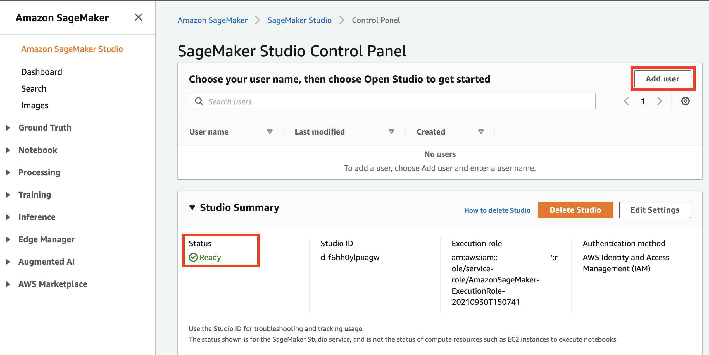

새 스튜디오 사용자를 추가하려면 사용자 추가 패널의 SageMaker Studio 생성 단계에서 생성된 해당 SageMaker 실행 역할을 입력하고 제출을 클릭합니다.

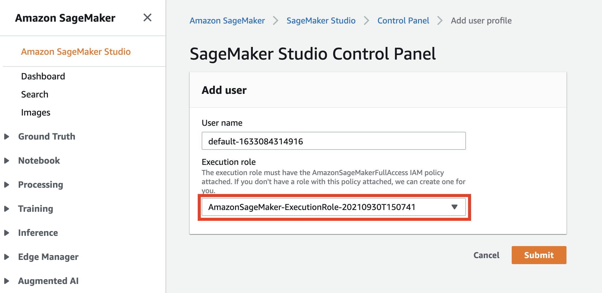

## 5.2 스튜디오 열기
사용자 프로필이 생성된 후 **Open Studio** 링크를 클릭할 수 있습니다. Studio IDE가 있는 새 브라우저 창으로 리디렉션됩니다.

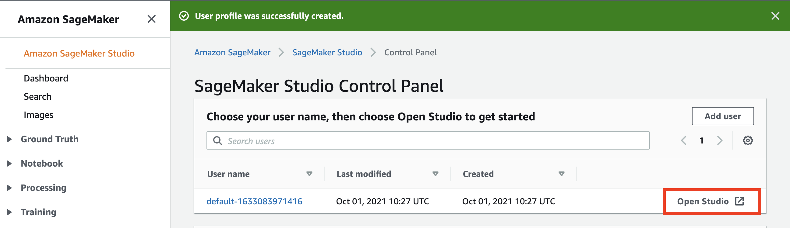

Studio에서 기본 JupyterServer 애플리케이션 생성을 마칠 때까지 기다립니다.


Launcher 방문 페이지를 제시했습니다.


## 5.3.  코드 리파지토리 복사 하기
제공된 노트북을 사용하려면 소스 코드 저장소를 Studio 환경에 복제해야 합니다.
**런처** 창의 Studio에서 시스템 터미널을 엽니다.

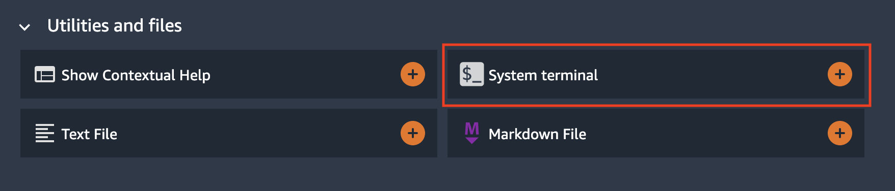

터미널에서 다음 명령을 실행합니다.
```sh
git clone https://github.com/gonsoomoon-ml/amazon-sagemaker-reusable-components-kr
```

코드 저장소가 다운로드되어 Studio의 홈 디렉토리에 저장됩니다.
이제 파일 브라우저로 이동하여 [00-setup](notebooks/00-setup.ipynb) 노트북을 엽니다.

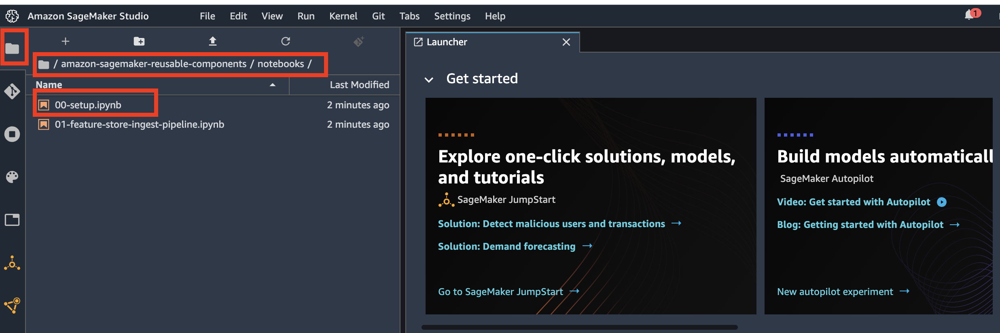

새 KernelGateway 앱에서 노트북 커널을 처음 시작하는 데는 약 5분이 걸립니다. 커널이 준비된 후 노트북의 추가 지침을 계속 진행합니다.

## 5.4. 솔루션 둘러보기
제공된 [설정](notebooks/00-setup.ipynb) 및 [feature-store-ingest-pipeline](notebooks/01-feature-store-ingest-pipeline.ipynb) 노트북을 사용하여 모든 솔루션 단계를 실행하십시오.

제공된 노트북은 다음 구현을 안내합니다.
- [설정, 00-setup.ipynb](notebooks/00-setup.ipynb)
1. 아키텍쳐 개요
2. 기본 변수 설정
    - 데이터 업로드를 위한 Amazon S3 버킷 가져오기
    - 데이타 랭글러 흐름 이름 설정 
3. 데이터 세트 준비
    - 데이터 세트 다운로드 및 데이터 탐색
4. 데이터 랭글러 흐름 (Flow) 생성
    - 데이터 변환 및 피쳐 수집을 위한 Amazon Data Wrangler 흐름 생성
5. 피쳐 스토어
    - 피쳐가 저장되는 피쳐 저장소에 새 피쳐 그룹 생성


- [피쳐 저장소 수집 파이프라인, 01-feature-store-ingest-pipeline.ipynb](notebooks/01-feature-store-ingest-pipeline.ipynb)
1. 아키텍처 개요
2. 전제 조건
3. 기본 변수 로딩
    - S3 data prefix to monitor : CSV 가 업로드가 되는 S3 Prefix
    - Data Wrangler flow URL
    - Data Wrangler output name
    - Feature group name
4. 세이지 메이커 사용자 템플릿을 통한 프로젝트 생성
5. 세이지 메이커 사용자 템플릿을 통한 프로젝트 분석 (데이타 수집 프로젝트)
6. 자동화 파이프라인 테스트
    - 지정된 S3 Prefix 에 CSV 를 업로딩하여 파이브라인을 자동으로 실행
7. 피쳐 스토어에서 데이터 확인


- [정리](notebooks/99-clean-up.ipynb)
    - 프로젝트 및 프로젝트 리소스 삭제
    - 피쳐 그룹 삭제
    - 프로젝트 프로비저닝된 S3 버킷 및 S3 객체 삭제


# 6. 리소스 제거
요금이 부과되지 않도록 하려면 AWS 계정에서 프로젝트 프로비저닝 및 생성된 리소스를 모두 제거해야 합니다.
1. 제공된 [정리노트, 99-clean-up.ipynb](notebooks/99-clean-up.ipynb)의 모든 단계를 실행합니다.
2. SageMaker Studio 도메인을 삭제합니다.
[Amazon SageMaker 개발자 안내서](https://docs.aws.amazon.com/sagemaker/latest/dg/gs-studio-delete-domain.html)의 자세한 단계별 지침을 참조하십시오.

3. 제공된 세이지 메이커 클랙식 노트북 생성을 위한 CloudFormation 패키지 및 배포 스택을 사용한 경우 삭제합니다.
- 클라우드 포메이션 컨솔에 가셔서 삭제 하셔도 됩니다.
```sh
aws cloudformation delete-stack --stack-name <stack name>
```


