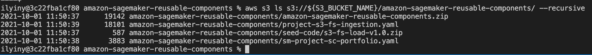

# CloudFormation 템플릿 패키지
제공된 [CloudFormation 템플릿](cfn-templates/)을 배포하려면 먼저 패키지를 만들고 배포를 위해 선택한 Amazon S3 버킷에 업로드해야 합니다. 이 준비 단계를 수행하는 방법에는 두 가지 옵션이 있습니다. 옵션 1은 모든 개발 환경(Windows, Linux 또는 MacOS)에서 작동합니다. 옵션 2는 Linux 또는 MacOS.re 변환 및 [SageMaker Feature Store](https://aws.amazon.com/sagemaker/feature-store/)로의 변환 및 수집에서만 작동합니다. 이 프로젝트 템플릿은 [AWS 서비스 카탈로그](https://aws.amazon.com/servicecatalog/) 제품으로 제공되며 **프로젝트** 아래 Studio **SageMaker 리소스** 메뉴에서 사용할 수 있습니다.

Studio를 시작하기 전에 필요한 모든 아티팩트를 프로비저닝하려면 다음 배포 단계를 따라야 합니다.

## 옵션 1 - CloudFormation 템플릿을 사용하여 패키징 및 업로드
이 옵션은 먼저 간단한 CloudFormation 템플릿 [`package-cfn.yaml`](package-cfn.yaml)을 배포합니다. 템플릿은 배포 템플릿을 패키징하고 지정된 S3 버킷에 업로드하는 [CodeBuild](https://aws.amazon.com/codebuild/) 프로젝트를 생성합니다.

배포 지침을 따르려면 터미널에서 다음 명령을 실행하십시오(모든 명령은 macOS 10.15.7용으로 테스트되었지만 Windows에서도 작동함).

1. GitHub repository 복사:
```sh
git clone https://github.com/aws-samples/amazon-sagemaker-reusable-components-kr.git
cd amazon-sagemaker-reusable-components-kr
```

2. S3 버킷이 없으면 완전히 새로 생성해야 합니다. **이미 S3 버킷이 있는 경우 이 단계를 건너뜁니다**.
```sh
S3_BUCKET_NAME=<your new S3 bucket name>
aws s3 mb s3://${S3_BUCKET_NAME} --region $AWS_DEFAULT_REGION
```
3. 소스 코드 zip 파일을 만듭니다.
```sh
rm -f amazon-sagemaker-reusable-components.zip
zip -r amazon-sagemaker-reusable-components.zip . -i "*.yaml" "*.yml" "*.sh" "*.py"
```
4. 소스 코드 zip 파일 `amazon-sagemaker-reusable-components.zip`을 S3 버킷에 업로드합니다.
```sh
S3_BUCKET_NAME=<your existing or just created S3 bucket name>
aws s3 cp amazon-sagemaker-reusable-components.zip s3://${S3_BUCKET_NAME}/amazon-sagemaker-reusable-components/
```

5. CloudFormation 템플릿을 배포합니다.
```sh
STACK_NAME=amazon-sagemaker-reusable-components-package-cfn
aws cloudformation deploy \
        --template-file package-cfn.yaml \
        --stack-name $STACK_NAME \
        --capabilities CAPABILITY_NAMED_IAM \
        --parameter-overrides \
        S3BucketName=$S3_BUCKET_NAME 
```

6. 배포가 완료될 때까지 기다렸다가 다음 명령을 사용하여 스택 출력을 인쇄합니다(업로드된 템플릿이 S3 버킷에 나타날 때까지 몇 분 정도 기다릴 수 있음).
```sh
aws cloudformation describe-stacks \
    --stack-name $STACK_NAME \
    --output table \
    --query "Stacks[0].Outputs[*].[OutputKey, OutputValue]"
```

📜 **나중에 사용할 수 있도록 출력을 스크래치 패드에 저장합니다.**

7. 배포 템플릿이 S3 버킷에 업로드되었는지 확인합니다.
```sh
aws s3 ls s3://${S3_BUCKET_NAME}/amazon-sagemaker-reusable-components/ --recursive
```



이제 모든 배포 CloudFormation 템플릿이 패키징되어 S3 버킷에 업로드됩니다. 추가 지침을 진행할 수 있습니다.

## 옵션 2 - 셸 스크립트를 사용하여 패키지 및 업로드
macOS/Linux를 사용하는 경우 `make` 명령을 통해 전달된 패키징 스크립트를 실행할 수 있습니다. 이 스크립트는 Windows에서 작동하지 **않습니다**.

다음 명령을 실행하여 배포 템플릿을 패키징하고 S3 버킷에 업로드합니다. 기존 S3 버킷의 이름이나 새 이름을 지정할 수 있습니다(S3 버킷이 자동으로 생성됨). 기존 S3 버킷을 사용하는 경우 CloudFormation 템플릿을 배포하는 **동일한 지역**에 있어야 합니다.

```sh
S3_BUCKET_NAME=<your existing or new Amazon S3 bucket name>
make package CFN_BUCKET_NAME=$S3_BUCKET_NAME DEPLOYMENT_REGION=$AWS_DEFAULT_REGION
```

Run the `ls` on the S3 bucket to check that all templates are uploaded:
```sh
aws s3 ls s3://${S3_BUCKET_NAME}/amazon-sagemaker-reusable-components/ --recursive
```

Copyright Amazon.com, Inc. or its affiliates. All Rights Reserved.
SPDX-License-Identifier: MIT-0