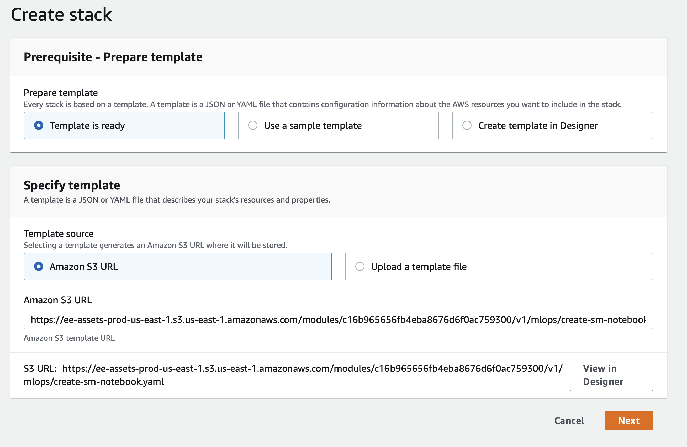
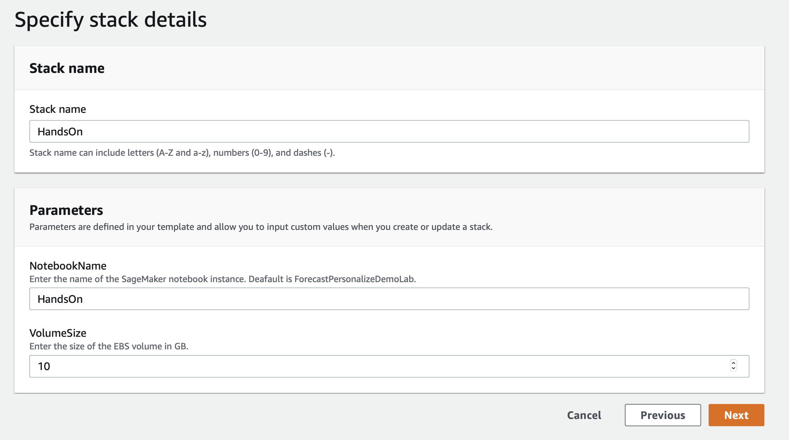
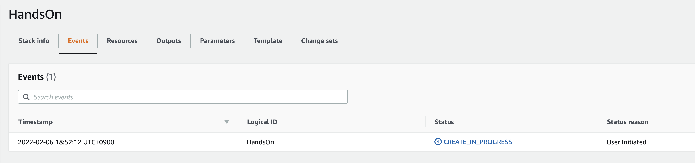
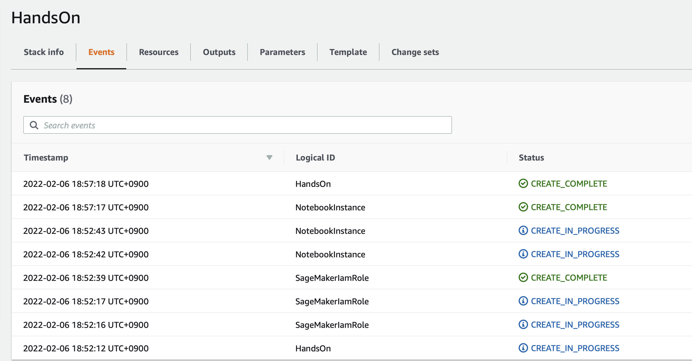
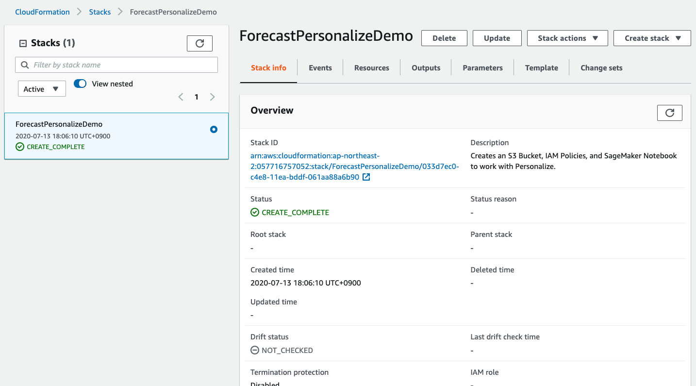

# 핸즈온 준비 단계 입니다.- Cloud Formation(CF) 을 통한 방법

# 1. CloudFormation Template을 사용하여 세이지 메이커 노트북 생성 및 권한 할당

### 아래 스크린샷의 가이드를 따라 하시면 됩니다. 
- 아래를 클릭 하세요.

### Cloud Formation Wizard

**"Next" 버튼을 눌러서 진행 하십시오.** 
Start by clicking `Next` at the bottom like shown:

**'Next'버튼을 클릭 해주세요.**  
click `Next` again.

**스크롤을 맨 밑까지 하신 후에 'Next' 클릭 해주세요.**  
This page is a bit longer so scroll to the bottom to click `Next`.

**맨 밑까지 스크롤 하신 후에 체크 박스 클릭(새로운 IAM 리소스 생성 관련) 해주세요.
이후에 'Create Stack'클릭 해주세요.** 
Again scroll to the bottom, check the box to enable the template to create new IAM resources and then click `Create Stack`.

**2-3분 후에 CloudFormation은 세이지 메이커 노트북 인스턴스, S3 버킷, 역할(Role) 등을 생성합니다.** 
For a few minutes CloudFormation will be creating the resources described above on your behalf it will look like this while it is provisioning:

**이 작업이 끝난 후에 녹색 글씨로 완료 되었다는 글이 보이실 겁니다. 만약 빨간색으로 Error 가 기술되어 있으면 에러 메세지를 확인 바랍니다.** 
Once it has completed you'll see green text like below indicating that the work has been completed:

# 2.세이지 메이커 노트북 열기
Using the Notebooks

**콘솔의 왼쪽 상단의 네비게이션 바에서 'Services'를 클릭 하신 후에 'SageMaker'를 찾으세요.** 
Start by navigating to the SageMaker serivce page by clicking the `Services` link in the top navigation bar of the AWS console.

**'SageMaker'를 입력하고, 서비스가 보이시면 클릭하세요.** 
이후에 **서비스 페이지로 부터 왼쪽 메뉴에 'Notebook Instances' 링크를 클릭 하세요.** 
In the search field enter `SageMaker` and then click for the service when it appears, from the service page click the `Notebook Instances` link on the far left menu bar.

**노트북 인스턴스의 끝에 'Open JupyterLab'을 클릭하세요.** 
To get to the Jupyter interface, simply click `Open JupyterLab` on the far right next to your notebook instance.

    
# 3. 준비 완료 (Get Ready)

- 핸즈온의 준비가 완료 되었습니다. 만일 이 과정이 완료가 안되었으면 진행자에게 알려 주세요.

# 9. 모든 작업 완료 후에 리소스 제거 방법
작업이 끝나면, 앞에서 CloudFormation으로 생성한 stack을 지워야 합니다.다시 AWS 콘솔을 클릭하시고, 입력란에 'CloudFormation'을 입력하시고
메뉴가 보이시면 클릭하세료.  
Once you have completed all of the work in the Notebooks and have completed the cleanup steps there as well, the last thing to do is to delete the stack you created with CloudFormation. To do that, inside the AWS Console again click the `Services` link at the top, and this time enter in `CloudFormation` and click the link for it.

전에 생성한 demo stack 위에 'Delete' 버튼을 클릭 해주세요.  
Click the `Delete` button on the demo stack you created:

팝업 메뉴에 'Delete Stack'을 클릭 해주세요.  
Lastly click the `Delete Stack` button that shows up on the popup:

보이는 것럼 지워지고 있다는 것을 알 수 있을 겁니다. 'Delete Completed'가 보이면 모든 작업이 완료 된 것 입니다. 수고 하셨습니다.  
You'll now notice that the stack is in progress of being deleted. Once you see `Delete Completed` you know that everything has been deleted and you are 100% done with this lab.

