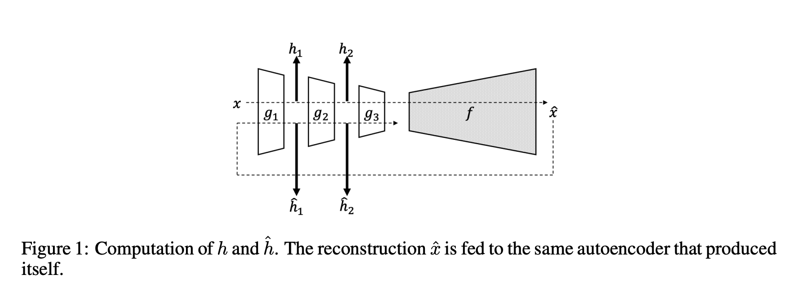
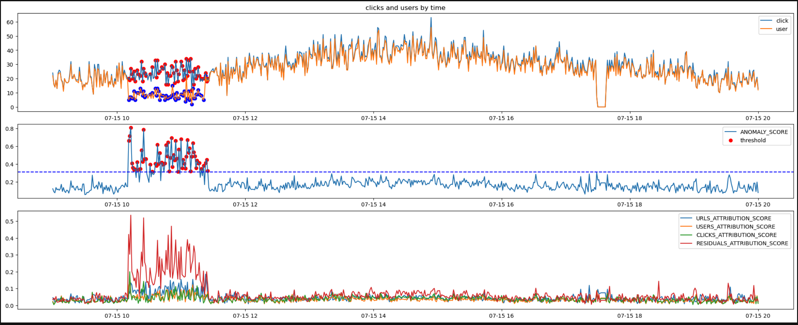

# Anomaly Detection with Machine Learning

# 1. Problem statements
- **Detect anomal behavoir** of systems or machines with **fault explanations**

- - -

# 2. Methods
- **Random Cut Forest** (RCF)  
    * [Paper] https://assets.amazon.science/d2/71/046d0f3041bda0188021395b8f48/robust-random-cut-forest-based-anomaly-detection-on-streams.pdf
    * [Desc, KOREAN] https://hiddenbeginner.github.io/paperreview/2021/07/14/rrcf.html
    * [AWS Docs] https://docs.aws.amazon.com/kinesisanalytics/latest/sqlref/sqlrf-random-cut-forest.html   
    * [AWS Sample codes] https://github.com/aws-samples/amazon-sagemaker-anomaly-detection-with-rcf-and-deepar
    

    

- **RaPP** - Novelty Detection with Reconstruction along Projection Pathway  
    * [Ppaer, ICLR 2020] https://openreview.net/attachment?id=HkgeGeBYDB&name=original_pdf
    * [Desc, KOREAN] https://makinarocks.github.io/rapp/
    * [Supplement #1] [Autoencoder based Anomaly Detection](https://makinarocks.github.io/Autoencoder-based-anomaly-detection/)
    * [Supplement #2] [Reference code (github)](https://github.com/Aiden-Jeon/RaPP)

    

    

- - -

# 3. Results

    

# anomaly-detection-with-explanation

# 4. Tutorials
- **Introduction to Anomaly Detection**  
    * [VOD] http://dmqm.korea.ac.kr/activity/seminar/339