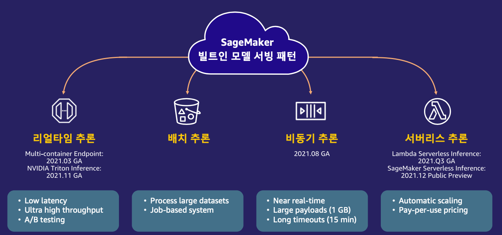

# Amazon SageMaker 모델 배포 방법 소개
---

## Why Cloud Model Serving?

MLOps에서 머신 러닝 코드는 극히 일부에 불과하고 고려할 것들이 많습니다. 한꺼번에 거버넌스, ML 워크플로 자동화, CI/CD 파이프라인 구축, 모니터링 같은 방대한 블록들을 모두 커버하는 것은 어렵죠. 그렇다면, 그 중에 가장 핵심이 되는 키 블록부터 커버하면 어떨까요? 천리 길도 한 걸음부터라고 MLOps의 첫 단추는 모델 서빙입니다. 하지만, 밑바닥부터 모델 서빙을 구현하려면 고려해야 하는 것들이 너무 많습니다.

특히 데이터 과학자의 입장에서는 이런 고민들을 할 수 있겠죠.
- 인프라 설정은 어떻게 해야 하는지? 
- 갑자기 호스팅 서버가 셧다운된다면 어떻게 대처할 것인지? 
- 머신러닝 프레임워크 버전 관리는?
- 동시 접속자들이 확 몰린다면? 
- A/B 테스트는 어떻게?
- 비용을 아껴야 하는데?

이 때, 바로 SageMaker로 대표되는 클라우드 네이티브 모델 서빙 서비스를 고려할 수 있습니다.

- 인프라 설정에 대한 관리를 할 필요가 없습니다. 간단한 API만 호출하면 단 몇 분 안에 모델 서빙을 위한 엔드포인트가 생성되고, 엔드포인트에서 가리키는 호스팅 인스턴스가 프로비저닝됩니다. 이 때, 모델 호스팅을 위한 프레임워크 및 디펜던시 설치와 기본 환경들이 모두 자동으로 설정되죠.
- 가용성과 오토스케일링에 대해서도 확실하게 보장하고 가성비도 훌륭합니다. 간혹 비용에 민감하신 분들은 EC2와 비교하는 경우가 있는데, 프로덕션 환경에 EC2만 달랑 띄워서 사용할 수 없습니다. 로드밸런서 붙이고, 오토스케일링 policy 설정하고, 컨테이너 등록하고 로드하는 등의 추가 비용과, 부가 서비스들을 연동하기 위한 시간과 노력을 고려해야 하죠. 
- 마지막으로 MLOps 연동을 빼놓을 수 없습니다. SageMaker Pipeline을 통해 머신 러닝 파이프라인을 쉽게 연동할 수 있고, SageMaker Project를 통해 CICD 파이프라인까지 확장이 가능하죠. 배포된 모델은 SageMaker Model Monitoring으로 모델, 데이터 드리프트를 즉각 파악할 수 있습니다.

## SageMaker 빌트인 4가지 모델 서빙 패턴

가장 널리 사용하는 모델 서빙 패턴들을 API로 쉽게 구현할 수 있습니다.

- 사용자의 요청에 실시간으로 반응하는 리얼타임 추론
- 주기별 예측에 적합한 배치 추론
- 실시간은 아니지만, 빠른 시간 내에 추론 결과를 받을 수 있고 큰 Payload 사이즈에 적합한 비동기 추론
- pay-per-use에 적합한 서버리스 추론

본 워크샵에서는 리얼타임 추론에 대해 다루며, 다른 모델 서빙 패턴에 대한 핸즈온이 필요하신 분들은 아래 링크를 참조해 주세요.
- AWS 전문가와 함께 하는 모델 서빙 패턴: https://github.com/aws-samples/sm-model-serving-patterns

## Workshop Guide

- [1. 리얼타임 추론 스텝 바이 스텝 (20-40분 소요)](2.1.Deploy.ipynb)
    - SageMaker 엔드포인트는 REST API를 통해 실시간 추론을 수행할 수 있는 완전 관리형 서비스입니다. 기본적으로 분산 컨테이너로 고가용성, 다중 모델 로딩, A/B 테스트를 위한 인프라 환경(EC2, 로드밸런서, 오토스케일링, 모델 아티팩트 로딩 등)이 사전 구축되어 있기에 몇 줄의 코드만으로 Endpoint가 자동으로 생성되기에, 모델을 프로덕션에 빠르게 배포할 수 있습니다. 

- [2. 로드 테스트 (10-20분 소요)](2.2.Load-Testing.ipynb)
    - Locust (https://docs.locust.io/en/stable/) 를 사용하여 간단한 로드 테스트를 수행합니다. Locust는 Python으로 테스트 스크립트를 빠르게 작성할 수 있고 파라메터들이 직관적이라 빠르게 로드 테스트 환경을 구축하고 실행할 수 있습니다.