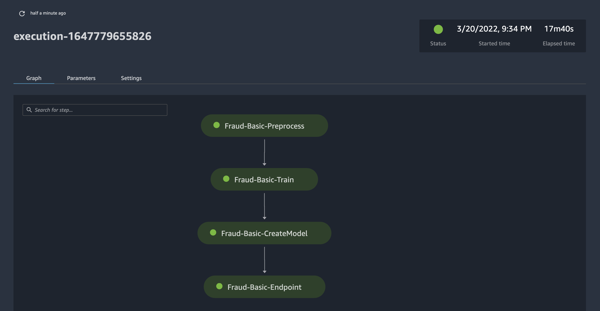
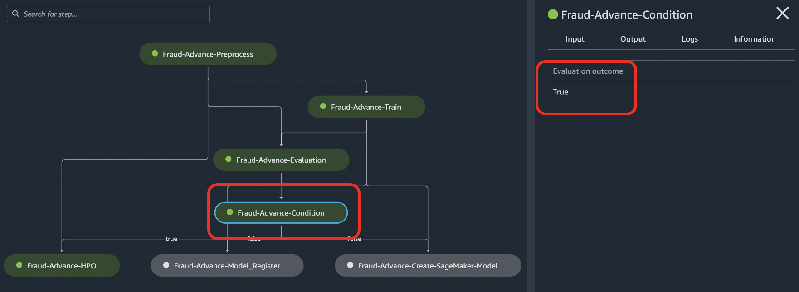

# lab_03_pipeline 

---

lab_03_pipeline 은 lab_01_training, lab_02_inference 이후의 단계 입니다.
이제 모델 훈련, 모델 추론을 실습을 했기에, 이렇게 배운 과정을 SageMaker Model Building Pipeline 으로 구성하는 작업을 합니다.

아래와 같이 두가지 방법으로 접근 가능합니다.
- [Quick Approach] 
    - 모든 스텝을 연결하여 파이프라인을 구성 합니다. 약 소요시간은 20분 걸립니다.
- [Step-By-Step 접근]
    - 스텝을 하나씩 구현해 가면서, 마지막에 전체를 연결하여 완성 합니다. 소요 시간은 약 60분 걸립니다.

### [Quick Approach] 
- Step-By-Step으로 접근하지 않고, 빠르게 보시기 위해서는 아래 노트북만을 수행 하세요.
    - 1.1.Prepare-Dataset.ipynb
    - 6.1.all-pipeline.ipynb
    - 7.1.Inference-Analyze.ipynb    

### [Step-By-Step 접근]

- 1.1.Prepare-Dataset.ipynb
    - 데이터 세트 (claims.csv, customers.csv) 를 S3에 업로드

- 2.1.Preprocess-Pipeline.ipynb
    - 첫번째의 전처리 과정의 스텝 생성 하며 아래 세가지의 단계별 구현을 합니다.
        - 로컬 노트북에서 전처리 스크립트 실행 (예: python preprocess.py)
        - MBP 의 파이프라인 단계 (step_proecess) 를 생성하여 실행

-  3.1.Train-Pipeline.ipynb
    - 전처리된 데이터를 바탕으로 모델 훈련을 합니다.
        - MBP 의 파이프라인 단계 (step_train) 를 생성하여 실행

- 4.1.Create-Model-Pipeline.ipynb 
    - 세이제 메이커 모델 생성 단계

- 5.1.Deploy-Pipeline.ipynb
    - 실시간 엔드포인트 생성 단계
        - SageMaker Pipeline 에서 엔드포인트 생성을 수행합니다.

- 6.1..all-pipeline.ipynb
    - 위에 생성한 모든 MBP 스텝을 연결하여 모든 파이프라인을 생성 함.
    
    
- 7.1.Inference-Analyze.ipynb
    - 최종적으로 생성한 실시간 엔드포인트에 추론 테스트
    

---

### [알림] 이 lab_3_pipeline 의 고급 과정은 여기를 참조 하세요.
- [고급 단계](Advanced/README.md)
    - 튜닝 스텝, 모델 레지스트리 스텝, 모델 평가 스템, 조건 스텝 및 캐싱 기능 사용
    - 아래와 같은 파이프라인 구성 구현
    - 

---

## [참고 자료]

    
- Amazon SageMaker Model Building Pipelines
    - 세이지 메이커 모델 빌딩 파이프라인의 개발자 가이드
    - https://docs.aws.amazon.com/sagemaker/latest/dg/pipelines.html

- Amazon SageMaker Local Mode Examples    
    - 로컬 모드에서 사용하는 예시 (로컬 노트북에서 PyCharm 으로 훈련 및 서빙 예시)
    - https://github.com/aws-samples/amazon-sagemaker-local-mode

- Run Amazon SageMaker Notebook locally with Docker container
    - https://towardsdatascience.com/run-amazon-sagemaker-notebook-locally-with-docker-container-8dcc36d8524a
    
